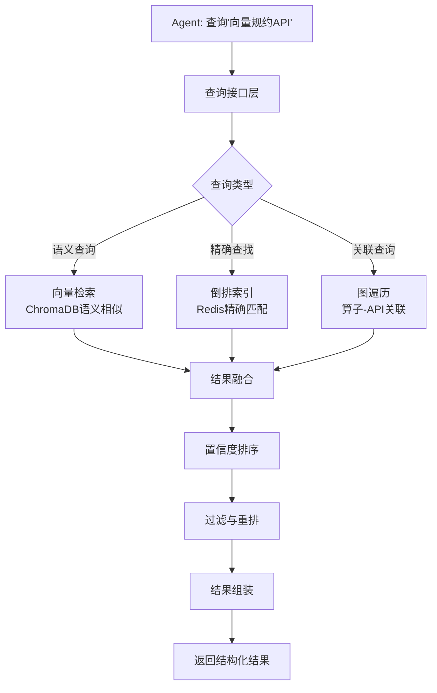
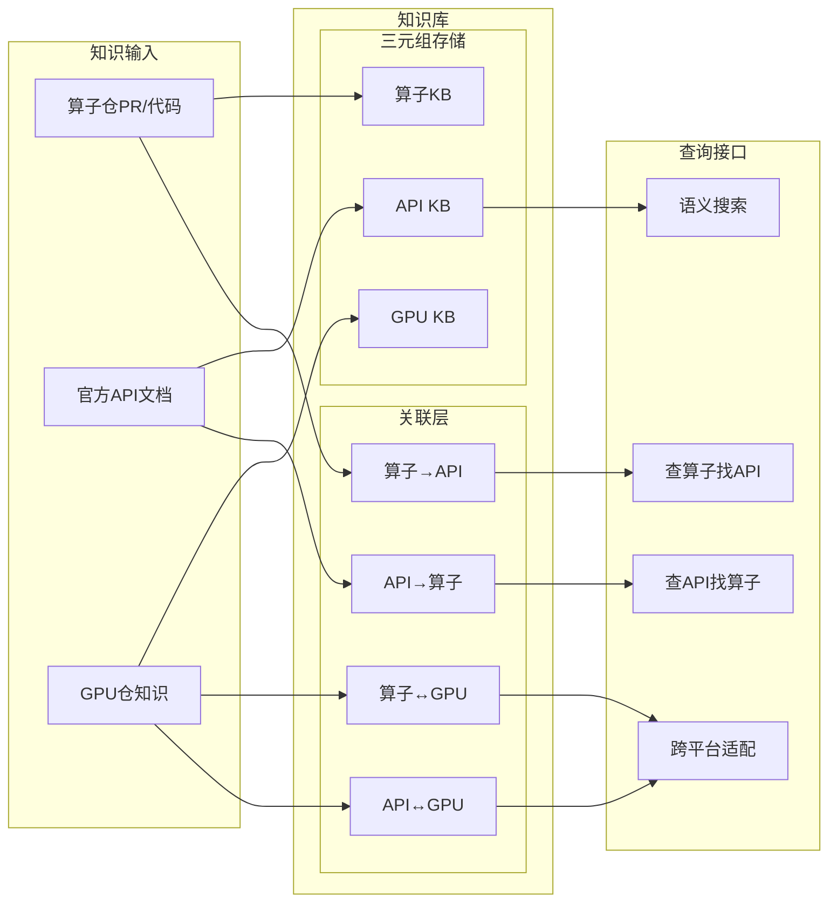

# AscendC API参考知识库与算子使用案例设计方案

**文档版本**: v1.0
**创建日期**: 2026-04-09
**作者**: 首席架构师
**状态**: 正式版

---

## 1. 背景与需求分析

### 1.1 现有知识库能力

当前昇腾AscendC算子知识库已实现：
- 原子化算子知识图谱（HierarchicalKV-ascend, fbgemm-ascend, ops-* 等6个算子仓）
- 置信度感知排序层（权威性×时效性×准确性）
- 双存储架构（ChromaDB向量库 + Redis KV存储）
- GPU→NPU跨平台适配知识（GPU算子采集 + API映射 + 适配辅助）
- MCP接口，支持Coding Agent查询

### 1.2 新增需求

```
┌─────────────────────────────────────────────────────────────────────┐
│                      新增能力矩阵                                     │
├─────────────────────────────────────────────────────────────────────┤
│                                                                     │
│  需求一：AscendC API参考知识库                                        │
│  ├─ 目标：存储和持续更新昇腾AscendC算子API                            │
│  ├─ 用户：Coding Agent开发AscendC算子时查询参考                      │
│  └─ 数据源：昇腾官方API文档                                          │
│                                                                     │
│  需求二：NPU算子API使用案例                                          │
│  ├─ 目标：保存算子涉及的AscendC API接口及多种实现案例                 │
│  ├─ 用户：Agent开发时参考具体用法                                    │
│  └─ 关联：与已有算子知识、GPU跨平台知识形成三角关联                   │
│                                                                     │
└─────────────────────────────────────────────────────────────────────┘
```

### 1.3 核心设计挑战

| 挑战 | 描述 | 解决方案 |
|------|------|----------|
| **API数据模型** | 如何结构化表示API（函数签名、参数、返回值、示例） | 分层模型：API定义 + API类别 + 版本信息 |
| **API知识采集** | 如何从昇腾官方文档持续同步 | 官方文档爬虫 + 版本追踪 + 权威性保证 |
| **API-算子关联** | API与算子的多对多关系如何建模 | 三元组关联：算子-使用-API + 权重去重 |
| **查询接口** | 如何支持多种查询模式 | 倒排索引 + 向量检索 + 图遍历混合 |

---

## 2. AscendC API数据模型

### 2.1 核心数据模型

```python
# AscendC API参考知识库 - 分层数据结构
@dataclass
class AscendCAPIDefinition:
    """AscendC API定义"""
    api_id: str                      # 唯一标识，如 "ascendc_vec_reduce_max_v2"
    canonical_name: str               # 标准名称，如 "VecReduce"
    full_signature: str              # 完整签名

    # 分类体系
    category: APICategory            # API类别（见2.2）
    subcategory: str                 # 子类别

    # 核心信息
    description: str                 # 功能描述
    parameters: List[APIParameter]   # 参数列表
    return_value: APIReturnValue     # 返回值

    # 版本信息
    version_info: APIVersionInfo     # 版本演进信息

    # 使用信息
    usage_examples: List[UsageExample]  # 使用案例
   注意事项: List[str]                # 使用注意事项
    禁忌: List[str]                    # 错误用法

    # 元数据
    source: APISourceInfo             # 文档来源
    confidence: float                 # 置信度（官方文档=1.0）
    last_updated: datetime

    # 向量嵌入（用于语义检索）
    embedding: List[float]


@dataclass
class APICategory:
    """API分类体系"""
    # 一级分类
    primary: str  # "memory" | "compute" | "sync" | "util" | "tensor"

    # 二级分类（按功能）
    secondary: str  # memory下: "alloc" | "copy" | "layout"
                    # compute下: "vector" | "cube" | "reduction"
                    # sync下: "barrier" | "pipe"

    # 硬件关联
    hardware_domain: str  # "ub" | "cube" | "l1" | "gm"

    # 优先级（API调用频率估计）
    usage_priority: int  # 1-5, 1为最常用


@dataclass
class APIParameter:
    """API参数定义"""
    name: str
    param_type: str                  # 参数类型
    description: str
    is_required: bool
    default_value: Optional[str]

    # 约束信息
    constraints: List[str]            # 如 "param_type ∈ {0, 1, 2}"
    valid_range: Optional[Dict]      # 如 {"min": 0, "max": 255}

    # 使用特征（用于案例匹配）
    usage_pattern: str               # "stride" | "aligned" | "contiguous"


@dataclass
class APIReturnValue:
    """API返回值定义"""
    return_type: str
    description: str

    # 错误码（如有）
    error_codes: Optional[List[ErrorCode]]

    # 副作用描述
    side_effects: Optional[List[str]]


@dataclass
class ErrorCode:
    """错误码定义"""
    code: int
    name: str
    description: str
    recovery_suggestion: str


@dataclass
class APIVersionInfo:
    """API版本演进信息"""
    introduced_version: str          # 首次引入版本
    deprecated_version: Optional[str]  # 弃用版本
    removed_version: Optional[str]    # 移除版本

    # 版本变更历史
    change_history: List[APIVersionChange]

    # 兼容性信息
    migration_guide: Optional[str]    # 迁移指南
    replaces: Optional[str]           # 替代的旧API


@dataclass
class APIVersionChange:
    """API版本变更记录"""
    version: str
    change_type: str  # "added" | "modified" | "deprecated" | "removed"
    description: str
    breaking_change: bool


@dataclass
class UsageExample:
    """API使用案例"""
    example_id: str
    title: str                       # 案例标题
    description: str                 # 案例描述

    # 代码内容
    code_snippet: str                # 代码片段
    context: str                      # 使用场景描述

    # 关联信息
    operator_id: Optional[str]       # 关联的算子（可选）
    performance_notes: Optional[str]  # 性能说明

    # 适用条件
   适用条件: List[str]                # 案例适用场景


@dataclass
class APISourceInfo:
    """API来源信息"""
    source_type: str  # "official_doc" | "community" | "internal"
    doc_url: str
    authority_score: float  # 0.0-1.0, 官方文档=1.0
    last_verified: datetime


### 2.1.5 官方文档页面结构（实测）

```python
# 实际官方API文档页面结构示例：LocalTensor页面
@dataclass
class OfficialAPIPageStructure:
    """官方API文档页面结构（实测）"""

    # 页面固定元素
    page_header: dict = {
        "面包屑导航": "CANN社区版 > Ascend C算子开发接口 > SIMD API > 基础数据结构 > LocalTensor",
        "版本标记": "9.0.0-beta.2",
        "评分入口": "我要评分",
        "反馈入口": "在线提单 / 论坛求助"
    }

    # 页面核心内容区
    content_sections: dict = {
        # API简介
        "api_intro": {
            "title": "LocalTensor简介",
            "update_time": "更新时间：2026/03/31",
            "description": "LocalTensor用于存放AI Core中Local Memory（内部存储）的数据...",
            "supported_positions": "VECIN、VECOUT、VECCALC、A1、A2、B1、B2、CO1、CO2"
        },

        # 必要信息
        "header_file": {
            "title": "需要包含的头文件",
            "content": '#include "kernel_operator.h"'
        },

        # 函数签名
        "signature": {
            "title": "原型定义",
            "content": """template <typename T> class LocalTensor : public BaseLocalTensor<T> {
public:
    __aicore__ inline LocalTensor<T>() {};
    __aicore__ inline uint64_t GetPhyAddr() const;
    __aicore__ inline uint64_t GetPhyAddr(const uint32_t offset) const;
    __aicore__ inline __inout_pipe__(S) PrimType GetValue(const uint32_t index) const;
    // ... 更多方法
};"""
        },

        # 模板参数说明（表格形式）
        "template_params": {
            "title": "模板参数",
            "table_header": ["参数名", "描述"],
            "table_rows": [
                ["T", "类型T可以支持基础数据类型以及TensorTrait类型..."]
            ]
        },

        # 约束说明
        "constraints": {
            "title": "使用约束",
            "content": "具体约束条件..."
        }
    }

    # 页面导航
    page_navigation: dict = {
        "prev_page": "通用说明和约束",
        "next_page": "LocalTensor构造函数"
    }

    # 法律信息
    legal_footer: dict = {
        "copyright": "版权所有 © 2021-2026华为技术有限公司",
        "record_num": "粤A2-20044005号"
    }
```

**实测LocalTensor API签名：**
```cpp
// 实测得到的完整签名（来自官方文档）
template <typename T> class LocalTensor : public BaseLocalTensor<T> {
public:
    using PrimType = PrimT<T>;
    __aicore__ inline LocalTensor<T>() {};

#if defined(ASCENDC_CPU_DEBUG) && ASCENDC_CPU_DEBUG == 1
    ~LocalTensor();
    explicit LocalTensor<T>(TBuffAddr& address);
    LocalTensor<T>(const LocalTensor<T>& other);
    LocalTensor<T> operator = (const LocalTensor<T>& other);
    PrimType* GetPhyAddr(const uint32_t offset) const;
    PrimType* GetPhyAddr() const;
    __inout_pipe__(S) PrimType GetValue(const uint32_t offset) const;
    __inout_pipe__(S) PrimType& operator()(const uint32_t offset) const;
    template <typename CAST_T> __aicore__ inline LocalTensor<CAST_T> ReinterpretCast() const;
    template <typename T1> __inout_pipe__(S) void SetValue(const uint32_t index, const T1 value) const;
    // ... 更多方法
#else
    __aicore__ inline uint64_t GetPhyAddr() const;
    __aicore__ inline uint64_t GetPhyAddr(const uint32_t offset) const;
    __aicore__ inline __inout_pipe__(S) PrimType GetValue(const uint32_t index) const;
    __aicore__ inline __inout_pipe__(S) __ubuf__ PrimType& operator()(const uint32_t offset) const;
    template <typename CAST_T> __aicore__ inline LocalTensor<CAST_T> ReinterpretCast() const;
    // ... 调试/非调试模式不同实现
#endif
    // 位置、大小、形状相关
    __aicore__ inline LocalTensor<T>(AscendC::TPosition pos, uint32_t addr, uint32_t tieSize);
    __aicore__ inline int32_t GetPosition() const;
    __aicore__ inline void SetSize(const uint32_t size);
    __aicore__ inline uint32_t GetSize() const;
    // ...
};
```

### 2.2 API分类体系（基于官方文档实测）

```
AscendC API 分类体系
═══════════════════════════════════════════════════════════════════════

【实测数据来源】
文档版本: CANN社区版 9.0.0-beta.2
提取URL: https://www.hiascend.com/document/detail/zh/CANNCommunityEdition/900beta2/API/ascendcopapi/

按硬件域分类：
┌─────────────────────────────────────────────────────────────────────┐
│  UB (Unified Buffer)     │ Cube (矩阵计算单元)  │ L1 (Local Memory) │
├─────────────────────────┼──────────────────────┼───────────────────┤
│ • Vec_* (向量操作)       │ • Mmad (矩阵乘累加)  │ • LocalTensor     │
│ • Matmul                │ • Load2D/Load3D     │ • GlobalTensor    │
│ • VecReduce             │ • Fixpipe           │ • Coordinate      │
│ • TensorTrait           │ • Conv2D (废弃)     │ • Layout          │
│                         │ • Gemm (废弃)       │ • TBuf/TQue       │
└─────────────────────────┴──────────────────────┴───────────────────┘

按功能分类（基于官方文档结构）：
┌─────────────────────────────────────────────────────────────────────┐
│ SIMD API基础        │ Memory数据搬运    │ 矩阵计算            │
│ (基础数据结构)       │                   │ (ISASI扩展)         │
├─────────────────────┼───────────────────┼─────────────────────┤
│ LocalTensor          │ DataCopy          │ Mmad                │
│ GlobalTensor         │ Copy              │ Load2D/Load3D      │
│ Coordinate           │ SetPadValue       │ SetFmatrix         │
│ Layout               │ BroadCastVecToMM  │ Fixpipe            │
│ TensorTrait          │                   │ Conv2D (废弃)      │
│ 内置数据类型         │                   │ Gemm (废弃)        │
│ UnaryRepeatParams    │                   │                     │
│ BinaryRepeatParams   │                   │                     │
├─────────────────────┼───────────────────┼─────────────────────┤
│ Memory矢量计算       │ Reg矢量计算       │ 资源管理            │
├─────────────────────┼───────────────────┼─────────────────────┤
│ 基础算术: Exp/Ln/Abs │ 寄存器数据类型     │ Pipe和Que框架      │
│ 逻辑计算: Not/And/Or │ RegTensor          │ TPipe              │
│ 复合计算: Axpy/Fused │ MaskReg            │ TBufPool           │
│ 比较选择: Compare    │ AddrReg            │ TQue                │
│ 类型转换: Cast       │ 搬入/搬出操作     │ TSCM               │
│ 归约计算: Reduce*    │ MaskReg计算        │ TQueBind           │
│ 数据转换: Transpose  │ Move/MaskInterleave│ TBuf               │
│ 数据填充: Duplicate  │ Pack/UnPack       │ 内存管理            │
│ 排序组合: Sort/Merge │ MoveMask           │ LocalMemAllocator  │
│ 离散聚合: Gather     │                   │                     │
│ 掩码操作: SetMask*   │                   │                     │
├─────────────────────┼───────────────────┼─────────────────────┤
│ 同步控制             │ 缓存控制           │ 原子操作            │
├─────────────────────┼───────────────────┼─────────────────────┤
│ 核内同步: TQueSync  │ DataCachePreload  │ SetAtomicAdd       │
│ 核间同步: IBSet/Wait │ DataCacheCleanAnd │ AtomicAdd/Min/Max  │
│ 任务间同步          │ ICachePreLoad      │ AtomicCas/Exch     │
│ Mutex               │                    │                     │
├─────────────────────┼───────────────────┼─────────────────────┤
│ 调试接口             │ 高阶API            │ 工具函数            │
├─────────────────────┼───────────────────┼─────────────────────┤
│ 上板打印: DumpTensor │ 数学计算: Tanh/Sin │ NumericLimits      │
│ 异常检测: assert    │ Matmul侧接口       │ Async              │
│ CPU孪生调试         │                    │ Kernel Tiling宏    │
│ 性能统计: Metrics*  │                    │                     │
├─────────────────────┼───────────────────┼─────────────────────┤
│ Cube分组管理(ISASI) │ 系统变量访问       │ 标量计算           │
├─────────────────────┼───────────────────┼─────────────────────┤
│ CubeResGroupHandle  │ GetBlockNum/Idx   │ GetBitCount        │
│ GroupBarrier        │ GetArchVersion    │ CountLeadingZero   │
│ KfcWorkspace        │ GetProgramCounter │ Cast               │
└─────────────────────┴───────────────────┴─────────────────────┘

【重要标记】
(ISASI) = 昇腾AI Stack Accelerator Interface，扩展接口
(废弃) = 已废弃接口，勿用

按使用频率分类（P0 = 最常用，基于官方文档示例数量估算）：
P0: VecMul, VecAdd, LocalTensor, GlobalTensor, DataCopy, Copy
P1: VecReduce, Load2D, Mmad, SyncAll, Matmul
P2: Exp, Sqrt, Abs, SetValue/GetValue, TQue, TPipe
P3: Conv2D/Gemm (已废弃), MMA相关, 特殊扩展接口
P4: ISASI扩展接口, CubeResGroupHandle, KfcWorkspace
```

### 2.3 API存储结构（ChromaDB + Redis）

```python
# ChromaDB Collection: ascendc_api_kb
API_KB_COLLECTION = {
    "fields": [
        {"name": "api_id", "type": "str", "is_primary": True},
        {"name": "embedding", "type": "numpy.array", "dim": 1024},

        # 检索用字段
        {"name": "canonical_name", "type": "VARCHAR", "max_length": 64},
        {"name": "category_primary", "type": "VARCHAR", "max_length": 32},
        {"name": "category_secondary", "type": "VARCHAR", "max_length": 32},
        {"name": "hardware_domain", "type": "VARCHAR", "max_length": 16},
        {"name": "usage_priority", "type": "INT8"},

        # 过滤用字段
        {"name": "version", "type": "VARCHAR", "max_length": 32},
        {"name": "is_deprecated", "type": "BOOL"},
        {"name": "authority_score", "type": "FLOAT"},

        # 统计字段
        {"name": "usage_count", "type": "INT32"},  # 被算子使用次数
        {"name": "example_count", "type": "INT16"},  # 案例数量

        {"name": "last_updated", "type": "BIGINT"}
    ],
    "indexes": [
        {"field": "embedding", "index_type": "IVF_FLAT", "params": {"nlist": 1024}},
        {"field": "canonical_name", "index_type": "INVERTED"},
        {"field": "category_primary", "index_type": "INVERTED"},
        {"field": "hardware_domain", "index_type": "INVERTED"},
        {"field": "usage_priority", "index_type": "STL_SORT"}
    ]
}

# Redis Key Pattern
API_REDIS_KEYS = {
    "api_detail": "kb:api:detail:{api_id}",           # API完整定义
    "api_examples": "kb:api:examples:{api_id}",         # API使用案例列表
    "api_version": "kb:api:version:{api_id}",          # API版本信息
    "api_params": "kb:api:params:{api_id}",            # API参数详情
    "api_related": "kb:api:related:{api_id}",          # 相关API列表
    "api_usage": "kb:api:usage:{api_id}",              # API使用统计
    "category_index": "kb:api:category:{primary}:{secondary}",  # 分类索引
    "operator_api": "kb:operator:apis:{operator_id}",  # 算子使用的API列表
    "api_operators": "kb:api:operators:{api_id}",       # 使用某API的算子列表
}
```

---

## 3. NPU算子API使用案例数据模型

### 3.1 核心数据模型

```python
# NPU算子API使用案例 - 关联算子与API
@dataclass
class OperatorAPIUsage:
    """算子对API的使用记录"""
    usage_id: str                    # 唯一标识

    # 关联的算子
    operator_id: str                 # 来自算子知识库的算子ID
    operator_name: str                # 算子名称
    repo_id: str                      # 来源仓库

    # 关联的API
    api_id: str                       # API ID
    api_name: str                     # API名称
    api_category: str                 # API类别

    # 使用详情
    usage_context: str                # 在算子中的使用上下文/位置
    code_reference: str               # 代码位置（文件:行号）
    snippet: str                      # 实际代码片段

    # 使用特征（用于检索和推荐）
    usage_pattern: UsagePattern       # 使用模式分类
    tile_size: Optional[str]          # 如有tiling，相关参数
    data_type: Optional[str]          # 数据类型
    optimization_notes: Optional[str]  # 优化备注

    # 质量评估
    is_reference_implementation: bool  # 是否为参考实现
    performance_indicator: Optional[str]  # 性能指标
    confidence: float                 # 此使用的置信度

    # 来源信息
    source: SourceInfo
    collected_at: datetime


@dataclass
class UsagePattern:
    """使用模式分类"""
    pattern_type: str  # "basic" | "tiled" | "pipelined" | "optimized" | "fused"

    # 模式特征
    characteristics: List[str]

    # 适用场景
    applicable_scenarios: List[str]

    # 优缺点
    pros: List[str]
    cons: List[str]


@dataclass
class OperatorAPIMapping:
    """算子-API映射关系（多对多）"""
    mapping_id: str

    # 关联的算子
    operator_id: str
    operator_name: str
    canonical_operator_name: str      # 标准化算子名

    # 关联的API列表
    apis: List[OperatorUsedAPI]

    # 聚合统计
    total_api_count: int             # 使用API总数
    api_categories: Dict[str, int]   # 各类别API数量
    hardware_domains: Dict[str, int]  # 各硬件域API数量

    # 使用复杂度
    complexity_score: float           # 1.0-5.0, 算子复杂度
    reference_implementation: Optional[str]  # 参考实现URL


@dataclass
class OperatorUsedAPI:
    """算子使用的单个API"""
    api_id: str
    api_name: str
    category: str
    hardware_domain: str
    usage_frequency: str  # "critical" | "major" | "minor" | "optional"

    # 使用位置
    code_location: str               # 文件:函数:行号
    call_sequence: int               # 在算子中的调用顺序

    # 依赖关系
    depends_on: List[str]           # 依赖的其他API
    depended_by: List[str]            # 依赖此API的其他API
```

### 3.2 多对多关系建模

```
算子-API 多对多关系
═══════════════════════════════════════════════════════════════════════

算子视角：
┌─────────────────────────────────────────────────────────────────────┐
│ 算子 "Matmul"                                                       │
│ ├─ API: VecMul (使用频率: critical, 调用顺序: 1)                    │
│ ├─ API: Load2D (使用频率: critical, 调用顺序: 2)                    │
│ ├─ API: Cube (使用频率: critical, 调用顺序: 3)                      │
│ ├─ API: Store2D (使用频率: critical, 调用顺序: 4)                   │
│ ├─ API: SyncAll (使用频率: major, 调用顺序: 5)                      │
│ └─ API: LocalAlloc (使用频率: minor, 调用顺序: 0)                    │
└─────────────────────────────────────────────────────────────────────┘

API视角：
┌─────────────────────────────────────────────────────────────────────┐
│ API "VecMul"                                                        │
│ ├─ 算子: Matmul (usage_context: "向量预处礆", confidence: 0.95)      │
│ ├─ 算子: ElementwiseAdd (usage_context: "残差连接", confidence: 0.88)│
│ ├─ 算子: LayerNorm (usage_context: "方差计算", confidence: 0.82)    │
│ └─ 统计: 被52个算子使用, reference_implementation: 38个             │
└─────────────────────────────────────────────────────────────────────┘

存储实现：
┌─────────────────────────────────────────────────────────────────────┐
│ ChromaDB Collection: operator_api_usage                          │
│ ├─ 字段: usage_id, operator_id, api_id, embedding,                   │
│ │        usage_pattern, confidence                                  │
│ └─ 索引: operator_id + api_id 联合倒排, embedding IVF               │
│                                                                      │
│ Redis:                                                               │
│ ├─ kb:operator:apis:{operator_id} → [api_id, api_id, ...]          │
│ └─ kb:api:operators:{api_id} → [operator_id, operator_id, ...]      │
└─────────────────────────────────────────────────────────────────────┘
```

### 3.3 使用案例存储结构

```python
# ChromaDB Collection: operator_api_usage
OPERATOR_API_USAGE_COLLECTION = {
    "fields": [
        {"name": "usage_id", "type": "VARCHAR", "max_length": 128, "is_primary": True},
        {"name": "embedding", "type": "FLOAT_VECTOR", "dim": 768},

        # 关联字段
        {"name": "operator_id", "type": "VARCHAR", "max_length": 64},
        {"name": "operator_name", "type": "VARCHAR", "max_length": 64},
        {"name": "api_id", "type": "VARCHAR", "max_length": 64},
        {"name": "api_name", "type": "VARCHAR", "max_length": 64},

        # 过滤字段
        {"name": "repo_id", "type": "VARCHAR", "max_length": 64},
        {"name": "usage_pattern", "type": "VARCHAR", "max_length": 32},
        {"name": "hardware_domain", "type": "VARCHAR", "max_length": 16},
        {"name": "data_type", "type": "VARCHAR", "max_length": 16},

        # 质量字段
        {"name": "confidence", "type": "FLOAT"},
        {"name": "is_reference_implementation", "type": "BOOL"},
        {"name": "performance_indicator", "type": "VARCHAR", "max_length": 128},

        {"name": "collected_at", "type": "BIGINT"}
    ],
    "indexes": [
        {"field": "embedding", "index_type": "IVF_FLAT", "params": {"nlist": 1024}},
        {"field": "operator_id", "index_type": "INVERTED"},
        {"field": "api_id", "index_type": "INVERTED"},
        {"field": "usage_pattern", "index_type": "INVERTED"},
        {"field": "confidence", "index_type": "STL_SORT"}
    ]
}
```

---

## 4. API知识采集方案

### 4.1 官方文档结构分析（实测）

```
官方文档结构分析
═══════════════════════════════════════════════════════════════════════

【文档信息】
- 版本: CANN社区版 9.0.0-beta.2
- 页面总数: 1786个API详情页
- URL模式: atlasascendc_api_07_XXXX.html (XXXX为4位序号)

【页面类型】
┌─────────────────────────────────────────────────────────────────────┐
│ 类型1: API列表页                                                      │
│ - URL: atlasascendc_api_07_0003.html (主列表)                       │
│ - 内容: 左侧导航(完整API目录) + 右侧内容(分类概览)                   │
│ - 作用: 提供所有API链接入口                                          │
├─────────────────────────────────────────────────────────────────────┤
│ 类型2: API详情页                                                      │
│ - URL: atlasascendc_api_07_XXXX.html (如0025=Exp, 0006=LocalTensor)│
│ - 内容: 产品支持情况 + 功能说明 + 函数原型 + 参数说明 +              │
│         返回值说明 + 约束说明 + 调用示例                            │
│ - 作用: 提供单个API的完整信息                                        │
└─────────────────────────────────────────────────────────────────────┘

【API详情页结构（实测Exp页面）】
┌─────────────────────────────────────────────────────────────────────┐
│ Exp详情页 atlasascendc_api_07_0025.html                            │
├─────────────────────────────────────────────────────────────────────┤
│ 产品支持情况                                                         │
│ ┌────────────┬───────────┐                                          │
│ │ 产品        │ 是否支持  │                                          │
│ ├────────────┼───────────┤                                          │
│ │ Atlas 350  │ √         │                                          │
│ │ Atlas A3   │ √         │                                          │
│ │ Atlas A2   │ √         │                                          │
│ └────────────┴───────────┘                                          │
├─────────────────────────────────────────────────────────────────────┤
│ 功能说明                                                             │
│ 按元素取自然指数，计算公式如下：                                     │
├─────────────────────────────────────────────────────────────────────┤
│ 函数原型（多个重载版本）                                            │
│ template <typename T, const ExpConfig& config = DEFAULT_EXP_CONFIG>│
│ __aicore__ inline void Exp(const LocalTensor<T>& dst,              │
│                              const LocalTensor<T>& src,              │
│                              const int32_t& count)                   │
├─────────────────────────────────────────────────────────────────────┤
│ 参数说明（模板参数 + 普通参数）                                      │
│ - T: 操作数数据类型 (half/float)                                    │
│ - isSetMask: 是否在接口内部设置mask                                                         │
│ - config: Subnormal计算模式配置                                     │
│ - dst/src/count/mask/repeatTime/repeatParams...                    │
├─────────────────────────────────────────────────────────────────────┤
│ 返回值说明                                                           │
│ 约束说明                                                             │
│ 调用示例                                                             │
└─────────────────────────────────────────────────────────────────────┘

【采集策略反思】
❌ 错误做法: 只提取innerText前10000字符 → 只得到导航列表
✅ 正确做法: 遍历1786个详情页URL，提取完整内容
```

### 4.2 两阶段采集方案

```
两阶段API采集流程
═══════════════════════════════════════════════════════════════════════

┌─────────────────────────────────────────────────────────────────────┐
│ 阶段一: 链接发现 (Link Discovery)                                     │
├─────────────────────────────────────────────────────────────────────┤
│                                                                     │
│  输入: API列表页URL                                                  │
│  输出: 1786个API详情页URL及元数据                                    │
│                                                                     │
│  步骤:                                                               │
│  1. 访问主列表页 atlasascendc_api_07_0003.html                      │
│  2. 提取所有<a href="atlasascendc_api_07_XXXX.html">链接            │
│  3. 解析链接上下文，建立分类映射                                     │
│  4. 存储URL列表 + ETag/Last-Modified                                 │
│                                                                     │
│  发现结果:                                                           │
│  - Total: 1786个API                                                 │
│  - Categories: 基础数据结构/基础API/高阶API/SIMT/Utils/AI CPU/C API │
│  - URL Pattern: atlasascendc_api_07_{4-digit-sequence}.html       │
└─────────────────────────────────────────────────────────────────────┘
                              │
                              ▼
┌─────────────────────────────────────────────────────────────────────┐
│ 阶段二: 详情采集 (Detail Extraction)                                  │
├─────────────────────────────────────────────────────────────────────┤
│                                                                     │
│  输入: 1786个API详情页URL                                           │
│  输出: 完整API定义数据                                               │
│                                                                     │
│  采集内容:                                                           │
│  ┌───────────────────────────────────────────────────────────────┐  │
│  │ field              │ source                    │ extracted    │  │
│  ├────────────────────┼───────────────────────────┼──────────────┤  │
│  │ api_id             │ URL编号                   │ ascendc_XXX  │  │
│  │ canonical_name     │ 页面标题/面包屑           │ Exp          │  │
│  │ category           │ 面包屑导航               │ SIMD基础算术  │  │
│  │ hardware_support   │ 产品支持情况表格          │ Atlas 350√  │  │
│  │ description        │ 功能说明段落             │ 按元素取指数  │  │
│  │ signatures         │ 函数原型(多版本)          │ 3个重载      │  │
│  │ parameters         │ 参数说明表格              │ T/config/count│  │
│  │ return_value       │ 返回值说明段落            │ void         │  │
│  │ constraints        │ 约束说明段落              │ 32字节对齐   │  │
│  │ examples           │ 调用示例代码              │ 代码块       │  │
│  │ is_isasi           │ URL/导航标记             │ true/false   │  │
│  │ is_deprecated      │ 页面标记                 │ true/false   │  │
│  └────────────────────┴───────────────────────────┴──────────────┘  │
└─────────────────────────────────────────────────────────────────────┘
```

### 4.3 采集组件设计

```python
# ============================================================
# 组件1: API链接发现器 (API Link Discoverer)
# ============================================================
class APILinkDiscoverer:
    """
    负责从API列表页发现所有API链接
    """

    LIST_PAGE_URL = (
        "https://www.hiascend.com/document/detail/zh/"
        "CANNCommunityEdition/900beta2/API/ascendcopapi/"
        "atlasascendc_api_07_0003.html"
    )

    def __init__(self, http_client, redis_client):
        self.http = http_client
        self.redis = redis_client
        self.category_parser = CategoryParser()

    async def discover(self) -> List[APILinkInfo]:
        """
        发现所有API链接

        Returns:
            List[APILinkInfo]: API链接信息列表
        """
        # 1. 检查增量更新
        cached_etag = await self.redis.get("etag:api_list_page")
        headers = {"If-None-Match": cached_etag} if cached_etag else {}

        # 2. 请求列表页
        response = await self.http.get(self.LIST_PAGE_URL, headers=headers)
        if response.status_code == 304:
            # 无更新，返回缓存
            return await self._get_cached_links()

        # 3. 解析API链接
        html = response.text
        links = self._parse_api_links(html)

        # 4. 更新缓存
        new_etag = response.headers.get("ETag")
        if new_etag:
            await self.redis.set("etag:api_list_page", new_etag)
            await self._cache_links(links)

        return links

    def _parse_api_links(self, html: str) -> List[APILinkInfo]:
        """
        解析HTML中的API链接

        关键：从<a>标签提取 href + 文本 + 分类上下文
        """
        soup = BeautifulSoup(html, "html.parser")

        # 提取所有API详情页链接
        api_links = []
        for a_tag in soup.find_all("a", href=True):
            href = a_tag.get("href", "")
            if "atlasascendc_api_07_" in href and href.endswith(".html"):
                # 解析URL获取API ID
                api_id = self._extract_api_id(href)

                # 提取链接文本（API名称）
                name = a_tag.get_text(strip=True)

                # 提取分类上下文（从父级导航结构）
                category = self._extract_category_context(a_tag)

                # 提取(ISASI)/(废弃)标记
                is_isasi = "(ISASI)" in name
                is_deprecated = "(废弃)" in name

                api_links.append(APILinkInfo(
                    api_id=api_id,
                    name=name.replace("(ISASI)", "").replace("(废弃)", "").strip(),
                    url=href,
                    category=category,
                    is_isasi=is_isasi,
                    is_deprecated=is_deprecated,
                    etag=None,
                    last_modified=response.headers.get("Last-Modified")
                ))

        return api_links


# ============================================================
# 组件2: API详情提取器 (API Detail Extractor)
# ============================================================
class APIDetailExtractor:
    """
    负责从API详情页提取完整信息
    """

    def __init__(self, http_client, redis_client):
        self.http = http_client
        self.redis = redis_client
        self.section_parser = SectionParser()

    async def extract(self, link_info: APILinkInfo) -> AscendCAPIDefinition:
        """
        提取单个API的完整信息
        """
        # 1. 检查增量更新
        cache_key = f"etag:api_detail:{link_info.api_id}"
        cached_etag = await self.redis.get(cache_key)
        headers = {"If-None-Match": cached_etag} if cached_etag else {}

        # 2. 请求详情页
        response = await self.http.get(link_info.url, headers=headers)
        if response.status_code == 304:
            return await self._get_cached_detail(link_info.api_id)

        # 3. 解析页面内容
        text = response.text
        return await self._parse_detail_page(link_info, text, response.headers)

    async def _parse_detail_page(
        self,
        link_info: APILinkInfo,
        html: str,
        headers: dict
    ) -> AscendCAPIDefinition:
        """
        解析详情页内容

        关键：从页面文本中定位各section，提取结构化信息
        """
        soup = BeautifulSoup(html, "html.parser")

        # 提取面包屑获取API名称和分类
        breadcrumb = self._extract_breadcrumb(soup)

        # 提取更新时间
        update_time = self._extract_update_time(soup)

        # 定位主要内容区（包含函数原型的section）
        main_content = self._find_main_content(soup)

        # 解析各section
        hardware_support = self._parse_hardware_support(main_content)
        description = self._parse_description(main_content)
        signatures = self._parse_signatures(main_content)
        parameters = self._parse_parameters(main_content)
        return_value = self._parse_return_value(main_content)
        constraints = self._parse_constraints(main_content)
        examples = self._parse_examples(main_content)

        return AscendCAPIDefinition(
            api_id=link_info.api_id,
            canonical_name=link_info.name,
            full_signatures=signatures,
            category=self._derive_category(breadcrumb),
            subcategory=self._derive_subcategory(breadcrumb),
            description=description,
            parameters=parameters,
            return_value=return_value,
            version_info=APIVersionInfo(
                introduced_version="9.0.0-beta.2",
                last_updated=update_time
            ),
            usage_examples=[UsageExample(code_snippet=ex) for ex in examples],
            注意事项=self._extract_notes(constraints),
            禁忌=[],
            source=APISourceInfo(
                source_type="official_doc",
                doc_url=link_info.url,
                authority_score=1.0,
                last_verified=datetime.now()
            ),
            confidence=1.0 if not link_info.is_deprecated else 0.7,
            last_updated=update_time,
            embedding=[],  # 待向量化
            is_isasi=link_info.is_isasi,
            is_deprecated=link_info.is_deprecated,
            hardware_support=hardware_support
        )


# ============================================================
# 组件3: 页面区块解析器 (Section Parser)
# ============================================================
class SectionParser:
    """
    解析API详情页中的各个区块
    """

    def _extract_breadcrumb(self, soup) -> List[str]:
        """提取面包屑导航"""
        breadcrumb_section = soup.find("section", class_="article-bread")
        if breadcrumb_section:
            # 格式: CANN社区版 > Ascend C算子开发接口 > SIMD API > 基础API > Memory矢量计算 > 基础算术 > Exp
            text = breadcrumb_section.get_text()
            return [x.strip() for x in text.split(">")]
        return []

    def _parse_hardware_support(self, content) -> Dict[str, bool]:
        """解析产品支持情况表格"""
        result = {}
        # 查找"产品支持情况"后的表格
        # 表格格式: | 产品 | 是否支持 |
        table = content.find("table")
        if table:
            rows = table.find_all("tr")
            for row in rows[1:]:  # 跳过表头
                cols = row.find_all(["td", "th"])
                if len(cols) >= 2:
                    product = cols[0].get_text(strip=True)
                    support = "√" in cols[1].get_text() or "支持" in cols[1].get_text()
                    result[product] = support
        return result

    def _parse_signatures(self, content) -> List[Dict]:
        """
        解析函数原型

        返回格式:
        [{
            "template_params": {"T": "数据类型", "config": "配置"},
            "signature": "void Exp(LocalTensor<T> dst, LocalTensor<T> src)",
            "description": "tensor前n个数据计算"
        }]
        """
        signatures = []

        # 查找"函数原型"标题后的所有<code>或<pre>区块
        sig_section = content.find(string=lambda t: "函数原型" in str(t))
        if sig_section:
            parent = sig_section.find_parent()
            code_blocks = parent.find_all_next(["code", "pre"], limit=10)

            for block in code_blocks:
                text = block.get_text(strip=True)
                if "template" in text or "__aicore__" in text:
                    signatures.append({
                        "template_params": self._parse_template_params(text),
                        "signature": self._parse_signature(text),
                        "description": self._extract_sig_description(block)
                    })

        return signatures

    def _parse_parameters(self, content) -> List[APIParameter]:
        """解析参数说明表格"""
        params = []

        # 查找"参数说明"后的表格
        param_section = content.find(string=lambda t: "参数说明" in str(t))
        if param_section:
            table = param_section.find_parent().find_next("table")
            if table:
                rows = table.find_all("tr")
                for row in rows[1:]:  # 跳过表头
                    cols = row.find_all("td")
                    if len(cols) >= 3:
                        params.append(APIParameter(
                            name=cols[0].get_text(strip=True),
                            param_type=cols[1].get_text(strip=True),
                            description=cols[2].get_text(strip=True),
                            is_required=True,
                            default_value=None,
                            constraints=[],
                            valid_range=None,
                            usage_pattern=""
                        ))

        return params


# ============================================================
# 组件4: 批量采集调度器 (Batch Collector Scheduler)
# ============================================================
class APICollectorScheduler:
    """
    调度批量采集任务，支持断点续采
    """

    BATCH_SIZE = 50  # 每批50个API
    RATE_LIMIT_DELAY = 0.5  # 请求间隔0.5秒

    def __init__(self, discoverer: APILinkDiscoverer,
                 extractor: APIDetailExtractor,
                 redis_client):
        self.discoverer = discoverer
        self.extractor = extractor
        self.redis = redis_client
        self.progress_key = "progress:api_collection"

    async def run_full_collection(self):
        """
        执行全量采集
        """
        # Step 1: 发现所有链接
        links = await self.discoverer.discover()
        total = len(links)

        # Step 2: 获取已采集进度
        completed = await self._get_completed_ids()

        # Step 3: 批量采集
        for i in range(0, total, self.BATCH_SIZE):
            batch = links[i:i + self.BATCH_SIZE]
            for link in batch:
                if link.api_id in completed:
                    continue

                # 提取详情
                detail = await self.extractor.extract(link)

                # 存储
                await self._store_detail(detail)
                completed.add(link.api_id)
                await self._save_progress(link.api_id)

                # 限速
                await asyncio.sleep(self.RATE_LIMIT_DELAY)

            # 每批结束打印进度
            logger.info(f"Progress: {len(completed)}/{total}")

    async def run_incremental_collection(self):
        """
        执行增量采集（每日定时任务）
        """
        # Step 1: 检查列表页是否有更新
        links = await self.discoverer.discover()

        # Step 2: 找出新增/变更的API
        changed = []
        for link in links:
            current_etag = await self.redis.get(f"etag:api:{link.api_id}")
            if current_etag != link.etag:
                changed.append(link)

        # Step 3: 重新采集变更的API
        for link in changed:
            detail = await self.extractor.extract(link)
            await self._store_detail(detail)
            await self.redis.set(f"etag:api:{link.api_id}", link.etag)

        return len(changed)
```

### 4.4 采集策略

```
采集策略
═══════════════════════════════════════════════════════════════════════

┌─────────────────────────────────────────────────────────────────────┐
│ 数据源               │ 采集方式              │ 频率    │ 内容         │
├──────────────────────┼───────────────────────┼─────────┼─────────────┤
│ 昇腾官方API文档      │ 两阶段采集            │ 每日    │ API详情     │
│ (1786个API详情页)   │ 链接发现→详情提取      │         │ 签名/参数   │
├──────────────────────┼───────────────────────┼─────────┼─────────────┤
│ 昇腾算子仓(6个)     │ Git Webhook+代码解析  │ 实时    │ API使用案例 │
├──────────────────────┼───────────────────────┼─────────┼─────────────┤
│ AscendC Samples     │ Git解析               │ 每周    │ 参考示例    │
└──────────────────────┴───────────────────────┴─────────┴─────────────┘

【关键设计决策】
1. 两阶段分离：链接发现(1次) vs 详情提取(1786次)
2. 断点续采：Redis存储进度，支持中断后恢复
3. 增量优先：基于ETag检测变化，只采集变更项
4. 并发控制：50个一批，请求间隔0.5秒，避免限流
```

### 4.5 增量同步机制

```python
# 增量同步管理器
class IncrementalSyncManager:
    """
    管理API知识的增量同步
    """

    def __init__(self, redis_client, collector: APICollectorScheduler):
        self.redis = redis_client
        self.collector = collector

    async def check_and_sync(self) -> SyncResult:
        """
        检查更新并同步

        Returns:
            SyncResult: 同步结果
        """
        # 1. 检查列表页ETag
        list_etag = await self._fetch_list_etag()
        cached_etag = await self.redis.get("etag:api_list_page")

        if list_etag == cached_etag:
            return SyncResult(has_changes=False, changed_count=0)

        # 2. 发现变更
        changed_apis = await self._discover_changed_apis()

        # 3. 增量采集
        for api in changed_apis:
            await self.collector.extractor.extract(api)
            await self._update_cached_etag(api)

        # 4. 更新列表页ETag
        await self.redis.set("etag:api_list_page", list_etag)

        return SyncResult(
            has_changes=True,
            changed_count=len(changed_apis),
            api_ids=[a.api_id for a in changed_apis]
        )

    async def schedule_daily_sync(self):
        """
        每日定时同步任务
        """
        while True:
            now = datetime.now()
            # 计算到下一个凌晨4点的时间
            target = now.replace(hour=4, minute=0, second=0, microsecond=0)
            if target < now:
                target += timedelta(days=1)
            wait_seconds = (target - now).total_seconds()

            await asyncio.sleep(wait_seconds)

            result = await self.check_and_sync()
            if result.has_changes:
                await self._notify_changes(result)
```

### 4.6 版本追踪机制

```python
# API版本追踪器
class APIVersionTracker:
    """AscendC API版本追踪"""

    def __init__(self):
        self.version_db = {}  # 存储版本变更历史

    def track_version_change(self, api_id: str, change: APIVersionChange):
        """追踪API版本变更"""
        if api_id not in self.version_db:
            self.version_db[api_id] = APIVersionHistory(api_id=api_id)

        self.version_db[api_id].add_change(change)

        # 触发告警（重大变更）
        if change.breaking_change:
            self._notify_breaking_change(api_id, change)

    def get_migration_guide(self, api_id: str, from_version: str, to_version: str):
        """获取版本迁移指南"""
        history = self.version_db.get(api_id)
        if not history:
            return None

        # 构建迁移路径
        migration = self._build_migration_path(history, from_version, to_version)
        return migration

    def detect_api_evolution(self) -> List[APIEvolution]:
        """检测API演进趋势"""
        evolutions = []

        for api_id, history in self.version_db.items():
            # 分析变更频率
            change_rate = len(history.changes) / history.time_span_days

            # 分析变更类型分布
            type_distribution = Counter(c.change_type for c in history.changes)

            evolutions.append(APIEvolution(
                api_id=api_id,
                change_rate=change_rate,
                type_distribution=type_distribution,
                trend="stable" if change_rate < 0.1 else "evolving"
            ))

        return evolutions
```

---

## 5. 案例关联设计

### 5.1 三元组关联模型

```
算子-API-案例 三元组关联
═══════════════════════════════════════════════════════════════════════

┌─────────────┐          uses          ┌─────────────┐
│   算子      │ ◄─────────────────────► │    API      │
│  Matmul     │                        │   VecMul    │
└──────┬──────┘                        └──────┬──────┘
       │                                      │
       │         ┌────────────────────────────┘
       │         │
       ▼         ▼
┌─────────────────────────────────────────────┐
│           OperatorAPIUsage                   │
│  usage_id: matmul_vecmul_001                │
│  operator: Matmul                            │
│  api: VecMul                                 │
│  context: "向量预处礆"                        │
│  snippet: "VecMul(input, output, count);"    │
│  pattern: "basic"                            │
│  confidence: 0.95                           │
└─────────────────────────────────────────────┘

多对多关系实现：
─────────────────────────────────────────────
算子 → API: 一对多（一个算子使用多个API）
API → 算子: 多对多（一个API被多个算子使用）
算子 + API → 使用记录: 一对多（同一算子-API有多个使用场景）
```

### 5.2 去重策略

```python
# API使用去重器
class APIUsageDeduplicator:
    """API使用记录去重"""

    def __init__(self):
        self.exact_match_threshold = 0.95   # 完全相同判定阈值
        self.semantic_match_threshold = 0.85  # 语义相似判定阈值

    def deduplicate(self, usages: List[OperatorAPIUsage]) -> List[OperatorAPIUsage]:
        """去重处理"""
        # Step 1: 完全相同去重（snippet完全一致）
        exact_deduped = self._exact_deduplicate(usages)

        # Step 2: 语义相似去重（相同算子+相同API+相似上下文）
        semantic_deduped = self._semantic_deduplicate(exact_deduped)

        # Step 3: 保留最佳实现（reference_implementation优先）
        best_ones = self._keep_reference_implementation(semantic_deduped)

        return best_ones

    def _exact_deduplicate(self, usages: List[OperatorAPIUsage]) -> List[OperatorAPIUsage]:
        """完全相同去重"""
        seen = {}
        for usage in usages:
            key = (usage.operator_id, usage.api_id, self._normalize_snippet(usage.snippet))
            if key not in seen:
                seen[key] = usage
            else:
                # 保留置信度更高的
                if usage.confidence > seen[key].confidence:
                    seen[key] = usage

        return list(seen.values())

    def _semantic_deduplicate(self, usages: List[OperatorAPIUsage]) -> List[OperatorAPIUsage]:
        """语义相似去重"""
        # 基于embedding计算余弦相似度
        embeddings = [u.embedding for u in usages]

        # 聚类
        clusters = self._cluster_by_similarity(embeddings, self.semantic_match_threshold)

        # 每个簇保留置信度最高的
        representatives = []
        for cluster in clusters:
            best = max(cluster, key=lambda u: u.confidence)
            representatives.append(best)

        return representatives

    def _keep_reference_implementation(self, usages: List[OperatorAPIUsage]) -> List[OperatorAPIUsage]:
        """保留参考实现"""
        # 按 (operator_id, api_id) 分组
        groups = defaultdict(list)
        for usage in usages:
            key = (usage.operator_id, usage.api_id)
            groups[key].append(usage)

        # 每组保留reference或置信度最高的
        result = []
        for key, group in groups.items():
            ref_impls = [u for u in group if u.is_reference_implementation]
            if ref_impls:
                result.extend(ref_impls)
            else:
                result.append(max(group, key=lambda u: u.confidence))

        return result
```

### 5.3 跨库关联

```python
# 跨库关联器
class CrossLibraryLinker:
    """跨知识库关联"""

    def __init__(self, operator_kb, api_kb, usage_kb):
        self.operator_kb = operator_kb
        self.api_kb = api_kb
        self.usage_kb = usage_kb

    def link_operator_to_api(self, operator_id: str) -> OperatorAPIMapping:
        """关联算子与API（算子视角）"""
        # 从使用记录获取
        usages = self.usage_kb.get_by_operator(operator_id)

        # 聚合
        api_groups = defaultdict(list)
        for usage in usages:
            api_groups[usage.api_id].append(usage)

        # 构建映射
        apis = []
        for api_id, usage_list in api_groups.items():
            best_usage = max(usage_list, key=lambda u: u.confidence)
            api_info = self.api_kb.get(api_id)

            apis.append(OperatorUsedAPI(
                api_id=api_id,
                api_name=api_info.canonical_name,
                category=api_info.category.primary,
                hardware_domain=api_info.category.hardware_domain,
                usage_frequency=self._calc_frequency(usage_list),
                code_location=best_usage.code_reference,
                call_sequence=best_usage.call_sequence,
                depends_on=self._extract_dependencies(best_usage),
                depended_by=[]  # 待填充
            ))

        return OperatorAPIMapping(
            mapping_id=f"map_{operator_id}",
            operator_id=operator_id,
            operator_name=usages[0].operator_name,
            canonical_operator_name=self._normalize_operator_name(usages[0].operator_name),
            apis=apis,
            total_api_count=len(apis),
            api_categories=Counter(a.category for a in apis),
            hardware_domains=Counter(a.hardware_domain for a in apis),
            complexity_score=self._calc_complexity(apis)
        )

    def link_api_to_operators(self, api_id: str) -> List[OperatorAPIUsage]:
        """关联API与算子（API视角）"""
        return self.usage_kb.get_by_api(api_id)

    def get_cross_platform_context(self, operator_id: str) -> CrossPlatformContext:
        """获取跨平台上下文"""
        # 获取算子
        operator = self.operator_kb.get(operator_id)

        # 获取API映射
        api_mapping = self.link_operator_to_api(operator_id)

        # 获取GPU对应实现（如有）
        gpu_knowledge = self._get_gpu_equivalent(operator.canonical_name)

        # 获取API映射（GPU→NPU）
        api_mappings = self._get_gpu_npu_api_mappings(api_mapping)

        return CrossPlatformContext(
            operator=operator,
            api_mapping=api_mapping,
            gpu_equivalent=gpu_knowledge,
            api_mappings=api_mappings
        )
```

---

## 6. 查询接口设计

### 6.1 查询模式总览

```
┌─────────────────────────────────────────────────────────────────────┐
│                      API知识库查询模式                               │
├─────────────────────────────────────────────────────────────────────┤
│                                                                     │
│  模式1: API语义查询                                                 │
│  "查找执行向量规约的API"                                             │
│         │                                                           │
│         ▼                                                           │
│  VecReduce (置信度: 0.96)                                           │
│  ├─ API定义、参数、返回值                                            │
│  ├─ 使用案例 (Matmul, LayerNorm, ...)                              │
│  └─ 适配建议 (GPU对应: __reduce_add)                               │
│                                                                     │
│  模式2: 算子API查询                                                 │
│  "Matmul使用了哪些API？"                                            │
│         │                                                           │
│         ▼                                                           │
│  Matmul API映射                                                      │
│  ├─ VecMul (critical)                                              │
│  ├─ Load2D (critical)                                              │
│  ├─ Cube (critical)                                                │
│  └─ Store2D (critical)                                             │
│                                                                     │
│  模式3: API使用案例查询                                              │
│  "VecMul在真实算子中如何使用？"                                      │
│         │                                                           │
│         ▼                                                           │
│  VecMul 使用案例                                                    │
│  ├─ Matmul中的向量预处礆                                            │
│  ├─ LayerNorm中的方差计算                                           │
│  └─ Attention中的Score计算                                         │
│                                                                     │
│  模式4: 跨平台API映射                                               │
│  "GPU的wgmma::mma_sync对应NPU什么API？"                             │
│         │                                                           │
│         ▼                                                           │
│  GPU→NPU API映射                                                    │
│  └─ wgmma::mma_sync → Cube (置信度: 0.92)                          │
│     ├─ 参数映射说明                                                 │
│     └─ 使用案例参考                                                  │
│                                                                     │
└─────────────────────────────────────────────────────────────────────┘
```

### 6.2 MCP工具定义

```python
# API知识库 MCP工具
ASCENDC_API_TOOLS = {
    # ========== API查询 ==========

    # 语义搜索API
    "query_ascendc_api": {
        "name": "query_ascendc_api",
        "description": "查询AscendC API定义和使用信息",
        "inputSchema": {
            "type": "object",
            "properties": {
                "query": {"type": "string", "description": "查询意图，如'向量规约'、'矩阵乘法API'"},
                "category": {
                    "type": "string",
                    "enum": ["memory", "compute", "sync", "tensor", "util"],
                    "description": "API类别过滤"
                },
                "hardware_domain": {
                    "type": "string",
                    "enum": ["ub", "cube", "l1", "gm"],
                    "description": "硬件域过滤"
                },
                "filters": {
                    "type": "object",
                    "properties": {
                        "min_confidence": {"type": "number", "default": 0.7},
                        "exclude_deprecated": {"type": "boolean", "default": True},
                        "max_results": {"type": "number", "default": 10}
                    }
                }
            },
            "required": ["query"]
        }
    },

    # 获取API详情
    "get_api_detail": {
        "name": "get_api_detail",
        "description": "获取AscendC API的完整定义",
        "inputSchema": {
            "type": "object",
            "properties": {
                "api_id": {"type": "string", "description": "API唯一标识"},
                "include_examples": {"type": "boolean", "default": True},
                "include_version_history": {"type": "boolean", "default": False}
            },
            "required": ["api_id"]
        }
    },

    # ========== 算子-API关联查询 ==========

    # 查询算子使用的API
    "get_operator_apis": {
        "name": "get_operator_apis",
        "description": "获取算子使用的API列表及使用详情",
        "inputSchema": {
            "type": "object",
            "properties": {
                "operator_id": {"type": "string", "description": "算子ID"},
                "operator_name": {"type": "string", "description": "算子名称（与operator_id二选一）"},
                "include_usage_examples": {"type": "boolean", "default": True},
                "include_code_references": {"type": "boolean", "default": True}
            }
        }
    },

    # 查询API使用案例
    "get_api_usage_examples": {
        "name": "get_api_usage_examples",
        "description": "获取API在真实算子中的使用案例",
        "inputSchema": {
            "type": "object",
            "properties": {
                "api_id": {"type": "string"},
                "api_name": {"type": "string", "description": "API名称（与api_id二选一）"},
                "operator_filter": {"type": "string", "description": "限定算子名称"},
                "usage_pattern": {
                    "type": "string",
                    "enum": ["basic", "tiled", "pipelined", "optimized", "fused"]
                },
                "max_results": {"type": "number", "default": 20}
            }
        }
    },

    # ========== 跨平台查询 ==========

    # GPU→NPU API映射查询
    "query_gpu_npu_api_mapping": {
        "name": "query_gpu_npu_api_mapping",
        "description": "查询GPU API到NPU API的映射关系",
        "inputSchema": {
            "type": "object",
            "properties": {
                "gpu_api_name": {"type": "string", "description": "GPU/CUDA API名称"},
                "npu_api_needed": {"type": "string", "description": "需要找等效的NPU API"},
                "mapping_direction": {
                    "type": "string",
                    "enum": ["gpu_to_npu", "npu_to_gpu"],
                    "default": "gpu_to_npu"
                }
            },
            "required": ["gpu_api_name"]
        }
    },

    # ========== 组合查询 ==========

    # 获取完整算子上下文（算子+API+GPU参考）
    "get_operator_full_context": {
        "name": "get_operator_full_context",
        "description": "获取算子的完整上下文（算子知识+API使用+跨平台参考）",
        "inputSchema": {
            "type": "object",
            "properties": {
                "operator_id": {"type": "string"},
                "operator_name": {"type": "string"},
                "include_gpu_reference": {"type": "boolean", "default": True},
                "include_adaptation_suggestions": {"type": "boolean", "default": True}
            }
        }
    },

    # ========== 工具类 ==========

    # 列出API类别
    "list_api_categories": {
        "name": "list_api_categories",
        "description": "列出所有API类别及其统计",
        "inputSchema": {
            "type": "object",
            "properties": {
                "level": {"type": "string", "enum": ["primary", "secondary"], "default": "primary"}
            }
        }
    },

    # 获取API变更通知
    "get_api_change_notifications": {
        "name": "get_api_change_notifications",
        "description": "获取API版本变更通知",
        "inputSchema": {
            "type": "object",
            "properties": {
                "since_version": {"type": "string", "description": "起始版本"},
                "change_type": {
                    "type": "array",
                    "items": {"type": "string", "enum": ["added", "modified", "deprecated", "removed"]}
                },
                "breaking_changes_only": {"type": "boolean", "default": False}
            }
        }
    }
}
```

### 6.3 查询流程



### 6.4 Python Client

```python
from ascend_kb import AscendKBClient

client = AscendKBClient(endpoint="http://localhost:8080", mcp_mode=True)

# ============================================
# API查询
# ====================================

# 语义搜索API
apis = client.query_ascendc_api(
    query="向量规约操作",
    category="compute",
    hardware_domain="ub",
    filters={"min_confidence": 0.8, "exclude_deprecated": True}
)

# 获取API详情
api_detail = client.get_api_detail(
    api_id="ascendc_vec_reduce_max_v2",
    include_examples=True,
    include_version_history=True
)

# ============================================
# 算子-API关联查询
# ====================================

# 获取算子使用的API
operator_apis = client.get_operator_apis(
    operator_name="Matmul",
    include_usage_examples=True
)

# 获取API使用案例
examples = client.get_api_usage_examples(
    api_name="VecMul",
    usage_pattern="tiled",
    max_results=10
)

# ============================================
# 跨平台查询
# ====================================

# GPU→NPU API映射
mapping = client.query_gpu_npu_api_mapping(
    gpu_api_name="__shared__",
    mapping_direction="gpu_to_npu"
)

# ============================================
# 组合查询
# ====================================

# 获取完整算子上下文
context = client.get_operator_full_context(
    operator_name="Matmul",
    include_gpu_reference=True,
    include_adaptation_suggestions=True
)
```

---

## 7. 与现有知识库的关系

### 7.1 知识库三角关联

```
┌─────────────────────────────────────────────────────────────────────┐
│                    昇腾知识库三角关联                                 │
├─────────────────────────────────────────────────────────────────────┤
│                                                                     │
│                        ┌─────────────┐                              │
│                        │   算子知识   │                              │
│                        │ OperatorKB  │                              │
│                        └──────┬──────┘                              │
│                               │                                     │
│              ┌────────────────┼────────────────┐                    │
│              │                │                │                    │
│              ▼                ▼                ▼                    │
│     ┌─────────────┐   ┌─────────────┐   ┌─────────────┐            │
│     │  API知识    │◄─►│ 算子-API   │◄─►│   GPU知识   │            │
│     │  APIKBC    │   │  关联Usage  │   │  GPUKB      │            │
│     └─────────────┘   └─────────────┘   └─────────────┘            │
│                                                                     │
│  关联说明：                                                          │
│  ├─ 算子 → API: 一对多（通过 OperatorAPIUsage 关联）                 │
│  ├─ API → 算子: 多对多（一个API被多个算子使用）                      │
│  ├─ 算子 ↔ GPU: 通过 canonical_name 跨平台关联                        │
│  └─ API ↔ GPU: 通过 APIMapping (GPU→NPU) 关联                       │
│                                                                     │
└─────────────────────────────────────────────────────────────────────┘
```

### 7.2 数据流整合



### 7.3 复用现有存储架构

```python
# 复用现有双存储架构
# ============================================

# ChromaDB: 扩展Collection
EXTENDED_COLLECTIONS = {
    # 已有
    "operator_kb": { ... },  # 算子知识

    # 新增
    "ascendc_api_kb": API_KB_COLLECTION,           # API定义
    "operator_api_usage": OPERATOR_API_USAGE_COLLECTION,  # 使用记录
    "api_mappings": {                                # API映射（GPU→NPU）
        "fields": [
            {"name": "mapping_id", "type": "VARCHAR", "max_length": 64, "is_primary": True},
            {"name": "embedding", "type": "FLOAT_VECTOR", "dim": 768},
            {"name": "source_api", "type": "VARCHAR", "max_length": 128},
            {"name": "source_platform", "type": "VARCHAR", "max_length": 16},  # gpu/npu
            {"name": "target_api", "type": "VARCHAR", "max_length": 128},
            {"name": "target_platform", "type": "VARCHAR", "max_length": 16},
            {"name": "equivalence_level", "type": "VARCHAR", "max_length": 32},
            {"name": "confidence", "type": "FLOAT"},
            {"name": "adaptation_guidance", "type": "VARCHAR", "max_length": 512}
        ],
        "indexes": [
            {"field": "embedding", "index_type": "IVF_FLAT"},
            {"field": "source_api", "index_type": "INVERTED"},
            {"field": "target_api", "index_type": "INVERTED"}
        ]
    }
}

# Redis: 扩展Key Pattern
EXTENDED_REDIS_KEYS = {
    # 已有
    "kb:operator:{operator_id}": "算子详情",
    "kb:context:{context_id}": "上下文",

    # 新增API相关
    "kb:api:detail:{api_id}": "API完整定义",
    "kb:api:examples:{api_id}": "API使用案例",
    "kb:api:params:{api_id}": "API参数",
    "kb:api:related:{api_id}": "相关API",
    "kb:api:version:{api_id}": "API版本",
    "kb:operator:apis:{operator_id}": "算子→API映射",
    "kb:api:operators:{api_id}": "API→算子映射",
    "kb:api:mapping:{gpu_api}": "GPU→NPU映射",

    # 索引
    "kb:api:category:{primary}:{secondary}": "API分类索引",
    "kb:api:hardware:{domain}": "硬件域索引"
}
```

---

## 8. 典型使用场景

### 场景一：Agent开发新算子时查询所需API

```
Agent需求：实现一个新的LayerNorm算子

Step 1: 语义搜索相关API
─────────────────────────────────────────────
Agent → query_ascendc_api("归一化计算 API")
返回:
  VecReduce (置信度: 0.94) - 用于计算均值/方差
  VecDiv (置信度: 0.89) - 用于归一化
  VecMul (置信度: 0.87) - 用于缩放gamma

Step 2: 查看VecReduce详情
─────────────────────────────────────────────
Agent → get_api_detail(api_id="ascendc_vec_reduce")
返回:
  signature: VecReduce(LocalTensor<T> src, LocalTensor<T> dst, ReduceMode mode)
  parameters:
    - src: 输入张量
    - dst: 输出张量
    - mode: REDUCE_SUM | REDUCE_MAX | REDUCE_MEAN ...
  examples:
    - LayerNorm中的均值计算
    - Softmax中的指数规约

Step 3: 查看VecReduce在真实算子中的使用
─────────────────────────────────────────────
Agent → get_api_usage_examples(api_name="VecReduce")
返回:
  案例1: LayerNorm (HierarchicalKV-ascend) [置信度: 0.95]
    snippet: VecReduce(sum, mean, REDUCE_MEAN);
    context: 计算最后一维的均值

  案例2: Softmax (ops-nn) [置信度: 0.91]
    snippet: VecReduce(expVal, maxVal, REDUCE_MAX);
    context: 计算指数最大值用于数值稳定
```

### 场景二：GPU算子迁移到NPU时查找API映射

```
Agent需求：将CUTLASS的FP16 Matmul迁移到AscendC

Step 1: 查找API映射
─────────────────────────────────────────────
Agent → query_gpu_npu_api_mapping(gpu_api_name="wmma::mma_sync")
返回:
  GPU API: wmma::mma_sync
  NPU API: Cube (置信度: 0.92)
  等价说明: 功能等价，参数形式不同
  适配指南:
    - 输入布局: row_major → NC1HWC0
    - 输出布局: 需要额外转置
    - tile形状: 16x16x16 → 16x16x16 (相同)

Step 2: 获取完整跨平台上下文
─────────────────────────────────────────────
Agent → get_operator_full_context(
    operator_name="Matmul",
    include_gpu_reference=True,
    include_adaptation_suggestions=True
)
返回:
  算子信息:
    name: Matmul
    category: matrix
    repo: HierarchicalKV-ascend

  API使用:
    VecMul (critical)
    Load2D (critical)
    Cube (critical)
    Store2D (critical)

  GPU参考 (CUTLASS):
    优化策略: 分块 + TensorCore + 双缓冲
    适配建议:
      - 分块策略 → Tiling策略 (类似)
      - TensorCore → Cube Unit
      - shared_memory → Local L1Buf
```

### 场景三：根据算子查找所需API和实现参考

```
Agent需求：查看某算子的完整实现需要哪些API

Step 1: 获取算子API映射
─────────────────────────────────────────────
Agent → get_operator_apis(
    operator_name="MultiHeadAttention",
    include_usage_examples=True
)
返回:
  算子: MultiHeadAttention
  API列表:
    ┌──────────┬──────────┬─────────────────────────────────────────┐
    │ API      │ 频率     │ 使用位置                                 │
    ├──────────┼──────────┼─────────────────────────────────────────┤
    │ VecMul   │ critical │ QK^T score计算                          │
    │ VecAdd   │ critical │ 偏置相加                                 │
    │ Softmax  │ critical │ Attention权重计算                       │
    │ Matmul   │ critical │ 最终输出投影                             │
    │ Load2D   │ major    │ Q/K/V矩阵加载                            │
    │ Cube     │ major    │ 矩阵乘法计算                             │
    └──────────┴──────────┴─────────────────────────────────────────┘

  实现复杂度: 4.2/5.0
  参考实现: HierarchicalKV-ascend/MultiHeadAttention
```

---

## 9. 新增组件清单

### 9.1 组件总览

| 组件 | 优先级 | 职责 | 依赖 |
|------|--------|------|------|
| **AscendCAPICollector** | P0 | 官方API文档采集 | DocSpider |
| **DocSpider** | P0 | 文档爬虫+增量检测 | - |
| **APIUsageExtractor** | P0 | 算子代码API使用抽取 | CodeParser |
| **AscendCAPIDefinition** | P0 | API数据模型 | - |
| **OperatorAPIUsage** | P0 | 使用案例数据模型 | - |
| **APIVersionTracker** | P1 | API版本追踪 | - |
| **APIUsageDeduplicator** | P1 | 使用记录去重 | embedding service |
| **CrossLibraryLinker** | P1 | 跨库关联 | operator_kb, api_kb, usage_kb |
| **APIRankingService** | P2 | API推荐排序 | - |

### 9.2 组件接口

```python
# API采集器接口
class AscendCAPICollectorProtocol(Protocol):
    """AscendC API采集器协议"""

    async def collect_from_official_doc(self) -> List[AscendCAPIDefinition]:
        """从官方文档采集"""
        ...

    async def collect_from_code_repos(self) -> List[OperatorAPIUsage]:
        """从代码仓采集使用案例"""
        ...

    async def sync_incremental(self) -> SyncResult:
        """增量同步"""
        ...


# API知识库接口
class AscendCAPIKBProtocol(Protocol):
    """AscendC API知识库协议"""

    async def query(
        self,
        query: str,
        category: Optional[str] = None,
        hardware_domain: Optional[str] = None,
        filters: Optional[Dict] = None
    ) -> List[AscendCAPIDefinition]:
        """语义查询API"""
        ...

    async def get_detail(self, api_id: str) -> AscendCAPIDefinition:
        """获取API详情"""
        ...

    async def get_usage_examples(
        self,
        api_id: str,
        filters: Optional[Dict] = None
    ) -> List[OperatorAPIUsage]:
        """获取API使用案例"""
        ...


# 算子-API关联接口
class OperatorAPIAssociationProtocol(Protocol):
    """算子-API关联协议"""

    async def get_operator_apis(self, operator_id: str) -> OperatorAPIMapping:
        """获取算子的API映射"""
        ...

    async def get_api_operators(self, api_id: str) -> List[str]:
        """获取使用某API的算子列表"""
        ...

    async def get_full_context(self, operator_id: str) -> FullOperatorContext:
        """获取完整上下文"""
        ...
```

---

## 10. 存储变更汇总

### 10.1 ChromaDB Collection变更

| Collection | 变更类型 | 说明 |
|------------|----------|------|
| `operator_kb` | 不变 | 复用现有 |
| `ascendc_api_kb` | **新增** | API定义向量库 |
| `operator_api_usage` | **新增** | 算子-API使用记录 |
| `api_mappings` | **新增** | GPU→NPU API映射 |

### 10.2 Redis Key Pattern新增

| Key Pattern | 类型 | 说明 |
|-------------|------|------|
| `kb:api:detail:{api_id}` | Hash | API完整定义 |
| `kb:api:examples:{api_id}` | List | API使用案例 |
| `kb:api:version:{api_id}` | Hash | API版本信息 |
| `kb:operator:apis:{operator_id}` | Set | 算子→API映射 |
| `kb:api:operators:{api_id}` | Set | API→算子映射 |
| `kb:api:mapping:{api_name}` | Hash | API映射详情 |

---

## 11. 实施阶段

### 11.1 阶段划分

| 阶段 | 内容 | 人天 | 交付物 |
|------|------|------|--------|
| **Phase A1** | API数据模型 + 存储结构 | 7人天 | API定义Model、Collection设计 |
| **Phase A2** | API文档采集Pipeline | 14人天 | DocSpider、Collector、增量同步 |
| **Phase A3** | API使用案例采集 | 14人天 | 算子代码解析、使用记录抽取、去重 |
| **Phase A4** | 查询接口实现 | 14人天 | MCP工具、Client SDK |
| **Phase A5** | 跨库关联 + 排序 | 7人天 | 关联器、置信度排序 |
| **合计** | - | **56人天** | - |

### 11.2 与现有知识库的关系

```
Phase A1-A2 (API知识库)  ─────────────────────────────────────────►
                                                              同期可并行
Phase G1-G3 (GPU知识库)  ─────────────────────────────────────────►

Phase A3 (案例采集)      ─────────────────────────────────────────►
                                                              依赖
Phase A4-A5 (接口+关联)  ─────────────────────────────────────────►
                                                              依赖

最终目标：三大知识库（算子 + API + GPU）统一服务
```

---

## 12. 关键设计决策

| 决策点 | 选择 | 理由 |
|--------|------|------|
| **API模型** | 分层模型（定义+类别+版本+案例） | 职责分离，便于扩展 |
| **采集源** | 官方文档优先 + 代码仓补充 | 权威性保证 + 真实使用案例 |
| **版本追踪** | 增量检测 + 变更通知 | 及时发现breaking change |
| **去重策略** | 三级去重（完全相同→语义相似→参考优先） | 保证质量的同时保留多样性 |
| **关联建模** | 三元组（算子-API-使用） | 灵活支持多对多查询 |
| **查询接口** | MCP + Python Client | 兼容Agent + 方便调试 |
| **存储策略** | 复用现有ChromaDB+Redis | 降低运维复杂度 |

---

**文档结束**

*本文档使用中文编写，采用mermaid图表格式*
