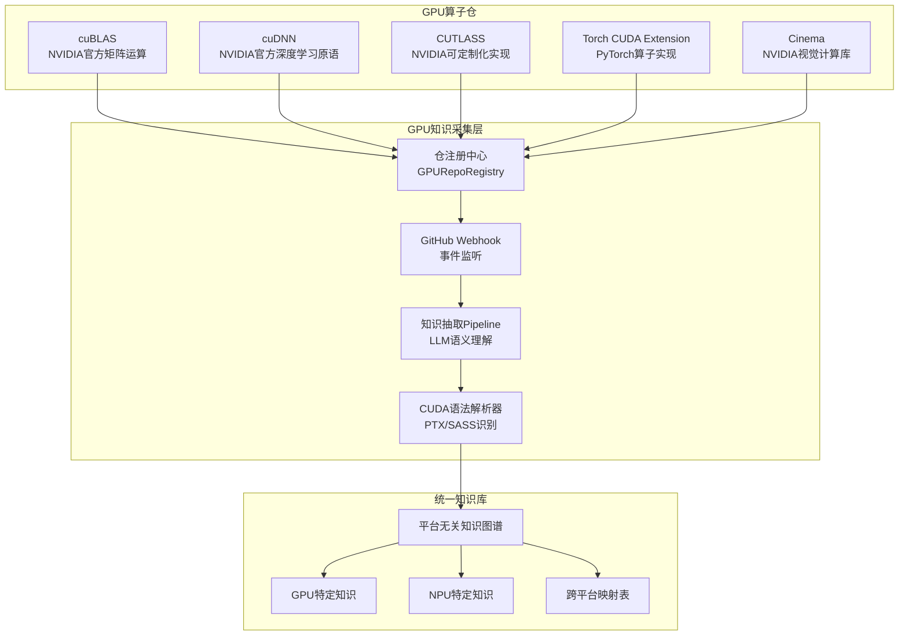
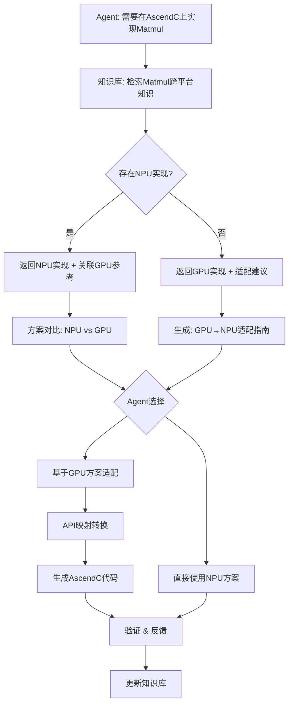
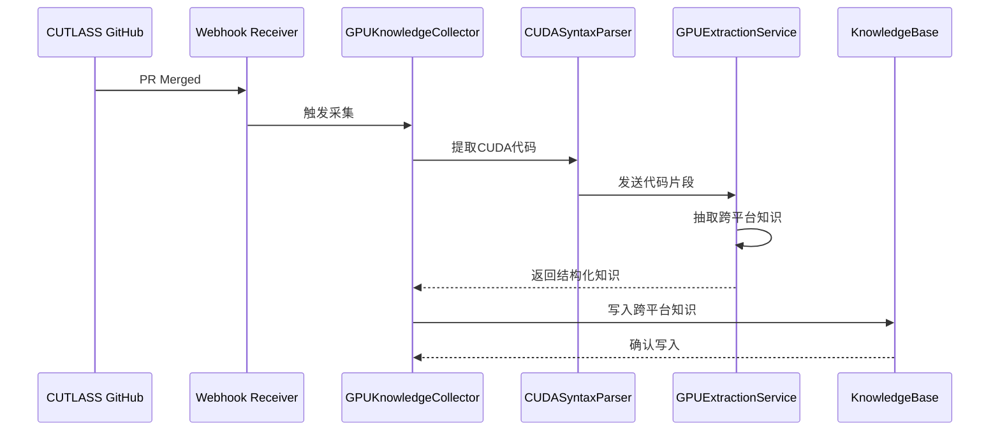

# GPU算子知识采集与GPU→NPU跨平台适配设计方案

**文档版本**: v1.0
**创建日期**: 2026-04-09
**作者**: 首席架构师
**状态**: 已废弃 (被 LLM 驱动的新架构替代)

> ⚠️ **架构变更通知**: 本设计方案描述的 `predefined_mappings.py` 静态映射已被删除。新架构使用 `GPUNPUAnalysisEngine` 通过 LLM 分析 GPU-NPU 代码对，直接存入 ChromaDB + Redis 向量库。详见 `docs/plans/2026-04-17-001-feat-gpu-npu-llm-discovery-plan.md`

---

## 1. 背景与目标

### 1.1 现有能力回顾

当前昇腾AscendC算子知识库已实现：
- 多算子仓支持（昇腾NPU仓）：HierarchicalKV-ascend, fbgemm-ascend, ops-math, ops-nn, ops-transformer, ops-cv
- 原子化算子知识图谱、置信度排序、增量同步、双存储架构
- MCP接口，支持Coding Agent查询

### 1.2 新增需求

**需求一：GPU算子知识采集**
- 采集NVIDIA GPU上实现的算子知识
- 包括CUDA算子实现方案、GPU优化技巧和手段、GPU bug修复方案
- 对接典型GPU算子仓：cuBLAS, cuDNN, CUTLASS, Torch CUDA extension等

**需求二：GPU→NPU跨平台适配场景**
- 核心差异化价值：让Agent在昇腾NPU上实现算子时，能从GPU实现中学习
- 典型场景：Agent需要在昇腾上实现Matmul算子时，先学习GPU上的CUTLASS实现，再在AscendC上适配开发

---

## 2. 核心设计理念

### 2.1 平台无关知识优先

```
设计原则：知识按"平台无关语义"存储，平台特定信息作为元数据附加

┌─────────────────────────────────────────────────────────────┐
│                    平台无关知识层                            │
│  ┌─────────────────────────────────────────────────────┐   │
│  │ 算子语义: Matmul(input[A,B,K], weight[K,C] -> [A,C]) │   │
│  │ 优化模式: 分块计算 + 寄存器分派 + 访存优化            │   │
│  │ 适用场景: 大矩阵乘法、Transformer核心算子            │   │
│  └─────────────────────────────────────────────────────┘   │
│                           │                                 │
│           ┌───────────────┼───────────────┐                │
│           ▼               ▼               ▼                │
│  ┌─────────────┐  ┌─────────────┐  ┌─────────────┐          │
│  │   GPU实现   │  │   NPU实现   │  │  其他平台   │          │
│  │  (CUDA)     │  │  (AscendC)  │  │             │          │
│  └─────────────┘  └─────────────┘  └─────────────┘          │
└─────────────────────────────────────────────────────────────┘
```

### 2.2 适配导向的知识组织

```
目标：知识库不仅回答"是什么"，更回答"如何从GPU迁移到NPU"

查询模式演进：
┌────────────────────────────────────────────────────────────────┐
│ Level 1: GPU知识查询                                           │
│   "CUTLASS是如何实现FP16 Matmul的？"                           │
├────────────────────────────────────────────────────────────────┤
│ Level 2: 跨平台对比                                            │
│   "GPU上的分块策略与AscendC有何差异？"                          │
├────────────────────────────────────────────────────────────────┤
│ Level 3: 适配建议生成                                          │
│   "将CUTLASS优化迁移到AscendC，需要做哪些改动？"               │
└────────────────────────────────────────────────────────────────┘
```

---

## 3. GPU算子仓接入方案

### 3.1 GPU仓接入架构



### 3.2 GPU仓配置

```python
# GPU仓权威性配置
GPU_REPO_CONFIG = {
    # NVIDIA官方仓
    "cuda": {
        "repo_id": "cuda",
        "name": "CUDA Toolkit",
        "repo_url": "https://github.com/NVIDIA/cuda",
        "authority_weight": 1.0,
        "repo_type": "official",
        "language": "CUDA C++",
        "knowledge_types": ["implementation", "optimization", "api_reference"]
    },

    # cuBLAS
    "cublas": {
        "repo_id": "cublas",
        "name": "CUDA Basic Linear Algebra Subprograms",
        "repo_url": "https://github.com/NVIDIA/cuda-blas",
        "authority_weight": 0.95,
        "repo_type": "official",
        "language": "CUDA C++",
        "knowledge_types": ["implementation", "optimization", "benchmark"]
    },

    # cuDNN
    "cudnn": {
        "repo_id": "cudnn",
        "name": "CUDA Deep Neural Network Library",
        "repo_url": "https://github.com/NVIDIA/cudnn-frontend",
        "authority_weight": 0.95,
        "repo_type": "official",
        "language": "CUDA C++",
        "knowledge_types": ["implementation", "optimization", "api_reference"]
    },

    # CUTLASS
    "cutlass": {
        "repo_id": "cutlass",
        "name": "CUDA Templates for Linear Algebra Subroutines",
        "repo_url": "https://github.com/NVIDIA/cutlass",
        "authority_weight": 0.90,
        "repo_type": "official",
        "language": "CUDA C++",
        "knowledge_types": ["implementation", "optimization", "template"],
        "adaptation_value": "high"  # CUTLASS对迁移最有参考价值
    },

    # PyTorch CUDA Extensions
    "torch_cuda": {
        "repo_id": "torch_cuda",
        "name": "PyTorch CUDA Extensions",
        "repo_url": "https://github.com/pytorch/pytorch",
        "authority_weight": 0.85,
        "repo_type": "community",
        "language": "Python + CUDA",
        "knowledge_types": ["implementation", "integration", "最佳实践"]
    }
}
```

### 3.3 采集策略

| GPU仓 | 采集优先级 | 采集内容 | 采集频率 |
|-------|-----------|---------|---------|
| CUTLASS | **P0** | Kernel实现、分块策略、模板参数 | 实时Webhook + 每日全量 |
| cuBLAS | P0 | GEMM实现、精度选项、算子融合 | 实时Webhook + 每周全量 |
| cuDNN | P1 | 卷积算法、内存布局、自动调优 | 实时Webhook + 每周全量 |
| PyTorch | P1 | CUDA扩展实现、算子集成 | 每日增量 |
| CUDA Samples | P2 | 示例代码、最佳实践 | 每月全量 |

### 3.4 新增采集组件

```python
# GPU知识采集Pipeline
class GPUKnowledgeCollector:
    """GPU算子知识采集器"""

    def __init__(self, gpu_repo_config: Dict, llm_client: LLMClient):
        self.repos = GPURepoRegistry(gpu_repo_config)
        self.llm = llm_client
        self.cuda_parser = CUDASyntaxParser()

    async def collect_from_pr(self, pr_event: PullRequestEvent) -> GPUKnowledge:
        """从PR中采集GPU知识"""
        # 1. 判断是否为GPU相关仓
        repo_id = pr_event.repo_id
        if repo_id not in self.repos:
            return None

        # 2. 提取CUDA代码变更
        cuda_changes = self.cuda_parser.extract_cuda_code(pr_event.diff)

        # 3. LLM语义抽取
        extraction = await self.llm.extract_gpu_knowledge(
            title=pr_event.title,
            description=pr_event.description,
            code_changes=cuda_changes,
            platform="cuda"
        )

        # 4. 构建平台无关知识 + GPU特定元数据
        return self.build_cross_platform_knowledge(extraction, pr_event)

    def build_cross_platform_knowledge(
        self,
        extraction: GPUExtraction,
        source: SourceInfo
    ) -> CrossPlatformKnowledge:
        """构建跨平台知识表示"""
        # 提取平台无关语义
        semantic_knowledge = PlatformAgnosticKnowledge(
            operator_name=extraction.operator_name,  # 标准化算子名
            core_algorithm=extraction.algorithm_description,
            optimization_patterns=extraction.patterns,  # 分块/向量化/流水...
            applicable_scenarios=extraction.scenarios,
        )

        # 提取GPU特定实现
        gpu_specific = GPUSpecificKnowledge(
            platform="cuda",
            implementation=extraction.cuda_implementation,
            sm_architecture=extraction.sm_version,  # sm_80/sm_90...
            memory_pattern=extraction.shared_memory_usage,
            warp_utilization=extraction.warp_level_optimization,
            intrinsics_used=extraction.cuda_intrinsics,
        )

        return CrossPlatformKnowledge(
            id=f"gpu_{source.repo_id}_{source.pr_number}_{extraction.operator_name}",
            semantic=semantic_knowledge,
            platform_specific={"cuda": gpu_specific},
            source=source,
            cross_platform_mapping=None  # 待适配时填充
        )
```

### 3.5 GPU知识与NPU知识的存储区分

```python
# 存储分区策略
STORAGE_PARTITIONS = {
    "milvus": {
        # 统一向量Collection，支持混合检索
        "operator_kb": {
            "fields": [
                {"name": "knowledge_id", "type": "VARCHAR", "max_length": 128, "is_primary": True},
                {"name": "embedding", "type": "FLOAT_VECTOR", "dim": 768},
                {"name": "platform", "type": "VARCHAR", "max_length": 16},  # gpu/npu/cross
                {"name": "operator_name", "type": "VARCHAR", "max_length": 64},
                {"name": "canonical_name", "type": "VARCHAR", "max_length": 64},  # 跨平台标准名
                {"name": "category", "type": "VARCHAR", "max_length": 32},
                {"name": "adaptation_difficulty", "type": "FLOAT"},  # 迁移难度评分
                {"name": "updated_at", "type": "BIGINT"}
            ],
            "indexes": [
                {"field": "embedding", "index_type": "IVF_FLAT", "params": {"nlist": 1024}},
                {"field": "platform", "index_type": "STL_SORT"},
                {"field": "canonical_name", "index_type": "INVERTED"}
            ]
        }
    },

    "redis": {
        # Key Pattern扩展，增加平台维度
        "operator": "kb:operator:{platform}:{operator_id}",
        "context": "kb:context:{platform}:{context_id}",
        "mapping": "kb:mapping:{canonical_name}",  # 跨平台映射表
        "gpu_metadata": "kb:gpu:{knowledge_id}",  # GPU特定元数据
        "adaptation": "kb:adapt:{gpu_id}:{npu_id}"  # 适配关系对
    }
}
```

---

## 4. 跨平台知识表示（数据模型）

### 4.1 核心数据模型

```python
# 跨平台知识表示 - 三层结构
@dataclass
class CrossPlatformKnowledge:
    """跨平台统一知识表示"""
    knowledge_id: str
    platform: str  # "gpu" / "npu" / "cross"

    # Layer 1: 平台无关语义（核心）
    semantic: PlatformAgnosticKnowledge

    # Layer 2: 平台特定实现
    platform_specific: Dict[str, PlatformSpecificKnowledge]

    # Layer 3: 跨平台映射（仅跨平台知识有）
    cross_platform_mapping: Optional[CrossPlatformMapping]

    # 元数据
    source: SourceInfo
    confidence: ConfidenceScore
    adaptation_notes: List[AdaptationNote]  # 迁移注意事项


@dataclass
class PlatformAgnosticKnowledge:
    """平台无关的算子语义知识"""
    canonical_name: str  # 跨平台标准算子名，如 "matmul", "conv2d", "layer_norm"
    algorithm_type: str  # "dense", "sparse", "mixture_of_experts"

    # 核心算法描述（平台无关）
    core_algorithm: str
    computational_complexity: str  # "O(n^3)", "O(n^2)"

    # 优化模式（跨平台通用）
    optimization_patterns: List[OptimizationPattern]
    # 例如:
    # - {"pattern": "tiling", "description": "分块计算", "applicability": "universal"}
    # - {"pattern": "vectorization", "description": "向量化", "applicability": "universal"}
    # - {"pattern": "pipeling", "description": "指令流水线", "applicability": "universal"}
    # - {"pattern": "shared_memory_reuse", "description": "共享内存复用", "applicability": "gpu/npu"}

    # 适用场景
    applicable_scenarios: List[str]

    # 输入输出语义
    io_semantics: IOSemantics

    # 已知约束（跨平台）
    constraints: List[str]


@dataclass
class OptimizationPattern:
    """优化模式（平台无关表示）"""
    pattern_id: str
    pattern_name: str
    description: str

    # 适用平台范围
    applicable_platforms: List[str]  # ["gpu", "npu", "cpu"]

    # 效果评估
    expected_benefit: str  # "memory_bandwidth_reduction", "compute_utilization"

    # 实现前提
    prerequisites: List[str]

    # 关键参数
    key_parameters: Dict[str, Any]


@dataclass
class GPUSpecificKnowledge:
    """GPU平台特定知识"""
    platform: str = "cuda"

    # CUDA特定实现
    cuda_implementation: str  # 代码片段
    sm_architecture: str  # "sm_80", "sm_90"

    # GPU优化手段
    memory_pattern: MemoryPattern
    # 例如: {"type": "shared", "size_bytes": 49152, "bank_conflict_strategy": "padding"}

    warp_utilization: WarpUtilization
    # 例如: {"warp_per_sm": 16, "occupancy": 0.75, "register_per_thread": 64}

    tensor_core_usage: Optional[TensorCoreUsage]
    # 例如: {"enabled": True, "shape": "mma_m16n8k16", "precision": "fp16"}

    intrinsics_used: List[str]  # 使用到的CUDA intrinsic

    # 性能数据
    performance_baseline: PerformanceBaseline
    # 例如: {"throughput_tflops": 250, "memory_bandwidth_gbs": 900}


@dataclass
class NPUSpecificKnowledge:
    """NPU平台特定知识（AscendC）"""
    platform: str = "ascend"

    # AscendC特定实现
    ascendc_implementation: str

    # 适配信息
    tiling_strategy: TilingStrategy
    local_memory_usage: LocalMemoryUsage
    vector_processing: VectorProcessingInfo
    cube_calculation: CubeCalculationInfo

    # 性能数据
    performance_baseline: PerformanceBaseline


@dataclass
class CrossPlatformMapping:
    """跨平台知识映射"""
    gpu_to_npu_mapping: Dict[str, str]
    # 例如:
    # {
    #     "threadIdx.x": "GetBlockIdx()",
    #     "shared_memory": "LocalL1Buf()",
    #     "__syncthreads()": "SyncAll()",
    #     "tensor core": "CubeUnit()"
    # }

    # 优化手段对应关系
    optimization_equivalents: List[OptimizationEquivalent]
    # 例如:
    # {
    #     "gpu_pattern": "shared_memory_reuse",
    #     "npu_equivalent": "LocalL1Buf + LocalMemory",
    #     "adaptation_guidance": "将GPU的shared_memory映射到NPU的LocalL1Buf"
    # }

    # 平台差异警告
    platform_differences: List[PlatformDifference]
    # 例如:
    # {
    #     "aspect": "memory_coalescing",
    #     "gpu_approach": "需要手动保证访存合并",
    #     "npu_approach": "UB向量化自动处理",
    #     "warning": "NPU不需要手动处理coalescing"
    # }


@dataclass
class AdaptationNote:
    """适配注意事项"""
    category: str  # "memory", "compute", "sync", "precision"
    severity: str  # "critical", "warning", "info"
    description: str
    gpu_approach: str
    npu_approach: str
    recommendation: str
```

### 4.2 跨平台映射表示

```python
# API映射关系库
@dataclass
class APIMapping:
    """GPU API → NPU API 映射"""
    mapping_id: str

    # GPU端
    gpu_api: GPUAPI
    gpu_api_category: str  # "memory", "compute", "sync", "intrinsic"
    gpu_api_description: str

    # NPU端
    npu_api: NPUAPI
    npu_api_category: str
    npu_api_description: str

    # 映射质量
    equivalence_level: str  # "exact", "similar", "approximate", "no_equivalent"
    adaptation_guidance: str
    example: Optional[str]


# 预定义API映射表（部分示例）
PREDEFINED_API_MAPPINGS = [
    # 内存访问类
    APIMapping(
        mapping_id="shared_memory_to_local_l1",
        gpu_api=GPUAPI(name="__shared__", category="memory"),
        npu_api=NPUAPI(name="LocalL1Buf", category="memory"),
        equivalence_level="similar",
        adaptation_guidance="GPU shared_memory需要手动管理，NPU LocalL1Buf由编译器自动分配"
    ),

    # 同步类
    APIMapping(
        mapping_id="syncthreads_to_sync_all",
        gpu_api=GPUAPI(name="__syncthreads", category="sync"),
        npu_api=NPUAPI(name="SyncAll", category="sync"),
        equivalence_level="exact",
        adaptation_guidance="功能完全等价，直接替换"
    ),

    # 计算类
    APIMapping(
        mapping_id="warp_reduce_to_ub_reduce",
        gpu_api=GPUAPI(name="__reduce_add", category="compute"),
        npu_api=NPUAPI(name="VecReduce", category="compute"),
        equivalence_level="similar",
        adaptation_guidance="GPU warp级别规约对应NPU的UB向量化规约"
    ),

    # TensorCore vs CubeUnit
    APIMapping(
        mapping_id="tensor_core_to_cube_unit",
        gpu_api=GPUAPI(name="mma_m16n8k16", category="compute"),
        npu_api=NPUAPI(name="CubeUnit", category="compute"),
        equivalence_level="similar",
        adaptation_guidance="功能类似，但精度选项和形状有差异"
    )
]
```

---

## 5. 适配辅助功能

### 5.1 核心适配场景

#### 场景一：GPU算子检索 → NPU适配

```
Agent查询：如何在AscendC上实现高性能Matmul？

知识库返回：
┌─────────────────────────────────────────────────────────────────────┐
│ 跨平台Matmul知识                                                    │
├─────────────────────────────────────────────────────────────────────┤
│ 1. CUTLASS FP16 Matmul (GPU) [置信度: 0.95]                        │
│    平台无关优化: 分块计算 + TensorCore加速 + 访存合并               │
│    GPU实现: 基于wmma API的FP16矩阵乘法                              │
│                                                                     │
│    适配建议:                                                        │
│    ✓ 分块策略 → AscendC Tiling策略 (类似)                          │
│    ✓ Tensor Core → Cube Unit (功能等价)                             │
│    ✓ Shared Memory → Local L1 (概念类似，需重新分配)               │
│    ⚠ __syncthreads → SyncAll (需确认同步范围)                      │
│                                                                     │
│ 2. cuBLAS GEMM (GPU) [置信度: 0.92]                                 │
│    平台无关优化: 内存布局转换 + 批量处理                            │
└─────────────────────────────────────────────────────────────────────┘
```

#### 场景二：GPU Bug → NPU预防

```
Agent查询：实现Matmul时遇到过拟合问题？

知识库返回：
┌─────────────────────────────────────────────────────────────────────┐
│ 跨平台Matmul已知问题                                                │
├─────────────────────────────────────────────────────────────────────┤
│ GPU已知问题:                                                        │
│ - CUTLASS #1234: FP16累加精度不足，修复方案：切换到TF32             │
│ - cuBLAS #5678: 内存对齐导致输出错误，修复方案：保证64字节对齐      │
│                                                                     │
│ NPU等效问题:                                                        │
│ - AscendC #asc_001: 相同精度问题，NPU建议使用FP32累加               │
│ - 内存对齐问题在NPU上影响较小（UB自动处理）                         │
└─────────────────────────────────────────────────────────────────────┘
```

### 5.2 适配辅助组件

```python
# 跨平台适配助手
class CrossPlatformAdapter:
    """GPU→NPU适配助手"""

    def __init__(
        self,
        knowledge_base: KnowledgeBase,
        api_mapper: APIMappingEngine,
        llm_client: LLMClient
    ):
        self.kb = knowledge_base
        self.api_mapper = api_mapper
        self.llm = llm_client

    async def generate_adaptation_suggestion(
        self,
        gpu_knowledge_id: str,
        target_platform: str = "ascend"
    ) -> AdaptationSuggestion:
        """生成从GPU知识到目标平台的适配建议"""

        # 1. 获取GPU知识
        gpu_knowledge = await self.kb.get(gpu_knowledge_id)

        # 2. 获取相关NPU知识（如有）
        npu_knowledge = await self.kb.get_by_canonical(
            gpu_knowledge.semantic.canonical_name,
            platform="npu"
        )

        # 3. 查询API映射
        api_mappings = self.api_mapper.get_mappings(
            source_platform="cuda",
            target_platform="ascend",
            apis_used=gpu_knowledge.platform_specific["cuda"].intrinsics_used
        )

        # 4. 生成适配建议
        suggestion = await self.llm.generate_adaptation(
            gpu_impl=gpu_knowledge.platform_specific["cuda"],
            target_platform="ascend",
            api_mappings=api_mappings,
            npu_existing_knowledge=npu_knowledge
        )

        return suggestion

    async def compare_implementations(
        self,
        gpu_id: str,
        npu_id: str
    ) -> ImplementationComparison:
        """对比GPU和NPU实现差异"""

        gpu_impl = await self.kb.get(gpu_id)
        npu_impl = await self.kb.get(npu_id)

        # 提取关键差异
        differences = []

        # 内存访问模式
        gpu_mem = gpu_impl.platform_specific["cuda"].memory_pattern
        npu_mem = npu_impl.platform_specific["ascend"].local_memory_usage
        differences.append(PlatformDifference(
            aspect="memory_access",
            gpu_approach=gpu_mem.describe(),
            npu_approach=npu_mem.describe(),
            equivalence="approximate",
            adaptation_notes="NPU使用UB向量化，自动合并访问"
        ))

        # 计算资源
        gpu_compute = gpu_impl.platform_specific["cuda"].tensor_core_usage
        npu_compute = npu_impl.platform_specific["ascend"].cube_calculation
        differences.append(PlatformDifference(
            aspect="compute_unit",
            gpu_approach=f"Tensor Core {gpu_compute.shape if gpu_compute else 'N/A'}",
            npu_approach=f"Cube Unit {npu_compute.compatibility}",
            equivalence="similar",
            adaptation_notes="形状和精度选项有差异，需要调整"
        ))

        return ImplementationComparison(
            gpu_id=gpu_id,
            npu_id=npu_id,
            canonical_name=gpu_impl.semantic.canonical_name,
            differences=differences,
            summary=f"整体优化思路一致，{len(differences)}个关键差异需要注意"
        )


# API映射引擎
class APIMappingEngine:
    """GPU→NPU API映射引擎"""

    def __init__(self):
        self.mappings = self._load_predefined_mappings()

    def get_mappings(
        self,
        source_platform: str,
        target_platform: str,
        apis_used: List[str]
    ) -> List[APIMappingResult]:
        """获取API映射结果"""

        results = []
        for api in apis_used:
            mapping = self._find_mapping(source_platform, target_platform, api)
            if mapping:
                results.append(APIMappingResult(
                    original_api=api,
                    target_api=mapping.npu_api,
                    equivalence=mapping.equivalence_level,
                    guidance=mapping.adaptation_guidance
                ))
            else:
                results.append(APIMappingResult(
                    original_api=api,
                    target_api=None,
                    equivalence="no_equivalent",
                    guidance="该API在NPU上没有直接对应，需重新实现"
                ))

        return results

    def _find_mapping(
        self,
        source: str,
        target: str,
        api: str
    ) -> Optional[APIMapping]:
        """查找API映射"""
        for mapping in self.mappings:
            if mapping.gpu_api.name == api and mapping.gpu_api.platform == source:
                return mapping
        return None
```

### 5.3 适配工作流



---

## 6. 新增组件清单

### 6.1 组件总览

| 组件 | 优先级 | 职责 |
|------|--------|------|
| GPURepoRegistry | P0 | GPU仓注册与配置管理 |
| GPUKnowledgeCollector | P0 | GPU知识采集Pipeline |
| CUDASyntaxParser | P0 | CUDA代码语法解析 |
| GPUExtractionService | P0 | GPU知识LLM抽取 |
| CrossPlatformKnowledge | P0 | 跨平台知识数据模型 |
| APIMappingEngine | P0 | GPU→NPU API映射 |
| AdaptationHelper | P1 | 适配辅助功能 |
| CrossPlatformRankingService | P1 | 跨平台排序服务 |
| AdaptationSuggestionGenerator | P1 | 适配建议生成 |

### 6.2 组件接口

```python
# GPU仓注册中心
class GPURepoRegistry:
    """GPU算子仓注册中心"""

    def __init__(self, config: Dict[str, GPURepoConfig]):
        self.repos = config

    def register(self, repo_config: GPURepoConfig) -> None:
        """注册新GPU仓"""
        self.repos[repo_config.repo_id] = repo_config

    def get(self, repo_id: str) -> Optional[GPURepoConfig]:
        """获取仓配置"""
        return self.repos.get(repo_id)

    def list_by_priority(self) -> List[GPURepoConfig]:
        """按优先级返回仓列表"""
        return sorted(self.repos.values(), key=lambda x: x.authority_weight, reverse=True)

    def match_webhook_source(self, webhook_source: str) -> Optional[GPURepoConfig]:
        """匹配Webhook来源"""
        for config in self.repos.values():
            if config.repo_url in webhook_source:
                return config
        return None


# GPU知识抽取服务
class GPUExtractionService:
    """GPU知识LLM抽取服务"""

    EXTRACTION_PROMPT = """
从以下GPU算子实现中抽取跨平台知识：

代码实现:
{code_implementation}

请抽取:
1. 算子标准名称（canonical_name）
2. 核心算法描述（平台无关）
3. 优化模式列表（如tiling/vectorization/pipelining等）
4. GPU特定实现细节
5. 可能的NPU等效实现提示
6. 适配注意事项

输出JSON格式。
"""

    async def extract(self, code: str, context: str) -> GPUExtraction:
        """从GPU代码中抽取知识"""
        prompt = self.EXTRACTION_PROMPT.format(
            code_implementation=code,
            context=context
        )

        response = await self.llm.complete(prompt)

        # 解析JSON输出
        result = json.loads(response)

        return GPUExtraction(
            canonical_name=result["canonical_name"],
            algorithm_description=result["algorithm"],
            patterns=[OptimizationPattern(**p) for p in result["patterns"]],
            gpu_specific=GPUSpecificInfo(**result["gpu_specific"]),
            npu_hints=result.get("npu_hints", []),
            adaptation_notes=result.get("adaptation_notes", [])
        )
```

### 6.3 存储层扩展

```python
# 统一存储层扩展
class UnifiedStorageLayer:
    """统一存储层（支持GPU+NPU知识）"""

    # 新增Collection
    COLLECTIONS = {
        # 跨平台统一向量Collection
        "cross_platform_kb": {
            "fields": [
                {"name": "knowledge_id", "type": "VARCHAR", "max_length": 128, "is_primary": True},
                {"name": "embedding", "type": "FLOAT_VECTOR", "dim": 768},
                {"name": "platform", "type": "VARCHAR", "max_length": 16},  # gpu/npu/cross
                {"name": "canonical_name", "type": "VARCHAR", "max_length": 64},
                {"name": "operator_category", "type": "VARCHAR", "max_length": 32},
                {"name": "adaptation_difficulty", "type": "FLOAT"},
                {"name": "quality_score", "type": "FLOAT"},
                {"name": "updated_at", "type": "BIGINT"}
            ]
        },

        # API映射表
        "api_mappings": {
            "fields": [
                {"name": "mapping_id", "type": "VARCHAR", "max_length": 64, "is_primary": True},
                {"name": "gpu_api", "type": "VARCHAR", "max_length": 128},
                {"name": "npu_api", "type": "VARCHAR", "max_length": 128},
                {"name": "equivalence_level", "type": "VARCHAR", "max_length": 32},
                {"name": "embedding", "type": "FLOAT_VECTOR", "dim": 768}
            ]
        }
    }

    # 新增Redis Key Pattern
    REDIS_KEYS = {
        "gpu_metadata": "kb:gpu:{knowledge_id}",  # GPU特定元数据
        "npu_metadata": "kb:npu:{knowledge_id}",  # NPU特定元数据
        "cross_mapping": "kb:mapping:{canonical_name}",  # 跨平台映射
        "adaptation_pairs": "kb:adapt:pairs:{gpu_id}",  # 某GPU知识的适配历史
        "api_equivalence": "kb:api:equiv:{api_name}"  # API等价类
    }
```

---

## 7. 关键设计决策

### 7.1 设计决策汇总

| 决策点 | 选择 | 理由 |
|--------|------|------|
| **GPU知识存储** | 与NPU知识统一存储，按platform字段区分 | 便于跨平台联合检索，避免数据重复 |
| **平台无关知识** | 优先抽取和存储平台无关语义 | 最大化知识复用性，支持多平台适配 |
| **API映射** | 预定义+LLM增强混合模式 | 预定义保证准确性，LLM增强覆盖长尾 |
| **适配建议生成** | LLM基于知识库上下文生成 | 灵活应对多样化适配场景 |
| **GPU知识采集** | CUTLASS优先（适配价值最高） | CUTLASS的模板化实现最易迁移到AscendC |
| **GPU仓接入** | Webhook实时+定时全量 | 保证知识实时性，同时支持全量知识补全 |

### 7.2 决策理由详述

#### 决策1：统一存储 vs 分区存储

**选择：统一存储（platform字段区分）**

```python
# 统一存储示例
{
    "knowledge_id": "matmul_001",
    "canonical_name": "matmul",
    "platform": "gpu",  # 或 "npu"
    "embedding": [...],
    # GPU知识存储在Redis: kb:gpu:matmul_001
    # NPU知识存储在Redis: kb:npu:matmul_001
}
```

**理由**：
1. **联合检索需求**：Agent查询时需要同时返回GPU和NPU实现，统一索引更高效
2. **映射关系简化**：跨平台知识天然关联，统一存储便于维护映射表
3. **避免数据重复**：相同算子的平台无关知识不需要重复存储

#### 决策2：API映射策略

**选择：预定义核心映射 + LLM增强覆盖长尾**

```python
# 预定义核心映射（高准确性）
CORE_API_MAPPINGS = [
    ("__shared__", "LocalL1Buf", "similar"),
    ("__syncthreads", "SyncAll", "exact"),
    ("wmma::load_matrix_sync", "Load2D", "similar"),
    # ... 50+ 核心映射
]

# LLM增强映射（覆盖长尾）
async def enhance_mapping(unmapped_api: str) -> Optional[APIMapping]:
    """LLM推断可能的NPU等效API"""
    prompt = f"""
    GPU API '{unmapped_api}' 在AscendC中的等效API是什么？
    如果没有直接等效，给出最接近的替代方案。
    """
```

**理由**：
1. **准确性保障**：核心API映射需保证100%正确，预定义最可靠
2. **覆盖度提升**：LLM可处理预定义中未收录的长尾API
3. **持续演进**：新GPU API出现时，LLM可快速推断映射

#### 决策3：CUTLASS优先采集

**选择：CUTLASS作为P0采集目标**

**理由**：
1. **模板化实现**：CUTLASS使用C++模板封装，算法逻辑清晰，易于提取
2. **高度可定制**：用户可基于CUTLASS模板快速定制算子，与AscendC开发模式相似
3. **优化策略丰富**：包含分块、流水线、共享内存等多种优化手段
4. **学术界认可**：大量GPU优化研究基于CUTLASS，参考价值高

---

## 8. 实施阶段

### 8.1 阶段划分

| 阶段 | 内容 | 交付物 | 人天 |
|------|------|--------|------|
| **Phase G1** | GPU知识采集基础设施 | GPURepoRegistry, GPUKnowledgeCollector, CUDASyntaxParser | 21人天 |
| **Phase G2** | CUTLASS知识采集（P0） | CUTLASS 50+核心Kernel知识 | 14人天 |
| **Phase G3** | 跨平台知识模型 | CrossPlatformKnowledge, APIMappingEngine | 14人天 |
| **Phase G4** | 适配辅助功能 | AdaptationHelper, 适配建议生成 | 21人天 |
| **Phase G5** | 其他GPU仓扩展 | cuBLAS, cuDNN, PyTorch知识采集 | 21人天 |
| **合计** | - | - | **91人天** |

### 8.2 Phase G1 详细计划

**目标**: 建立GPU知识采集基础设施

**交付物**:
1. GPU仓注册中心（GPURepoRegistry）
2. GPU知识采集Pipeline
3. CUDA语法解析器
4. GPUExtractionService
5. 存储层扩展

**实施任务**:

| 任务 | 工作量 | 说明 |
|------|--------|------|
| GPURepoRegistry实现 | 3人天 | 仓配置管理、Webhook源匹配 |
| GPUKnowledgeCollector实现 | 5人天 | PR事件处理、知识抽取流程 |
| CUDASyntaxParser实现 | 5人天 | CUDA代码解析、PTX识别 |
| GPUExtractionService实现 | 5人天 | LLM抽取Prompt、解析逻辑 |
| 存储层适配 | 3人天 | Collection创建、Redis Key扩展 |

### 8.3 典型采集流程



---

## 9. API扩展

### 9.1 MCP工具扩展

```typescript
// 新增GPU相关MCP工具
const GPU_TOOLS = {
  // GPU知识查询
  query_gpu_knowledge: {
    name: "query_gpu_knowledge",
    description: "查询NVIDIA GPU算子实现知识",
    inputSchema: {
      type: "object",
      properties: {
        query: { type: "string", description: "查询意图" },
        gpu_repo: {
          type: "string",
          enum: ["cutlass", "cublas", "cudnn", "torch_cuda"],
          description: "指定GPU仓"
        },
        canonical_name: { type: "string", description: "标准算子名" }
      },
      required: ["query"]
    }
  },

  // 跨平台适配查询
  query_cross_platform: {
    name: "query_cross_platform",
    description: "查询GPU→NPU跨平台适配知识",
    inputSchema: {
      type: "object",
      properties: {
        operator_name: { type: "string", description: "算子名称" },
        adaptation_mode: {
          type: "string",
          enum: ["gpu_to_npu", "npu_to_gpu", "compare"],
          default: "gpu_to_npu"
        }
      },
      required: ["operator_name"]
    }
  },

  // 获取适配建议
  get_adaptation_suggestion: {
    name: "get_adaptation_suggestion",
    description: "生成GPU实现到NPU的适配建议",
    inputSchema: {
      type: "object",
      properties: {
        gpu_knowledge_id: { type: "string" },
        target_platform: { type: "string", default: "ascend" }
      },
      required: ["gpu_knowledge_id"]
    }
  },

  // API映射查询
  query_api_mapping: {
    name: "query_api_mapping",
    description: "查询GPU API到NPU API的映射",
    inputSchema: {
      type: "object",
      properties: {
        api_name: { type: "string", description: "GPU API名称" },
        direction: {
          type: "string",
          enum: ["gpu_to_npu", "npu_to_gpu"],
          default: "gpu_to_npu"
        }
      },
      required: ["api_name"]
    }
  }
};
```

### 9.2 Python Client扩展

```python
from ascend_kb import AscendKBClient

client = AscendKBClient(endpoint="http://localhost:8080", mcp_mode=True)

# GPU知识查询
gpu_results = client.query_gpu(
    "CUTLASS是如何实现FP16 Matmul分块的？",
    gpu_repo="cutlass"
)

# 跨平台查询
cross_results = client.query_cross_platform(
    operator_name="matmul",
    adaptation_mode="gpu_to_npu"
)

# 获取适配建议
suggestion = client.get_adaptation_suggestion(
    gpu_knowledge_id="cutlass_matmul_fp16_001"
)

# API映射查询
mapping = client.query_api_mapping(
    api_name="__shared__",
    direction="gpu_to_npu"
)
```

---

## 10. 预期效果

### 10.1 核心价值

```
┌─────────────────────────────────────────────────────────────────────┐
│                    知识库核心价值扩展                                 │
├─────────────────────────────────────────────────────────────────────┤
│                                                                     │
│  原有价值:                                                          │
│  "Agent在昇腾NPU上实现算子时，能检索昇腾知识"                         │
│                                                                     │
│  新增价值:                                                          │
│  "Agent在昇腾NPU上实现算子时，能从NVIDIA GPU实现中学习"               │
│                                                                     │
│  差异化优势:                                                        │
│  • GPU优化经验 70年+ 积累（cuBLAS/cuDNN/CUTLASS）                    │
│  • 学术界前沿优化研究（基于CUDA）                                    │
│  • 快速适配到AscendC的成熟路径                                       │
│                                                                     │
└─────────────────────────────────────────────────────────────────────┘
```

### 10.2 验收标准

| 指标 | 目标值 | 说明 |
|------|--------|------|
| GPU知识覆盖率 | CUTLASS Top-50 Kernel全覆盖 | 覆盖主流算子类型 |
| 适配建议准确率 | > 85% | LLM+规则混合评估 |
| API映射覆盖率 | > 90% | 核心API预定义全覆盖 |
| 跨平台检索延迟 | < 300ms | P99 |

---

## 11. 术语表

| 术语 | 定义 |
|------|------|
| CUTLASS | NVIDIA CUDA Templates for Linear Algebra Subroutines |
| cuBLAS | NVIDIA CUDA Basic Linear Algebra Subprograms |
| cuDNN | NVIDIA CUDA Deep Neural Network Library |
| 平台无关知识 | 不依赖特定硬件平台的知识，如算法描述、优化模式 |
| API映射 | GPU API到NPU API的功能对应关系 |
| 适配建议 | 基于GPU实现生成的NPU迁移指导 |

---

## 12. 参考资料

- [CUTLASS Repository](https://github.com/NVIDIA/cutlass)
- [cuBLAS Documentation](https://docs.nvidia.com/cublas/)
- [cuDNN Documentation](https://docs.nvidia.com/deeplearning/cudnn/)
- [AscendC Documentation](https://www.hiascend.com/document)

---

**文档结束**

*本文档使用中文编写，采用mermaid图表格式*
