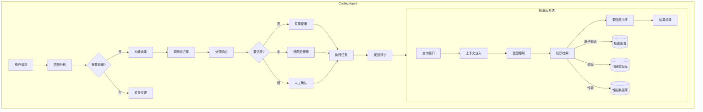

# Ideation: 昇腾AscendC算子Agent知识库

## 项目背景

**目标**: 构建昇腾AscendC算子优化知识库，为Claude Code/Codex/Cursor等Coding Agent提供外部知识源

**核心约束**:
1. 知识库需跟随昇腾算子仓更新持续迭代
2. 框架解耦——可对接不同Coding Agent框架

**知识来源**: 昇腾算子代码仓的PR提交和具体代码实现

---

## Codebase Context

本项目为全新项目（greenfield），无现有代码可扫描。

用户背景（来源: CLAUDE.md）:
- 用户有多个昇腾相关项目: aihub、ngo、pta、torchair等
- 有丰富的昇腾生态经验
- 熟悉AscendC算子开发

---

## Ranked Ideas

### 1. 原子化算子知识图谱
**Description:** 以昇腾AscendC算子为核心节点，构建"问题上下文 + 代码变更 + 效果指标"三层结构的异构图谱，支持图推理和向量检索双重能力

**Rationale:** 这是知识库的**战略核心**，所有上层检索应用都依赖图谱提供的结构化知识。一旦建成，将成为项目的核心竞争力

**Downsides:** 设计复杂度高，冷启动需要大量人工标注；建议初期简化为"算子+上下文"两层逐步演进

**Confidence:** 90%
**Complexity:** High
**Status:** Unexplored
**Priority:** P0

---

### 2. 置信度感知排序层
**Description:** 基于来源权威性（昇腾官方PR > 社区贡献）、时效性（距上次更新时间）、准确性（用户反馈纠错率）多维度计算置信度分数，对检索结果进行智能排序

**Rationale:** 直接决定Coding Agent感知到的检索质量；是用户体验的核心保障，低质量知识会严重误导Agent

**Downsides:** 权威性评估标准难以统一定义，权重调参需要持续迭代优化

**Confidence:** 85%
**Complexity:** Medium
**Status:** Unexplored
**Priority:** P0

---

### 3. 增量知识同步管道
**Description:** Webhook实时触发 + PR语义抽取（自动识别"优化措施"和"bug修复"两类知识）+ 差量同步推送，确保知识库准实时跟随昇腾仓更新

**Rationale:** 知识库的"生命力"所在；缺失此能力则知识库会逐渐过时，无法满足"持续迭代积累"的核心要求

**Downsides:** PR语义抽取准确率不稳定（昇腾PR描述质量参差不齐），需要人工兜底机制

**Confidence:** 80%
**Complexity:** Medium
**Status:** Unexplored
**Priority:** P0

---

### 4. 双存储架构
**Description:** 向量库（如Milvus/Pinecone）存储语义嵌入支持相似性检索，KV存储（如Redis）精确存储代码片段、PR元数据和算子属性

**Rationale:** 工程可行性强，ROI高；暂不引入图数据库以控制复杂度；混合存储架构已被Pinterest、Stripe等公司验证

**Downsides:** 跨存储关联查询需要两层逻辑，完整图数据库能力暂缺

**Confidence:** 75%
**Complexity:** Medium
**Status:** Unexplored
**Priority:** P1

---

### 5. 知识质量评分体系
**Description:** 引用频率（被Agent调用次数）+ 时效性（距上次更新时间）+ 准确性（用户反馈纠错率）三维评分，作为置信度排序的数据源，实现知识的自动质量管控

**Rationale:** 为置信度排序提供量化依据；支持知识的自我优化和良性新陈代谢

**Downsides:** 评分机制可能被gaming（如刷调用次数）；"准确性"维度难以完全自动化评估

**Confidence:** 70%
**Complexity:** Medium
**Status:** Unexplored
**Priority:** P1

---

## Recommended Architecture

```
                    ┌─────────────────────────────────────────┐
                    │         Coding Agent (客户端)           │
                    │   Claude Code / Codex / Cursor 等        │
                    └─────────────────┬───────────────────────┘
                                      │ 请求/响应
                                      ▼
                    ┌─────────────────────────────────────────┐
                    │     置信度感知排序层 (P0) + 质量评分     │
                    │  多维排序：权威性 × 时效性 × 准确性       │
                    └─────────────────┬───────────────────────┘
                                      │
           ┌──────────────────────────┼──────────────────────────┐
           │                          │                          │
           ▼                          ▼                          ▼
┌─────────────────────┐    ┌─────────────────────┐    ┌─────────────────────┐
│   双存储架构 (P1)   │    │   原子化算子图谱(P0) │    │  增量同步管道 (P0)  │
│  ┌────────┬───────┐│    │  ┌────────────────┐  │    │  ┌────────────────┐  │
│  │向量库  │ KV存储││    │  │ 算子节点+上下文 │  │    │  │ Webhook触发   │  │
│  │(Embedding)    ││    │  │ (未来: 变更+效果)│  │    │  │ PR语义抽取    │  │
│  └────────┴───────┘│    │  └────────────────┘  │    │  └────────────────┘  │
│                     │    │         │            │    │          │          │
└─────────────────────┘    └─────────┼────────────┘    └──────────┼──────────┘
                                      │                          │
                                      ▼                          ▼
                           ┌──────────────────────────────────────────┐
                           │           昇腾AscendC算子仓               │
                           │     (GitLab/Gitea Webhook + 定时Polling)  │
                           └──────────────────────────────────────────┘
```

---

## Rejection Summary

| # | Idea | Reason Rejected |
|---|------|-----------------|
| 1 | 自适应知识路由层 | 框架无关是伪需求——昇腾知识库天然绑定昇腾生态；LLM意图路由增加不必要延迟和失败点 |
| 2 | PR溯源知识图谱 | 昇腾仓历史10万+ PR，DAG构建成本指数级增长；PR语义关联难以自动抽取 |
| 3 | 版本化知识快照 | 存储成本高（50+版本快照/年）；版本迁移场景覆盖有限 |
| 4 | 联邦知识查询聚合 | 单组织内部知识库无需分布式设计；CAP取舍引入不必要复杂度 |
| 5 | 流式增量注入协议 | 与Coding Agent请求-响应范式不匹配；流式一致性保证成本高 |
| 6 | 失效知识墓园与周年归档 | 长期运维能力，P2优先级；归档知识几乎不会被查询 |
| 7 | 社区反馈闭环驱动迭代 | 内部项目难以获得有质量反馈；恶意反馈防御成本高 |
| 8 | 代码模板抽象 | 需要大量标注数据训练领域模型；抽象过程信息损失风险高 |

---

## Implementation Roadmap

### 方案依赖关系与拓扑排序

```
Phase 1 (独立)          Phase 2 (并行)           Phase 3        Phase 4
┌──────────────────┐    ┌──────────────────┐
│ P1 双存储架构    │    │ P0 原子化算子    │    P0 置信度     P1 质量评分
│ (Milvus+Redis)   │───►│ 知识图谱         │──┐   排序层        体系
└──────────────────┘    └──────────────────┘  │
                                             │  │
                    ┌────────────────────────┘  │
                    │ P0 增量同步管道            │
                    └────────────────────────────┘
```

### 实施阶段划分

| 阶段 | 内容 | 人天 | 交付物 |
|------|------|------|--------|
| **Phase 1** | 双存储架构搭建 | 14人天 | Milvus + Redis 部署完成，Schema定义 |
| **Phase 2a** | 原子化算子知识图谱 | 21人天 | 50+核心算子知识，冷启动数据就绪 |
| **Phase 2b** | 增量知识同步管道 | 21人天 | Webhook + PR语义抽取 + 差量同步 |
| **Phase 3** | 置信度感知排序层 | 14人天 | 三维度排序服务（权威性×时效性×准确性） |
| **Phase 4** | 知识质量评分体系 | 14人天 | 引用追踪 + 反馈API + Dashboard |
| **合计** | - | **84人天** | - |

### MVP 验收标准

- [ ] 向量检索延迟 < 200ms（P99）
- [ ] 单次查询返回 Top-5 相关知识
- [ ] 冷启动知识条目 >= 50条
- [ ] API接口可用率 >= 99.9%
- [ ] 基础置信度排序生效

### 技术选型

| 组件 | 推荐选型 | 备选方案 |
|------|----------|----------|
| 向量库 | **Milvus** (本地部署) | Qdrant |
| KV存储 | **Redis** | RocksDB |
| 图数据库 | 暂不引入（预留接口） | Neo4j |
| LLM抽取 | API调用 (Phase2冷启动) | 本地模型 (后期) |

### 关键里程碑

| 里程碑 | 日期 | 验收条件 |
|--------|------|----------|
| M1: 存储基础设施就绪 | 2026-04-28 | Milvus + Redis 部署完成 |
| M2: MVP可用 | 2026-06-04 | 支持Agent查询，返回排序结果 |
| M3: 全面上线 | 2026-06-18 | 增量同步正常运行 |
| M4: 知识库自洽 | 2026-09-01 | 知识条目 >= 500，月活 >= 1000次 |

### 核心风险与缓解

| 风险 | 等级 | 缓解策略 |
|------|------|----------|
| PR语义抽取准确率低 | **高** | 多层兜底（API抽取+规则过滤+人工审核5%） |
| 冷启动数据质量差 | **高** | 双重验证（自动化+人工）+ 灰度上线 |
| 排序权重调参困难 | 中 | AB测试框架 + 渐进式调整 |

---

## Session Log

- 2026-04-09: Initial ideation — 30+ candidates generated, 5 core ideas survived (P0: 3, P1: 2)
- 候选方案来源: 4个Ideation Sub-Agent（知识获取/知识表示/Agent集成/持续迭代）
- 评审方法: 对抗性过滤 + 跨方案综合
- 2026-04-09: 细化实施路径 — 84人天Roadmap，4阶段划分，MVP定义

---

## Agent 使用体验设计

### 1. 算子实现四阶段与知识库介入

```
┌─────────────────────────────────────────────────────────────────────┐
│                     算子实现生命周期                                  │
├─────────────┬─────────────┬─────────────┬─────────────┬─────────────┤
│   需求理解   │   方案设计   │   代码实现   │   测试验证   │   持续优化   │
└──────┬──────┴──────┬──────┴──────┬──────┴──────┬──────┴──────┬──────┘
       ▼             ▼             ▼             ▼             ▼
   ┌─────────────────────────────────────────────────────────────────┐
   │                      知识库介入点                                 │
   │  原子知识查询   设计模式推荐   实现模板检索   测试用例匹配   性能基准对比  │
   └─────────────────────────────────────────────────────────────────┘
```

| 阶段 | 知识库介入方式 | 触发方式 | 返回形式 |
|------|---------------|---------|---------|
| 需求理解 | 相似算子检索、原子组件图谱 | 主动查询+语义推荐 | 算子列表+组件索引 |
| 方案设计 | 设计模式推荐、性能基线参考 | 主动查询+上下文推荐 | 结构化建议+代码片段 |
| 代码实现 | 代码模板检索、API参数补全 | 实时补全+上下文推荐 | 代码模板+参数配置 |
| 测试验证 | 测试框架模板、黄金数据匹配 | 主动查询 | 测试用例+验证脚本 |

---

### 2. 交互模式：混合模式（推荐）

```
                    Agent                         知识库
                      │                             │
                      │──── query_request ─────────►│  主动查询
                      │◄─── query_response ─────────│  同步返回
                      │                             │
    上下文变更 ───────►│  上下文检测                  │
                      │──── async recommend ────────►│  被动推荐
                      │◄─── recommendation ─────────│  异步推送
```

**为什么选择混合模式？**
- 纯主动查询：Agent 可能不知道需要查询什么
- 纯被动推荐：噪音过多，可能干扰 Agent
- 混合模式：双重确认，减少遗漏

---

### 3. 接口协议：MCP 优先

| 协议 | 优势 | 劣势 | 推荐指数 |
|------|------|------|----------|
| **MCP** | 工具原生、支持流式、上下文丰富 | 需要 Agent 端支持 | ⭐⭐⭐⭐⭐ |
| REST API | 通用性强、易调试 | 延迟较高、功能受限 | ⭐⭐⭐ |
| gRPC | 高性能、类型安全 | 需要 protobuf 定义 | ⭐⭐⭐⭐ |

**MCP 工具定义示例**：

```typescript
// 知识库 MCP 工具
const TOOLS = {
  query_atomic_knowledge: {
    name: "query_atomic_knowledge",
    description: "查询昇腾AscendC原子化算子知识图谱",
    inputSchema: {
      type: "object",
      properties: {
        query: { type: "string", description: "查询意图描述" },
        domain: {
          type: "string",
          enum: ["vector", "matrix", "reduction", "activation", "attention"],
          description: "算子领域分类"
        },
        filters: {
          min_confidence: { type: "number", default: 0.7 },
          max_results: { type: "number", default: 10 }
        }
      },
      required: ["query"]
    }
  },

  retrieve_code_template: {
    name: "retrieve_code_template",
    description: "检索可直接使用的AscendC代码模板",
    inputSchema: {
      type: "object",
      properties: {
        template_type: {
          type: "string",
          enum: ["kernel", "manager", "test", "benchmark"]
        },
        pattern: { type: "string", description: "模板模式描述" },
        params: { type: "object", description: "模板参数" }
      },
      required: ["template_type"]
    }
  },

  recommend_design_pattern: {
    name: "recommend_design_pattern",
    description: "根据当前上下文推荐算子设计方案",
    inputSchema: {
      type: "object",
      properties: {
        operator_spec: { type: "object", description: "算子规格描述" },
        constraints: { type: "object", description: "设计约束条件" },
        context: { type: "object", description: "当前实现上下文" }
      },
      required: ["operator_spec"]
    }
  },

  query_performance_baseline: {
    name: "query_performance_baseline",
    description: "查询类似算子的性能基准数据",
    inputSchema: {
      type: "object",
      properties: {
        operator_type: { type: "string" },
        hardware_config: { type: "object" },
        metrics: { type: "array", items: { type: "string" }, default: ["throughput", "latency"] }
      },
      required: ["operator_type"]
    }
  }
};
```

---

### 4. 返回结果：四级渐进式披露

```
L1 原始知识条目  ──►  L2 结构化优化建议  ──►  L3 代码模板  ──►  L4 完整方案
   描述+代码           改进点+理由            可嵌入代码        可直接编译
   可追溯              结构化输出            带占位符          零改动使用
```

```python
# L1: 原始知识条目
@dataclass
class KnowledgeEntry:
    id: str
    type: str  # atomic | composite | pattern
    content: {
        description: str,
        code_snippets: List[CodeSnippet],
        references: List[Reference]
    }
    metadata: {
        confidence: float,
        source: str,
        last_updated: str,
        verified: bool
    }

# L3: 代码模板（可直接使用）
@dataclass
class CodeTemplate:
    id: str
    name: str
    category: str  # kernel | manager | test | benchmark
    code: str  # 模板代码
    parameters: List[Parameter]  # 参数定义
    usage_steps: List[str]  # 使用步骤
    compatibility: {
        ascendc_versions: List[str],
        hardware_targets: List[str]
    }
```

---

### 5. 典型使用场景

#### 场景一：相似算子参考检索

```
Agent 需要实现 LayerNorm 算子，不确定最佳实现方式

Agent ──► query_atomic_knowledge(query="LayerNorm 实现", domain="normalization")
          │
          ▼
知识库返回：BatchNorm (0.92) > InstanceNorm (0.81) > RMSNorm (0.75)

Agent ──► retrieve_code_template(template_type="kernel", pattern="normalization")
          │
          ▼
知识库返回：BatchNorm Kernel 模板 + 适配建议
           • LayerNorm 需要对最后一个维度归一化
           • gamma/beta 参数形状不同
           • 建议复用统计量计算逻辑
```

#### 场景二：上下文感知的实时补全

```
Agent 正在编写 Matmul 内存管理代码：
    Tensor* input = queue.GmAlloc();

知识库检测到上下文变更，分析最佳实践

知识库返回推荐：
    1. Add error handling (高置信度 0.94)
       if (input == nullptr) {
           KERNEL_LOG_ERROR("Failed to allocate input tensor");
           return false;
       }

    2. Use aligned allocation (中置信度 0.87)
       // 确保64字节对齐以优化Vector计算
```

#### 场景三：设计阶段的多方案对比

```
Agent 准备设计 Multi-Head Attention 算子

Agent ──► recommend_design_pattern(
              operator_spec: {name: "MultiHeadAttention", input_shape: [...]},
              constraints: {memory_limit: "16GB", latency_target: "<5ms"}
          )
          │
          ▼
知识库返回：
┌─────────────────────────────────────────────────────────┐
│ 设计方案对比                                              │
├─────────────────┬─────────────────┬────────────────────┤
│ FlashAttention  │ Memory-Efficient│ Standard MHA       │
│ (推荐)          │ Attention       │                    │
├─────────────────┼─────────────────┼────────────────────┤
│ 延迟: 3.0-3.5ms │ 延迟: 4.0-4.5ms │ 延迟: 8.5ms        │
│ 内存: O(sqrt(N))│ 内存: O(N)      │ 内存: O(N²)        │
│ 置信度: 0.91    │ 置信度: 0.85    │ 置信度: 0.72       │
└─────────────────┴─────────────────┴────────────────────┘
```

---

### 6. 端到端交互流程



---

### 7. Python Client 接口

```python
from ascend_kb import AscendKBClient

# 初始化客户端（支持 MCP 模式）
client = AscendKBClient(endpoint="http://localhost:8080", mcp_mode=True)

# 同步查询
results = client.query(
    "Matmul算子的tiling策略",
    domain="matrix",
    filters={"min_confidence": 0.8}
)

# 检索代码模板
templates = client.retrieve_template(
    template_type="kernel",
    pattern="matmul_tiling",
    params={"tile_size": 64}
)

# 获取设计建议
suggestion = client.get_design_recommendation(
    context={"operator": "Attention", "input_shape": [seq, batch, heads, dim]},
    constraints={"latency_target": "5ms"}
)

# 提交反馈
client.submit_feedback(
    query_id=query.id,
    entry_id=result.id,
    action="used",
    rating=5
)
```

---

### 8. 核心设计决策

| 决策点 | 选择 | 理由 |
|--------|------|------|
| 交互模式 | **混合模式** | 平衡精确性与覆盖率 |
| 接口协议 | **MCP优先** | 与 Agent 工作流原生契合 |
| 返回粒度 | **L1-L4渐进** | 支持不同场景需求 |
| 置信度策略 | **软排序+阈值** | 保留多样性，Agent 有最终决定权 |
| 知识组织 | **原子化图谱** | 灵活组合，支持精确匹配和语义扩展 |

---

## Session Log

- 2026-04-09: Initial ideation — 30+ candidates generated, 5 core ideas survived (P0: 3, P1: 2)
- 候选方案来源: 4个Ideation Sub-Agent（知识获取/知识表示/Agent集成/持续迭代）
- 评审方法: 对抗性过滤 + 跨方案综合
- 2026-04-09: 细化实施路径 — 84人天Roadmap，4阶段划分，MVP定义
- 2026-04-09: 深化使用体验 — Agent交互模式、MCP协议、四级返回、典型场景

---

## Next Steps

1. **brainstorm a selected idea** — 选择一个方案进行深度定义
2. **refine the ideation** — 补充更多方案或重新评估
3. **share to Proof** — 分享文档给团队
4. **end the session** — 结束本次构思

---

*Generated by ce-ideate workflow*
