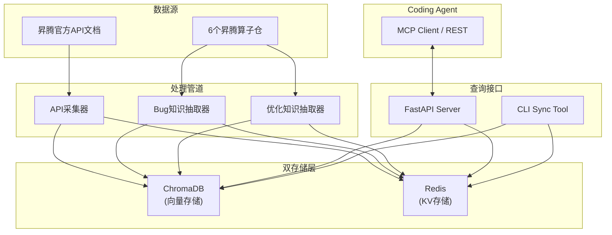
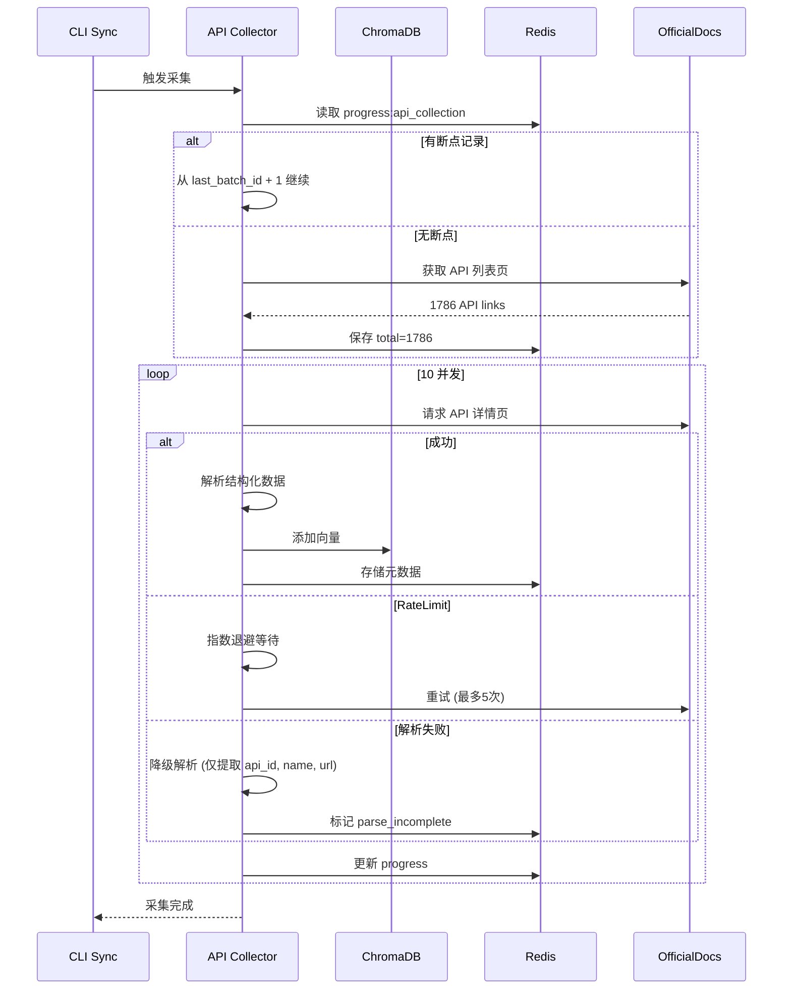

# AscendC Operator Knowledge Base - Implementation Plan

## Overview

实现面向 Coding Agent 的昇腾 AscendC 算子知识检索系统。系统通过 ChromaDB (向量存储) + Redis (KV存储) 双存储架构，提供 API 知识查询、Bug 修复知识查询、优化知识查询三大核心功能，支持 CLI 触发增量同步。

**来源文档**: `docs/brainstorms/2026-04-10-complete-design-requirements.md` (v1.0, 2026-04-10)

---

## Problem Frame

当前设计文档完备，但核心代码未实现。需要在已有骨架 (`src/asc_ops/`) 基础上，完成：
1. 双存储架构搭建 (ChromaDB + Redis)
2. API 知识采集与索引 (1786+ API)
3. 增量同步管道 (CLI 触发)
4. 置信度排序层
5. 质量评分体系
6. Bug/优化知识抽取与查询

---

## Requirements Trace

- **R1**: API 知识库 - 从昇腾官方文档采集 1786+ API 定义，存储到 ChromaDB + Redis，支持精确查询和语义搜索
- **R2**: Bug 修复知识库 - 从 PR/commit 中抽取 Bug 修复知识 (根因、触发条件、修复方案)，≥200 条
- **R3**: 优化知识库 - 从 PR/commit 中抽取优化知识 (优化类型、量化指标)，≥100 条
- **R4**: 主动查询接口 - Agent 开发前查询 Bug 注意事项和优化经验
- **R5**: 被动查询接口 - Agent 遇问题时查询可能原因和建议检查项
- **R6**: CLI 同步接口 - 支持 `python -m ascend_kb sync --api/--operator/--all` 手动触发增量同步
- **R7**: 置信度排序 - 基于完整度、来源、时效性计算置信度，结果按权重排序
- **R8**: Agent 集成 - 支持 MCP 协议或 REST API 供 Coding Agent 调用

---

## Scope Boundaries

**在范围内:**
- ChromaDB + Redis 双存储架构
- API 采集稳定性设计 (重试、降级、限速、断点续采)
- Bug/优化知识抽取与存储
- CLI 同步工具
- FastAPI 查询接口
- 置信度排序

**不在范围内:**
- GPU 算子知识采集 (规划中)
- 跨平台 API 映射 (规划中)
- 告警接收渠道配置 (钉钉/飞书)
- 采集任务调度 UI
- MCP Server 长期标准化实现 (Phase 1 用 Skill 形式做 MVP)

---

## Key Technical Decisions

- **D1. ChromaDB (嵌入式)**: 零运维、嵌入式存储，适合当前规模 (1786 API + 知识向量)
- **D2. Redis**: 高性能 KV 存储，用于精确索引、元数据、关联查询
- **D3. sentence-transformers (all-MiniLM-L6-v2)**: 默认 embedding 模型，支持本地运行；设计预留 Qwen3-Embedding-4B 升级接口
- **D4. Claude 3.5 Sonnet**: LLM 抽取 Bug/优化知识，设计预留多模型支持
- **D5. CLI 手动触发同步**: 简化复杂度，不依赖自动变更检测
- **D6. 三知识库分离**: APIKB、BugKB、OptKB 独立 collection，按需关联
- **D7. 增量更新而非全量**: 仅同步变更部分，保护 API 限额
- **D8. Skill 优先 (MVP)**: Phase 1 Agent 集成用 Skill 形式快速验证，Phase 2 再实现 MCP Server
- **D9. BM25 关键词检索**: 融合排序中补充 BM25 关键词检索 (向量相似度×0.6 + BM25×0.3 + 置信度×0.1)

---

## Open Questions

### Resolved During Planning

- **Q1 (Phase 5 范围)**: Phase 5 Bug/优化知识设计已确认包含在此次规划中
- **Q2 (Embedding 模型)**: 默认使用 `all-MiniLM-L6-v2` (已在 docker-compose.yml 中配置)，Qwen3-Embedding-4B 作为可配置升级选项

### Deferred to Implementation

- **Q3 (解析器实现)**: SectionParser 的 HTML 选择器、表格解析逻辑将在 Phase 2a 实现阶段确定
- **Q4 (Qwen3-Embedding-4B 维度)**: 需确认具体模型变体的输出维度 (1024/1536)，可配置
- **Q5 (昇腾文档限流)**: 需实际采集时验证，Phase 2a 实现降级策略

---

## High-Level Technical Design

> *This illustrates the intended approach and is directional guidance for review, not implementation specification. The implementing agent should treat it as context, not code to reproduce.*

### 1. 系统架构



### 2. ChromaDB Collections 设计

```python
# Collections:
# 1. "ascend_apis" - API 知识向量
# 2. "bug_fixes" - Bug 修复知识向量
# 3. "optimizations" - 优化知识向量

# 每个 collection 的 metadata 字段:
# - source: str (文档/仓名)
# - confidence: float
# - category: str
# - last_updated: datetime
```

### 3. Redis Key 设计

```python
# API 索引: "api:{api_id}" -> Hash (name, category, subcategory, url, ...)
# 算子索引: "operator:{operator_id}" -> Hash (name, repo, bug_count, opt_count, ...)
# PR 元数据: "pr:{repo}:{pr_number}" -> Hash
# 同步状态: "sync:status" -> Hash (last_sync, new_apis, changed_apis, ...)
# 进度: "progress:api_collection" -> Hash (total, completed, failed, last_batch_id, ...)
```

### 4. 采集流程 (Phase 2a)



---

## Implementation Units

### Phase 1: 双存储架构搭建 (14 days)

- [ ] **Unit 1: ChromaDB 存储层实现**

**Goal:** 建立 ChromaDB 存储抽象，提供 collection 管理和向量 CRUD 接口

**Requirements:** R1, R2, R3

**Dependencies:** None

**Files:**
- Create: `src/asc_ops/storage/chroma_client.py`
- Create: `src/asc_ops/storage/collections.py`
- Create: `tests/unit/storage/test_chroma_client.py`
- Create: `tests/unit/storage/test_collections.py`

**Approach:**
- 封装 ChromaDB client，提供 `get_collection()`, `upsert_vector()`, `query()` 等接口
- 定义 `CollectionType` enum: `ASCEND_APIS`, `BUG_FIXES`, `OPTIMIZATIONS`
- 每个 collection 创建时自动管理 schema 和 index
- 支持 `reset()` (清空重建) 和 `backup()` (导出数据)

**Patterns to follow:**
- `src/asc_ops/models.py` - dataclass 定义风格
- ChromaDB 官方 Python client 文档

**Test scenarios:**
- 创建 collection 后可正常读写向量
- `query()` 返回相似度排序结果
- `reset()` 清空后 collection 仍可用
- 并发写入不冲突

**Verification:**
- `pytest tests/unit/storage/test_chroma_client.py -v` 全部通过
- `pytest tests/unit/storage/test_collections.py -v` 全部通过

---

- [ ] **Unit 2: Redis 存储层实现**

**Goal:** 建立 Redis 存储抽象，提供 KV 和 Hash 操作接口

**Requirements:** R1, R2, R3, R6

**Dependencies:** None

**Files:**
- Create: `src/asc_ops/storage/redis_client.py`
- Create: `src/asc_ops/storage/keys.py` (key 命名空间管理)
- Create: `tests/unit/storage/test_redis_client.py`
- Create: `tests/unit/storage/test_keys.py`

**Approach:**
- 封装 Redis client，提供 `get()`, `set()`, `hgetall()`, `hmset()` 等接口
- key 命名空间统一管理: `api:*`, `operator:*`, `pr:*`, `sync:*`, `progress:*`
- 支持连接池管理和断线重连
- 本地开发时提供 mock 模式 (fakeredis)

**Patterns to follow:**
- `src/asc_ops/models.py` - dataclass 定义风格
- Redis 官方 Python client (redis-py) 文档

**Test scenarios:**
- 基本 KV 操作正确
- Hash 操作正确
- 连接池可复用
- Mock 模式在无 Redis 环境下正常工作

**Verification:**
- `pytest tests/unit/storage/test_redis_client.py -v` 全部通过
- `pytest tests/unit/storage/test_keys.py -v` 全部通过

---

- [ ] **Unit 3: 配置管理模块**

**Goal:** 统一管理环境变量和配置，支持开发/生产环境切换

**Requirements:** R1-R8 (横切关注点)

**Dependencies:** None

**Files:**
- Create: `src/asc_ops/config.py`
- Create: `tests/unit/test_config.py`

**Approach:**
- 使用 `pydantic-settings` 管理配置
- 配置项: `CHROMA_DB_PATH`, `REDIS_HOST`, `REDIS_PORT`, `ANTHROPIC_API_KEY`, `EMBEDDING_MODEL`, `SERVER_HOST`, `SERVER_PORT`, `LOG_LEVEL`
- Embedding 模型可配置: 默认 `all-MiniLM-L6-v2`，支持切换 `Qwen3-Embedding-4B`
- LLM 可配置: 默认 `Claude 3.5 Sonnet`，预留多模型支持

**Patterns to follow:**
- 12-Factor App 配置规范
- `.env.example` 文件已存在

**Test scenarios:**
- 开发环境默认使用 mock 存储
- 配置缺失时提供合理的默认值
- 环境变量覆盖配置文件

**Verification:**
- `pytest tests/unit/test_config.py -v` 全部通过

---

- [ ] **Unit 4: Docker Compose 生产环境部署**

**Goal:** 提供生产级 Docker Compose 配置，支持一键部署

**Requirements:** R1-R8 (部署基础设施)

**Dependencies:** Unit 1, Unit 2, Unit 3

**Files:**
- Modify: `docker-compose.yml` (补充 ChromaDB 服务)
- Create: `Dockerfile.app` (多阶段构建)
- Create: `docker-compose.prod.yml`

**Approach:**
- 服务组成: `asc_ops` (主服务) + `redis` + `chroma` (如果用 ChromaDB client-server 模式)
- 当前使用 ChromaDB 嵌入式模式，chroma 服务可选
- 多阶段构建: 开发镜像 (带测试工具) vs 生产镜像 (最小化)
- 健康检查: `/health` 端点

**Patterns to follow:**
- 现有 `docker-compose.yml` 结构
- 官方 Docker 最佳实践

**Test scenarios:**
- `docker-compose up` 可正常启动所有服务
- `docker-compose ps` 显示 healthy 状态
- 日志正常输出

**Verification:**
- 本地验证 `docker-compose up -d` 成功
- `docker-compose logs` 无报错

---

### Phase 2a: API 知识采集管道 (21 days)

- [ ] **Unit 5: API 链接发现器**

**Goal:** 从昇腾官方文档列表页发现所有 API 链接

**Requirements:** R1

**Dependencies:** Unit 1, Unit 2, Unit 3

**Files:**
- Create: `src/asc_ops/collector/link_discovery.py`
- Create: `src/asc_ops/collector/official_docs.py`
- Create: `tests/unit/collector/test_link_discovery.py`

**Approach:**
- 解析昇腾官方文档的 API 列表页，提取所有 API 详情页链接
- 检测新增 API 和已删除 API
- 支持增量发现 (仅返回变更部分)

**Patterns to follow:**
- `scripts/analyze_repos.py` - HTTP 请求和解析风格
- `docs/brainstorms/2026-04-10-api-collection-stability-requirements.md` - R1-R6 稳定性设计

**Test scenarios:**
- 已知页面可正确提取所有链接
- 重复调用返回一致结果
- 网络异常时正确降级

**Verification:**
- `pytest tests/unit/collector/test_link_discovery.py -v` 全部通过

---

- [ ] **Unit 6: API 详情页解析器**

**Goal:** 从 API 详情页解析出完整结构化信息

**Requirements:** R1

**Dependencies:** Unit 5

**Files:**
- Create: `src/asc_ops/collector/parsers.py`
- Create: `src/asc_ops/collector/section_parser.py`
- Create: `tests/unit/collector/test_parsers.py`

**Approach:**
- 解析 API 详情页，提取: 函数签名、参数列表、返回值、使用示例、注意事项
- 两级降级策略: 完整解析 → 降级解析 (仅 api_id, name, url) → 原始 HTML 存储
- 解析器支持 HTML 和可能的 Markdown 格式

**Patterns to follow:**
- `docs/brainstorms/2026-04-10-api-collection-stability-requirements.md` - R2 解析容错设计

**Test scenarios:**
- 已知 API 页面正确解析出所有字段
- 解析失败时触发降级
- 降级后核心字段 (api_id, name, url) 可用

**Verification:**
- `pytest tests/unit/collector/test_parsers.py -v` 全部通过

---

- [ ] **Unit 7: API 向量化与存储**

**Goal:** 将解析后的 API 转换为向量并存储到 ChromaDB

**Requirements:** R1

**Dependencies:** Unit 6

**Files:**
- Create: `src/asc_ops/collector/embedder.py`
- Create: `src/asc_ops/collector/api_storage.py`
- Create: `tests/unit/collector/test_embedder.py`
- Create: `tests/integration/test_api_collection_pipeline.py`

**Approach:**
- 使用 sentence-transformers 生成 API 描述文本的向量
- Embedding 内容: 函数签名 + 功能描述 + 参数类型 + 返回值类型 + 使用约束
- 批量写入 ChromaDB，控制频率避免触发限流
- Redis 同步存储元数据 (category, subcategory, confidence 等)

**Patterns to follow:**
- `docs/brainstorms/2026-04-10-api-collection-stability-requirements.md` - R3 自适应限速, R4 并发控制

**Test scenarios:**
- 相同 API 多次采集结果一致
- 向量相似度检索返回相关 API
- 1786 API 全量采集成功率 ≥ 99%

**Verification:**
- `pytest tests/unit/collector/test_embedder.py -v` 全部通过
- `pytest tests/integration/test_api_collection_pipeline.py -v` 全部通过

---

- [ ] **Unit 8: 采集稳定性模块**

**Goal:** 实现重试、降级、断点续采能力

**Requirements:** R1 (采集稳定性部分)

**Dependencies:** Unit 5, Unit 6, Unit 7

**Files:**
- Create: `src/asc_ops/collector/retry.py`
- Create: `src/asc_ops/collector/checkpoint.py`
- Create: `src/asc_ops/collector/rate_limiter.py`
- Create: `tests/unit/collector/test_retry.py`
- Create: `tests/unit/collector/test_checkpoint.py`

**Approach:**
- 指数退避重试: Timeout (3次, 1s→2s→4s), RateLimit (5次, 10s→...→160s), ServerError (3次, 2s→...)
- 断点续采: Redis 存储 progress，每批次保存 checkpoint，支持中断恢复
- 自适应限速: 根据响应时间动态调整间隔 (0.5s 初始)
- 并发控制: asyncio.Semaphore 控制 10 并发

**Patterns to follow:**
- `docs/brainstorms/2026-04-10-api-collection-stability-requirements.md` - R1-R6 稳定性设计

**Test scenarios:**
- 网络抖动后自动重试成功
- 中断后从断点恢复，不重复采集
- RateLimit 触发时完整执行退避周期
- 成功率 < 95% 时记录告警

**Verification:**
- `pytest tests/unit/collector/test_retry.py -v` 全部通过
- `pytest tests/unit/collector/test_checkpoint.py -v` 全部通过

---

### Phase 2b: 增量同步管道 (14 days)

- [ ] **Unit 9: CLI 同步工具**

**Goal:** 提供命令行接口支持手动触发增量同步

**Requirements:** R6

**Dependencies:** Unit 8

**Files:**
- Create: `src/asc_ops/cli/sync.py`
- Create: `src/asc_ops/cli/__init__.py`
- Create: `tests/unit/cli/test_sync.py`

**Approach:**
- CLI 入口: `python -m ascend_kb sync`
- 子命令: `--api` (API 同步), `--operator` (算子同步), `--all` (全量同步), `--status` (查看状态)
- 同步前检查: 读取 `sync:status` 判断是否有待处理变更
- 同步后更新: `last_sync`, `new_apis`, `changed_apis`, `deleted_apis`

**Patterns to follow:**
- `docs/brainstorms/2026-04-10-api-collection-stability-requirements.md` - R15 手动触发同步, R16 同步状态跟踪

**Test scenarios:**
- `asc_kb sync --api` 正确触发 API 同步
- `asc_kb sync --status` 显示正确状态
- 同步过程中断后 `sync --status` 显示 interrupted

**Verification:**
- `pytest tests/unit/cli/test_sync.py -v` 全部通过
- CLI 集成测试通过

---

- [ ] **Unit 10: 同步状态管理**

**Goal:** 实现同步状态跟踪和变更检测

**Requirements:** R6

**Dependencies:** Unit 2, Unit 9

**Files:**
- Create: `src/asc_ops/sync/state_manager.py`
- Create: `tests/unit/sync/test_state_manager.py`

**Approach:**
- Redis Hash 存储 `sync:status`: `last_sync`, `new_apis`, `changed_apis`, `deleted_apis`
- API 变更检测: 对比 `last_sync` 时的 API 列表和当前列表
- 算子变更检测: 基于 commit 时间戳判断新增 PR
- 状态流转: `idle` → `syncing` → `idle` 或 `failed`

**Test scenarios:**
- 模拟新增/变更/删除 API，状态正确更新
- 并发同步请求被正确拒绝
- 同步失败时状态为 `failed`

**Verification:**
- `pytest tests/unit/sync/test_state_manager.py -v` 全部通过

---

### Phase 3: 置信度排序层 (14 days)

- [ ] **Unit 11: 置信度计算引擎**

**Goal:** 实现置信度评分算法

**Requirements:** R7

**Dependencies:** Unit 1, Unit 2

**Files:**
- Create: `src/asc_ops/ranker/confidence.py`
- Create: `tests/unit/ranker/test_confidence.py`

**Approach:**
- API 置信度: 来源权重 (官方 1.0, 社区 0.7) × 完整度 (字段缺失扣分) × 时效性 (超过1年扣分)
- Bug 知识置信度: 根因描述完整度 × 修复方案完整度 × 来源权重 × 审核状态
- 优化知识置信度: 量化指标存在 × 描述完整度 × 来源权重
- 分数范围: 0.0-1.0，低于 0.3 标记为低置信度

**Patterns to follow:**
- `src/asc_ops/models.py` - dataclass 定义风格
- `docs/brainstorms/2026-04-10-complete-design-requirements.md` - 置信度排序设计

**Test scenarios:**
- 官方文档来源 API 置信度为 1.0
- 缺失根因描述的 Bug 知识置信度 < 0.5
- 有量化指标的优化知识置信度 > 无量化指标的

**Verification:**
- `pytest tests/unit/ranker/test_confidence.py -v` 全部通过

---

- [ ] **Unit 12: 排序与结果融合**

**Goal:** 实现查询结果的排序和融合

**Requirements:** R7, R4, R5

**Dependencies:** Unit 11

**Files:**
- Create: `src/asc_ops/ranker/fusion.py`
- Create: `src/asc_ops/ranker/bm25.py`
- Create: `tests/unit/ranker/test_fusion.py`
- Create: `tests/unit/ranker/test_bm25.py`

**Approach:**
- 结果融合: 向量相似度 × 0.6 + BM25 关键词得分 × 0.3 + 权威性/置信度 × 0.1
- 意图路由: 分类查询 → 过滤 + 排序; 语义查询 → 向量检索 + 融合
- 返回格式: Top-N 结果，每条带置信度分数和来源说明

**Patterns to follow:**
- `docs/brainstorms/2026-04-10-api-collection-stability-requirements.md` - R13 意图路由检索

**Test scenarios:**
- 纯语义查询返回向量相似度高的结果
- 带 API 名称的精确查询返回精确匹配优先
- 融合分数正确计算

**Verification:**
- `pytest tests/unit/ranker/test_fusion.py -v` 全部通过

---

### Phase 4: 质量评分体系 (14 days)

- [ ] **Unit 13: 知识质量评分**

**Goal:** 实现知识质量评估和审核流程

**Requirements:** R2, R3

**Dependencies:** Unit 11

**Files:**
- Create: `src/asc_ops/quality/scorer.py`
- Create: `src/asc_ops/quality/reviewer.py`
- Create: `tests/unit/quality/test_scorer.py`

**Approach:**
- 完整性评分: 必填字段缺失扣分，可选字段缺失不扣分
- 准确性评分: 基于 LLM 自检或人工标注
- 审核状态: `pending` → `reviewed` → `approved` 或 `rejected`
- 低质量知识自动标记: confidence < 0.3 或完整性得分 < 0.5

**Test scenarios:**
- 必填字段缺失的知识得分 < 0.5
- 完整填写的知识得分 > 0.8
- 审核状态正确流转

**Verification:**
- `pytest tests/unit/quality/test_scorer.py -v` 全部通过

---

### Phase 5: Bug/优化知识抽取与查询 (18 days)

- [ ] **Unit 14: PR 分类器**

**Goal:** 从 commit/PR 中自动分类 bugfix / optimization / feature

**Requirements:** R2, R3

**Dependencies:** Unit 2, Unit 3

**Files:**
- Create: `src/asc_ops/extractor/classifier.py`
- Create: `tests/unit/extractor/test_classifier.py`

**Approach:**
- 基于 commit message 和 PR 标题关键词分类
- 支持: `fix`, `bug`, `patch` → bugfix; `optim`, `perf`, `improve` → optimization; 其他 → feature
- 置信度: 关键词明确 → 0.9，模糊 → 0.6，不确定 → 0.3
- 支持人工校正

**Patterns to follow:**
- `scripts/analyze_repos.py` - 已有 PR 分类逻辑

**Test scenarios:**
- `fix: memory leak in Matmul` 分类为 bugfix
- `perf: improve VecReduceMax throughput` 分类为 optimization
- 混合关键词时按权重判断

**Verification:**
- `pytest tests/unit/extractor/test_classifier.py -v` 全部通过

---

- [ ] **Unit 15: Bug 知识抽取器**

**Goal:** 从 bugfix PR 中抽取 Bug 修复知识

**Requirements:** R2

**Dependencies:** Unit 14

**Files:**
- Create: `src/asc_ops/extractor/bug_extractor.py`
- Create: `tests/unit/extractor/test_bug_extractor.py`
- Create: `tests/integration/test_bug_extraction_pipeline.py`

**Approach:**
- LLM 抽取: 根因 (root_cause), 触发条件 (trigger_conditions), 修复方案 (fix_pattern)
- PR 信息: source_repo, source_pr, commit_hash, commit_date
- 关联算子: 从 PR 标题或代码路径中提取算子名称
- 涉及 API: 从 diff 中识别 AscendC API 调用

**Patterns to follow:**
- `scripts/analyze_bugfix_quality.py` - 已有 bugfix 分析逻辑

**Test scenarios:**
- 已知 bugfix PR 可正确抽取根因和修复方案
- 无法抽取根因时返回 None 而非报错
- 关联 API 识别准确

**Verification:**
- `pytest tests/unit/extractor/test_bug_extractor.py -v` 全部通过
- `pytest tests/integration/test_bug_extraction_pipeline.py -v` 全部通过

---

- [ ] **Unit 16: 优化知识抽取器**

**Goal:** 从 optimization PR 中抽取优化知识

**Requirements:** R3

**Dependencies:** Unit 14

**Files:**
- Create: `src/asc_ops/extractor/opt_extractor.py`
- Create: `tests/unit/extractor/test_opt_extractor.py`
- Create: `tests/integration/test_opt_extraction_pipeline.py`

**Approach:**
- LLM 抽取: 优化类型 (optimization_type[]), 优化描述 (optimization_description)
- 量化指标: 从 PR 描述或 commit message 提取 before/after 性能数据
- 可选字段: improvement_ratio, before_metrics, after_metrics (无则不填)
- 关联算子和 API 同 Unit 15

**Test scenarios:**
- 有量化指标的优化 PR 正确提取 improvement_ratio
- 无量化指标时字段为 None 而非报错
- 优化类型正确分类 (分块/流水/向量化/内存优化等)

**Verification:**
- `pytest tests/unit/extractor/test_opt_extractor.py -v` 全部通过
- `pytest tests/integration/test_opt_extraction_pipeline.py -v` 全部通过

---

- [x] **Unit 17: Bug/优化知识存储** ✅

**Goal:** 将抽取的 Bug/优化知识存入 ChromaDB + Redis

**Requirements:** R2, R3

**Dependencies:** Unit 15, Unit 16

**Files:**
- Create: `src/asc_ops/extractor/knowledge_storage.py`
- Create: `tests/unit/extractor/test_knowledge_storage.py`

**Approach:**
- ChromaDB: 存储向量 (使用 BugFixKnowledge / OptimizationKnowledge 的语义描述字段生成向量)
- Redis: 存储结构化数据 (Hash) 和关联索引 (Set)
- 审核状态: 默认 `pending`，需人工审核后改为 `approved`
- 去重: 基于 source_repo + source_pr 判断是否已抽取

**Test scenarios:**
- 同一 PR 重复抽取不会产生重复记录
- 审核状态正确更新
- 关联索引正确建立

**Verification:**
- `pytest tests/unit/extractor/test_knowledge_storage.py -v` 全部通过 (21 tests)

---

- [x] **Unit 18: 查询接口实现** ✅

**Goal:** 实现 `KnowledgeQueryService` 的三个查询方法

**Requirements:** R4, R5

**Dependencies:** Unit 12, Unit 17

**Files:**
- Modify: `src/asc_ops/knowledge_query.py`
- Create: `tests/unit/test_knowledge_query.py`

**Approach:**
- `query_for_development()`: 主动查询，返回 Bug 注意事项和优化经验
- `query_for_troubleshooting()`: 被动查询，根据症状搜索可能原因
- `query_api()`: API 精确查询或语义搜索
- 调用 `Ranker` 进行结果排序和融合
- 返回结果带置信度分数

**Patterns to follow:**
- `src/asc_ops/knowledge_query.py` - 已有方法签名

**Test scenarios:**
- `query_api("Exp")` 返回 Exp API 的完整信息
- `query_for_development("Matmul")` 返回 Matmul 的 Bug 和优化知识
- `query_for_troubleshooting("Matmul crash")` 返回可能的根因列表

**Verification:**
- `pytest tests/unit/test_knowledge_query.py -v` 全部通过 (13 tests)

---

- [x] **Unit 19: FastAPI 路由实现** ✅

**Goal:** 实现 REST API 路由，暴露查询接口

**Requirements:** R4, R5, R8

**Dependencies:** Unit 18

**Files:**
- Modify: `src/asc_ops/app.py` (取消注释路由)
- Create: `src/asc_ops/routes/query.py`
- Create: `src/asc_ops/routes/management.py`
- Create: `tests/api/test_query_routes.py`
- Create: `tests/api/test_management_routes.py`

**Approach:**
- 查询路由: `POST /api/v1/query/development`, `POST /api/v1/query/troubleshooting`, `GET /api/v1/query/api`
- 管理路由: `GET /api/v1/status`, `POST /api/v1/sync` (触发同步)
- 统一响应格式: `{ success, data, error, meta }`
- 错误处理: 400 (参数错误), 404 (未找到), 500 (内部错误)

**Patterns to follow:**
- `src/asc_ops/app.py` - FastAPI app 配置风格

**Test scenarios:**
- `GET /health` 返回 healthy 状态
- `POST /api/v1/query/development` 正确返回开发知识
- 无效参数返回 400 错误

**Verification:**
- `pytest tests/api/test_query_routes.py -v` 全部通过
- `pytest tests/api/test_management_routes.py -v` 全部通过

---

## System-Wide Impact

- **Interaction graph:**
  - `app.py` 依赖 `KnowledgeQueryService` 和 `Ranker`
  - `KnowledgeQueryService` 依赖 `ChromaDBClient` 和 `RedisClient`
  - `Collector` 和 `Extractor` 依赖 `ChromaDBClient`, `RedisClient`, `EmbeddingModel`, `LLM`
- **Error propagation:**
  - ChromaDB 连接失败 → API 返回 503 Service Unavailable
  - Redis 连接失败 → 降级到纯向量检索 (不访问元数据)
  - LLM 调用失败 → 标记为 `pending` 状态，保留原始数据
- **State lifecycle risks:**
  - 采集中断 → 断点续采，已完成数据不丢失
  - 同步冲突 → Redis 锁机制，同一时间仅一个同步任务
  - 数据不一致 → 置信度低的结果标记 `pending` 审核

---

## Risks & Dependencies

- **Risk**: ChromaDB 嵌入式模式在并发写入时有锁竞争
  - **Mitigation**: 使用 ChromaDB 0.4.22+ 的并发优化，控制写入批次大小

- **Risk**: 1786 API 全量采集触发昇腾文档服务器限流
  - **Mitigation**: 实现 R3 自适应限速和 R4 并发控制，控制 10 并发 + 0.5s 初始间隔

- **Risk**: LLM 抽取 Bug/优化知识产生幻觉
  - **Mitigation**: 设置 `review_status: pending`，置信度低于阈值时触发人工审核

- **Risk**: Redis 持久化失败导致同步状态丢失
  - **Mitigation**: 同时记录 checkpoint 到本地文件，双重保活

- **Dependency**: Phase 3 置信度排序依赖 Phase 2a API 采集完成
  - **Dependency**: Phase 5 查询接口依赖 Phase 4 质量评分完成

---

## Phased Delivery

### Phase 1 (14 days) - 双存储架构
- **Deliverable**: 可运行的 ChromaDB + Redis 存储层，配置管理就绪
- **验收**: `pytest tests/unit/storage/ -v` 全部通过

### Phase 2a (21 days) - API 采集管道
- **Deliverable**: 1786 API 成功采集并可查询
- **验收**: API 采集成功率 ≥ 99%，`pytest tests/integration/test_api_collection_pipeline.py -v` 通过

### Phase 2b (14 days) - 增量同步
- **Deliverable**: CLI 工具可用，支持 `--api/--operator/--all/--status`
- **验收**: CLI 集成测试通过

### Phase 3 (14 days) - 置信度排序
- **Deliverable**: 查询结果按置信度排序
- **验收**: `pytest tests/unit/ranker/ -v` 全部通过

### Phase 4 (14 days) - 质量评分
- **Deliverable**: 知识质量可评估，审核流程就绪
- **验收**: `pytest tests/unit/quality/ -v` 全部通过

### Phase 5 (18 days) - Bug/优化知识
- **Deliverable**: Bug ≥200 条，优化 ≥100 条
- **验收**: `pytest tests/integration/test_*extraction_pipeline.py -v` 全部通过，R2/R3 指标达标

---

## Documentation Plan

- [ ] 更新 `docs/README.md` - 包含新功能使用说明
- [ ] 更新 `docs/getting-started/quickstart.md` - 包含 Phase 1-2 快速验证
- [ ] 补充 `docs/api/` - API 参考文档 (Phase 3 后)
- [ ] 补充 `docs/deployment/` - 生产部署指南 (Phase 1 后)

---

## Dependencies / Prerequisites

- **External Dependencies**:
  - 昇腾官方文档可访问 (网络)
  - 6 个昇腾算子仓可访问 (git clone)
  - ChromaDB 0.4.22+
  - rank-bm25 (for BM25 keyword search in fusion ranking)
  - Redis 5.0+ (或 fakeredis for dev)
  - Anthropic API Key (Claude 抽取)

- **Internal Dependencies**:
  - Phase 1 → Phase 2a/2b (存储层就绪)
  - Phase 2a → Phase 3 (有数据可排序)
  - Phase 4 → Phase 5 (质量评分就绪)
  - Phase 5 → Phase 3/4 查询接口完善

---

## Sources & References

- **Origin document**: [docs/brainstorms/2026-04-10-complete-design-requirements.md](docs/brainstorms/2026-04-10-complete-design-requirements.md)
- **API 采集稳定性设计**: [docs/brainstorms/2026-04-10-api-collection-stability-requirements.md](docs/brainstorms/2026-04-10-api-collection-stability-requirements.md)
- **ChromaDB Python Client**: https://docs.trychroma.com/
- **Redis Python Client**: https://redis-py.readthedocs.io/
- **FastAPI**: https://fastapi.tiangolo.com/
