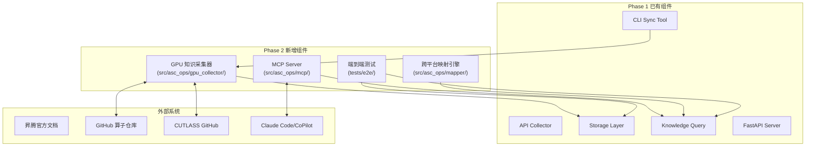
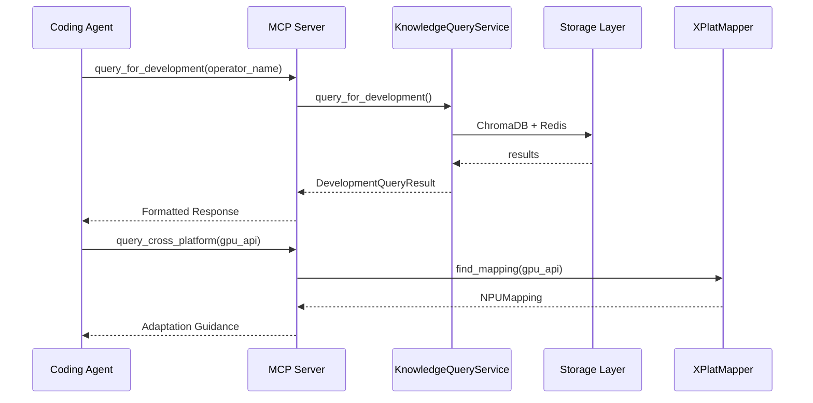
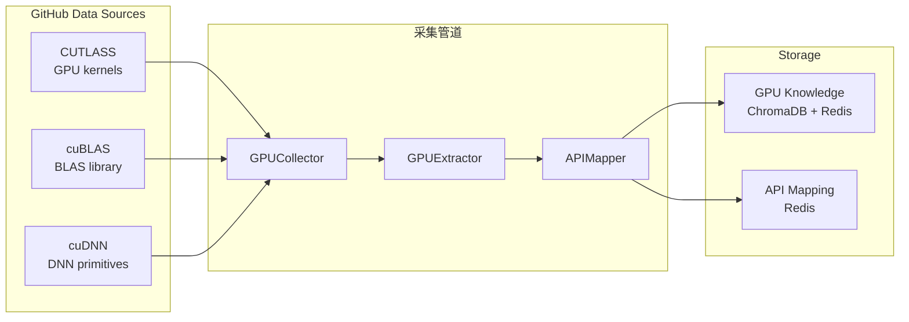

# AscendC Operator Knowledge Base - Phase 2 Enhancement Plan

## Overview

Phase 2 在 Phase 1 完成的昇腾 AscendC 算子知识库基础上，增强四个核心方向：
1. **MCP Server** - 标准化 Agent 集成协议
2. **GPU 算子知识采集** - 构建跨平台知识映射
3. **CLI 同步完善** - 完整的 Git 采集管道
4. **端到端集成测试** - 全链路验证

## Problem Frame

Phase 1 已实现基础存储、采集、排序、查询能力，但：
- Agent 集成依赖 Skill 形式，非标准 MCP 协议
- 仅有 NPU 算子知识，缺少 GPU 对比参考
- CLI 同步为占位实现，未连接真实数据源
- 缺乏端到端集成测试验证全链路

Phase 2 解决上述问题，使知识库可真正服务于 Coding Agent。

## Requirements Trace

- **R1**: MCP Server - 支持 `query_for_development`, `query_for_troubleshooting`, `query_api`, `query_cross_platform` 工具
- **R2**: GPU 知识采集 - 从 CUTLASS/cuBLAS/cuDNN 采集 GPU 算子知识
- **R3**: 跨平台映射 - GPU API → NPU API 等效映射
- **R4**: CLI 同步完善 - 支持昇腾算子仓库的 bug/优化知识抽取
- **R5**: 集成测试 - 采集→存储→查询全链路测试

## Scope Boundaries

**在范围内:**
- MCP Server 标准协议实现
- GPU 算子知识采集管道
- GPU→NPU API 映射引擎
- CLI Git 采集管道完善
- 端到端集成测试

**不在范围内:**
- Web UI 管理界面
- 自动调度系统
- 钉钉/飞书告警渠道
- 生产环境部署配置

---

## High-Level Technical Design

### MCP Server 架构

### GPU 知识采集架构

## Implementation Units

- [ ] **Unit P2-1: MCP Server 核心实现**

**Goal:** 实现 MCP Server，暴露标准工具接口供 Agent 调用

**Requirements:** R1

**Dependencies:** 无

**Files:**
- Create: `src/asc_ops/mcp/__init__.py`
- Create: `src/asc_ops/mcp/server.py`
- Create: `src/asc_ops/mcp/tools.py`
- Create: `src/asc_ops/mcp/models.py`
- Create: `tests/unit/mcp/test_tools.py`
- Create: `tests/unit/mcp/test_server.py`

**Approach:**
- 使用 `mcp-server-python` 或 FastMCP 框架
- 实现四个核心工具: `query_for_development`, `query_for_troubleshooting`, `query_api`, `query_cross_platform`
- 工具返回格式化 JSON，符合 MCP 协议
- 支持流式响应用于长查询

**Patterns to follow:**
- `src/asc_ops/knowledge_query.py` - 查询服务实现
- `src/asc_ops/routes/query.py` - API 响应格式

**Test scenarios:**
- `query_for_development("Matmul")` 返回格式化结果
- `query_api("Exp")` 返回 API 定义
- `query_cross_platform("wmma::load_matrix_sync")` 返回 NPU 等效 API

**Verification:**
- `pytest tests/unit/mcp/ -v` 全部通过
- MCP Server 可独立启动并被 Agent 调用

---

- [ ] **Unit P2-2: GPU 知识数据模型**

**Goal:** 定义 GPU 算子知识的数据模型和采集接口

**Requirements:** R2

**Dependencies:** Unit P2-1

**Files:**
- Create: `src/asc_ops/gpu_collector/models.py`
- Create: `src/asc_ops/gpu_collector/__init__.py`
- Create: `tests/unit/gpu_collector/test_models.py`

**Approach:**
- 定义 `GPUKernelKnowledge` 模型 (kernel name, architecture, memory pattern, warp utilization)
- 定义 `GPURepository` 模型 (repo source, api_surface, documentation)
- 定义 `CrossPlatformMapping` 模型 (gpu_api, npu_api, equivalence_level, adaptation_notes)
- 等价级别: `exact`, `similar`, `conceptual_only`

**Patterns to follow:**
- `src/asc_ops/models.py` - 现有数据模型风格

**Test scenarios:**
- `CrossPlatformMapping` 可正确序列化
- 等价级别枚举正确

**Verification:**
- `pytest tests/unit/gpu_collector/test_models.py -v` 全部通过

---

- [ ] **Unit P2-3: GPU 知识采集器**

**Goal:** 实现 GPU 算子知识采集管道

**Requirements:** R2, R3

**Dependencies:** Unit P2-2

**Files:**
- Create: `src/asc_ops/gpu_collector/collectors/cutlass_collector.py`
- Create: `src/asc_ops/gpu_collector/collectors/cublas_collector.py`
- Create: `src/asc_ops/gpu_collector/extractors.py`
- Create: `src/asc_ops/gpu_collector/storage.py`
- Create: `tests/unit/gpu_collector/test_collectors.py`

**Approach:**
- CUTLASS 采集器: 解析 `include/cutlass/` 下的 kernel 定义
- cuBLAS 采集器: 从官方文档页面抓取 API 签名
- GPU 知识存储到独立 ChromaDB collection: `gpu_kernels`
- 提取: kernel name, compute capability, shared memory usage, template parameters

**Patterns to follow:**
- `src/asc_ops/collector/` - Phase 1 采集器模式

**Test scenarios:**
- CUTLASS kernel 可正确解析
- GPU 知识可存储到 ChromaDB

**Verification:**
- `pytest tests/unit/gpu_collector/test_collectors.py -v` 全部通过

---

- [ ] **Unit P2-4: 跨平台映射引擎**

**Goal:** 实现 GPU→NPU API 映射查询

**Requirements:** R3

**Dependencies:** Unit P2-3

**Files:**
- Create: `src/asc_ops/mapper/engine.py`
- Create: `src/asc_ops/mapper/predefined_mappings.py`
- Create: `src/asc_ops/mapper/__init__.py`
- Create: `tests/unit/mapper/test_engine.py`

**Approach:**
- 预定义核心映射表 (如 `__syncthreads` → `SyncAll`)
- LLM 增强: 未匹配 API 调用 LLM 生成映射建议
- 映射存储到 Redis Set 便于快速查询
- 支持 `query_cross_platform(gpu_api)` 接口

**Patterns to follow:**
- `src/asc_ops/ranker/fusion.py` - 结果融合模式

**Test scenarios:**
- `find_mapping("__syncthreads")` 返回 `SyncAll` (exact)
- `find_mapping("wmma::load_matrix_sync")` 返回 `Load2D` (similar)

**Verification:**
- `pytest tests/unit/mapper/test_engine.py -v` 全部通过

---

- [ ] **Unit P2-5: CLI 同步完善**

**Goal:** 实现昇腾算子仓库的 bug/优化知识抽取 CLI

**Requirements:** R4

**Dependencies:** Phase 1 (extractor 模块)

**Files:**
- Modify: `src/asc_ops/cli/sync.py` (扩展支持 operator sync)
- Create: `src/asc_ops/cli/operator_sync.py`
- Create: `tests/unit/cli/test_operator_sync.py`

**Approach:**
- `python -m asc_ops.cli.operator_sync --repo ascend-cann/ascend-cann --since 2024-01-01`
- 支持 GitHub API 拉取 PR 列表
- 分类 PR 类型 (bugfix/optimization/feature)
- 调用 `BugExtractor` / `OptimizationExtractor` 抽取知识
- 存储到 ChromaDB + Redis

**Patterns to follow:**
- `src/asc_ops/cli/sync.py` - Phase 1 CLI 模式
- `src/asc_ops/extractor/` - 抽取器模式

**Test scenarios:**
- 指定仓库 PR 可正确分类
- 抽取结果正确存储

**Verification:**
- `pytest tests/unit/cli/test_operator_sync.py -v` 全部通过

---

- [ ] **Unit P2-6: 端到端集成测试**

**Goal:** 实现采集→存储→查询全链路集成测试

**Requirements:** R5

**Dependencies:** Units P2-1, P2-3, P2-4, P2-5

**Files:**
- Create: `tests/e2e/test_collection_pipeline.py`
- Create: `tests/e2e/test_query_pipeline.py`
- Create: `tests/e2e/test_mcp_integration.py`
- Create: `tests/e2e/conftest.py`

**Approach:**
- 使用真实 ChromaDB (持久化临时目录)
- 使用 `fakeredis` 进行 Redis mock
- 测试场景:
  1. API 采集 → 存储 → 查询
  2. Bug 知识抽取 → 存储 → 开发查询
  3. GPU 知识采集 → 存储 → 跨平台映射
  4. MCP Server → KnowledgeQueryService → Storage

**Patterns to follow:**
- `tests/` - 现有测试结构

**Test scenarios:**
- 全链路 API 知识采集测试
- Bug 知识全流程测试
- GPU→NPU 映射查询测试
- MCP 工具调用测试

**Verification:**
- `pytest tests/e2e/ -v` 全部通过

---

- [ ] **Unit P2-7: MCP Server CLI 入口**

**Goal:** 提供 MCP Server 启动命令

**Requirements:** R1

**Dependencies:** Unit P2-1

**Files:**
- Modify: `src/asc_ops/server.py` (添加 MCP 模式)
- Create: `src/asc_ops/mcp/cli.py`

**Approach:**
- `python -m asc_ops.mcp.server` 启动 MCP Server
- 支持 `--port` 配置
- 与现有 FastAPI Server 可并行运行

**Patterns to follow:**
- `src/asc_ops/server.py` - 服务器启动模式

**Test scenarios:**
- MCP Server 可独立启动
- 工具注册正确

**Verification:**
- Server 启动无错误

---

## System-Wide Impact

- **MCP Server**: 新增 `src/asc_ops/mcp/` 目录，独立于 FastAPI
- **GPU 采集**: 新增 `src/asc_ops/gpu_collector/` 目录
- **跨平台映射**: 新增 `src/asc_ops/mapper/` 目录
- **CLI 扩展**: 修改 `src/asc_ops/cli/sync.py`
- **测试新增**: `tests/e2e/` 目录

## Risks & Dependencies

| 风险 | 影响 | 缓解 |
|------|------|------|
| GitHub API 限流 | GPU 采集失败 | 添加 rate limiter + 缓存 |
| GPU kernel 解析复杂度 | 抽取质量低 | 聚焦 P0 的 CUTLASS |
| MCP 协议版本变化 | 需适配 | 使用稳定版本 v1 |

## Open Questions

### Deferred to Implementation

- **Q1 (MCP 框架选择)**: 使用 `mcp-server-python` 还是 FastMCP，需实际测试后决定
- **Q2 (GPU 采集范围)**: CUTLASS 全部 kernel 还是子集，需评估存储成本
- **Q3 (映射准确性)**: 预定义映射 vs LLM 生成映射的比例

## Alternative Approaches Considered

### MCP 框架选择
- **mcp-server-python**: 官方维护，协议兼容性好，但文档较少
- **FastMCP**: 开发体验好，但为第三方实现
- **最终选择**: 先用 FastMCP MVP，后续可切换

### GPU 采集策略
- **全量采集**: 覆盖全，但存储/处理成本高
- **增量采集**: 按需触发，但首次需大量 seed 数据
- **最终选择**: P0 优先 (CUTLASS core kernels)，逐步扩展

## Documentation

- MCP Server 使用文档
- GPU 知识采集指南
- 跨平台映射使用说明
