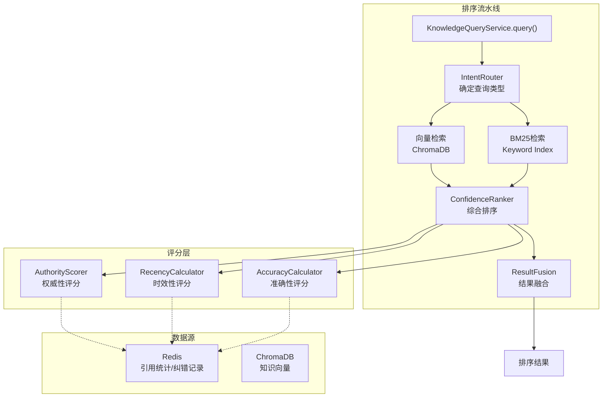

# AscendC Operator Knowledge Base - Phase 3: 置信度感知排序层实施计划

**文档版本**: v1.0
**创建日期**: 2026-04-10
**阶段**: Phase 3
**状态**: 待实施

---

## 1. 概述

### 1.1 目标

实现多维度置信度感知排序层，将权威性、时效性、准确性三个维度综合考虑，对知识查询结果进行智能排序。

### 1.2 现状分析

Phase 2 已完成的组件:
- ✅ BM25 索引 (`src/asc_ops/ranker/bm25.py`)
- ✅ Confidence Engine (`src/asc_ops/ranker/confidence.py`)
- ✅ Result Fusion (`src/asc_ops/ranker/fusion.py`)
- ✅ Ranker 类 (`src/asc_ops/ranker/fusion.py`)

**关键 Gap**: 这些组件未集成到 `KnowledgeQueryService` 查询流程中。

### 1.3 交付物

| 交付物 | 描述 |
|--------|------|
| D3-1 | 权威性评估模块 (AuthorityScorer) |
| D3-2 | 时效性计算模块 (RecencyCalculator) |
| D3-3 | 准确性评估模块 (AccuracyCalculator) |
| D3-4 | 综合排序服务 (ConfidenceRanker) |
| D3-5 | Ranker 集成到 KnowledgeQueryService |
| D3-6 | 单元测试 + 集成测试 |

---

## 2. 详细设计

### 2.1 排序公式

```
ConfidenceScore = w1 × AuthorityScore + w2 × RecencyScore + w3 × AccuracyScore

其中:
- AuthorityScore = SourceWeight × ContributorWeight
  - SourceWeight: 昇腾官方=1.0, 社区=0.7, 其他=0.5
  - ContributorWeight: 核心贡献者=1.0, 活跃=0.8, 新人=0.6

- RecencyScore = e^(-λ × days_since_update)
  - λ = 0.05 (可通过配置调整)

- AccuracyScore = 1 - corrections / total_citations
  - 无引用时默认 0.5
```

**默认权重**: w1=0.5, w2=0.3, w3=0.2

### 2.2 架构设计



### 2.3 文件结构

```
src/asc_ops/ranker/
├── __init__.py
├── bm25.py                    # 已有
├── confidence.py              # 已有
├── fusion.py                  # 已有
├── scoring/
│   ├── __init__.py
│   ├── authority.py           # [NEW] 权威性评估器
│   ├── recency.py             # [NEW] 时效性计算器
│   ├── accuracy.py            # [NEW] 准确性评估器
│   └── config.py              # [NEW] 排序配置
└── integrated_ranker.py       # [NEW] 集成排序器 (整合所有组件)
```

---

## 3. 实施任务

### 3.1 任务总览

| 任务 | 描述 | 工作量 | 依赖 |
|------|------|--------|------|
| T3-1 | 创建评分模块目录结构 | 0.5人天 | - |
| T3-2 | 实现 AuthorityScorer | 2人天 | - |
| T3-3 | 实现 RecencyCalculator | 1人天 | - |
| T3-4 | 实现 AccuracyCalculator | 2人天 | - |
| T3-5 | 实现 ConfidenceRanker | 2人天 | T3-2, T3-3, T3-4 |
| T3-6 | 集成到 KnowledgeQueryService | 2人天 | T3-5 |
| T3-7 | 编写单元测试 | 2人天 | T3-2~T3-6 |
| T3-8 | 编写集成测试 | 1.5人天 | T3-6 |
| **合计** | | **13人天** | |

---

### 3.2 任务详细设计

#### T3-1: 创建评分模块目录结构

**目标**: 创建 `src/asc_ops/ranker/scoring/` 目录和基础文件

**文件**:
- `src/asc_ops/ranker/scoring/__init__.py`
- `src/asc_ops/ranker/scoring/config.py`

**config.py 设计**:
```python
from dataclasses import dataclass


@dataclass
class RankingConfig:
    """排序配置"""
    # 权重配置
    authority_weight: float = 0.5
    recency_weight: float = 0.3
    accuracy_weight: float = 0.2

    # 权威性配置
    source_weights: dict[str, float] = None
    contributor_weights: dict[str, float] = None

    # 时效性配置
    recency_lambda: float = 0.05  # 衰减系数
    max_recency_days: int = 365  # 最大时效天数

    # 准确性配置
    default_accuracy: float = 0.5  # 无引用时的默认准确性

    def __post_init__(self):
        if self.source_weights is None:
            self.source_weights = {
                "official": 1.0,   # 昇腾官方
                "community": 0.7, # 社区
                "other": 0.5      # 其他
            }
        if self.contributor_weights is None:
            self.contributor_weights = {
                "core": 1.0,      # 核心贡献者
                "active": 0.8,    # 活跃贡献者
                "newcomer": 0.6   # 新人
            }


# 全局默认配置
DEFAULT_RANKING_CONFIG = RankingConfig()
```

---

#### T3-2: 实现 AuthorityScorer

**目标**: 实现权威性评估器

**文件**: `src/asc_ops/ranker/scoring/authority.py`

**设计**:
```python
from dataclasses import dataclass
from typing import Optional
from enum import Enum


class SourceType(Enum):
    OFFICIAL = "official"      # 昇腾官方
    COMMUNITY = "community"    # 社区贡献
    OTHER = "other"            # 其他来源


class ContributorLevel(Enum):
    CORE = "core"              # 核心贡献者
    ACTIVE = "active"          # 活跃贡献者
    NEWCOMER = "newcomer"      # 新人


@dataclass
class AuthorityScore:
    """权威性评分结果"""
    total: float               # 总分 [0, 1]
    source_weight: float       # 来源权重
    contributor_weight: float  # 贡献者权重
    source_type: SourceType
    contributor_level: ContributorLevel


class AuthorityScorer:
    """权威性评估器"""

    def __init__(self, config: RankingConfig):
        self.config = config

    def calculate(
        self,
        source_type: SourceType | str,
        contributor_level: ContributorLevel | str | None = None,
        author: str | None = None
    ) -> AuthorityScore:
        """计算权威性分数"""

        # 解析 source_type
        if isinstance(source_type, str):
            source_type = SourceType(source_type)

        # 获取来源权重
        source_weight = self.config.source_weights.get(source_type.value, 0.5)

        # 获取贡献者权重
        if contributor_level is None:
            contributor_weight = 0.8  # 默认活跃贡献者
        elif isinstance(contributor_level, str):
            contributor_weight = self.config.contributor_weights.get(
                contributor_level, 0.8
            )
        else:
            contributor_weight = self.config.contributor_weights.get(
                contributor_level.value, 0.8
            )

        # 综合分数
        total = source_weight * contributor_weight

        return AuthorityScore(
            total=total,
            source_weight=source_weight,
            contributor_weight=contributor_weight,
            source_type=source_type,
            contributor_level=contributor_level or ContributorLevel.ACTIVE
        )

    def calculate_from_metadata(self, metadata: dict) -> AuthorityScore:
        """从元数据计算权威性分数"""
        source_type = metadata.get("source_type", "other")
        contributor_level = metadata.get("contributor_level")
        author = metadata.get("author")

        return self.calculate(source_type, contributor_level, author)
```

---

#### T3-3: 实现 RecencyCalculator

**目标**: 实现时效性计算器

**文件**: `src/asc_ops/ranker/scoring/recency.py`

**设计**:
```python
from dataclasses import dataclass
from datetime import datetime
from typing import Union


@dataclass
class RecencyScore:
    """时效性评分结果"""
    total: float               # 总分 [0, 1]
    days_since_update: int     # 距离上次更新的天数
    lambda_value: float        # 使用的衰减系数


class RecencyCalculator:
    """时效性计算器

    使用指数衰减模型:
    RecencyScore = e^(-λ × days)
    """

    def __init__(self, config: RankingConfig):
        self.config = config

    def calculate(
        self,
        last_updated: Union[datetime, str, int],
        reference_time: datetime | None = None
    ) -> RecencyScore:
        """计算时效性分数

        Args:
            last_updated: 上次更新时间 (datetime对象、ISO字符串或Unix时间戳)
            reference_time: 参考时间，默认为当前时间
        """

        if reference_time is None:
            reference_time = datetime.now()

        # 解析时间
        if isinstance(last_updated, str):
            last_updated_dt = datetime.fromisoformat(last_updated.replace("Z", "+00:00"))
        elif isinstance(last_updated, int):
            last_updated_dt = datetime.fromtimestamp(last_updated)
        else:
            last_updated_dt = last_updated

        # 计算天数差
        delta = reference_time - last_updated_dt
        days = max(0, delta.days)

        # 限制最大天数
        days = min(days, self.config.max_recency_days)

        # 指数衰减计算
        lambda_val = self.config.recency_lambda
        score = math.exp(-lambda_val * days)

        return RecencyScore(
            total=score,
            days_since_update=days,
            lambda_value=lambda_val
        )

    def calculate_from_metadata(self, metadata: dict) -> RecencyScore:
        """从元数据计算时效性分数"""
        last_updated = metadata.get("last_updated")
        if last_updated is None:
            last_updated = metadata.get("updated_at")
        if last_updated is None:
            last_updated = metadata.get("timestamp")

        if last_updated is None:
            # 无时间信息，返回最低分
            return RecencyScore(
                total=0.5,
                days_since_update=self.config.max_recency_days,
                lambda_value=self.config.recency_lambda
            )

        return self.calculate(last_updated)
```

---

#### T3-4: 实现 AccuracyCalculator

**目标**: 实现准确性评估器

**文件**: `src/asc_ops/ranker/scoring/accuracy.py`

**设计**:
```python
from dataclasses import dataclass
from typing import Optional


@dataclass
class AccuracyScore:
    """准确性评分结果"""
    total: float               # 总分 [0, 1]
    correction_count: int      # 纠错次数
    citation_count: int        # 引用次数
    error_rate: float          # 错误率


class AccuracyCalculator:
    """准确性评估器

    基于纠错率和引用次数计算准确性:
    AccuracyScore = 1 - corrections / citations
    无引用时默认返回 0.5
    """

    def __init__(self, config: RankingConfig, redis_client=None):
        self.config = config
        self.redis = redis_client

    async def calculate(
        self,
        entity_id: str,
        entity_type: str,  # "bug" | "optimization" | "api"
        citation_count: Optional[int] = None,
        correction_count: Optional[int] = None
    ) -> AccuracyScore:
        """计算准确性分数

        Args:
            entity_id: 实体ID
            entity_type: 实体类型
            citation_count: 引用次数 (可选，从Redis获取)
            correction_count: 纠错次数 (可选，从Redis获取)
        """

        # 如果未提供，从 Redis 获取
        if citation_count is None or correction_count is None:
            if self.redis:
                citation_count, correction_count = await self._fetch_from_redis(
                    entity_id, entity_type
                )
            else:
                citation_count = 0
                correction_count = 0

        # 计算错误率
        if citation_count == 0:
            # 无引用，使用默认分数
            error_rate = 0.0
            total = self.config.default_accuracy
        else:
            error_rate = correction_count / citation_count
            total = max(0, 1 - error_rate)

        return AccuracyScore(
            total=total,
            correction_count=correction_count,
            citation_count=citation_count,
            error_rate=error_rate
        )

    def calculate_sync(
        self,
        citation_count: int,
        correction_count: int
    ) -> AccuracyScore:
        """同步版本准确性计算"""
        if citation_count == 0:
            error_rate = 0.0
            total = self.config.default_accuracy
        else:
            error_rate = correction_count / citation_count
            total = max(0, 1 - error_rate)

        return AccuracyScore(
            total=total,
            correction_count=correction_count,
            citation_count=citation_count,
            error_rate=error_rate
        )

    async def _fetch_from_redis(
        self,
        entity_id: str,
        entity_type: str
    ) -> tuple[int, int]:
        """从 Redis 获取引用和纠错统计"""
        prefix = f"ascendc:stats:{entity_type}"

        citations = await self.redis.get(f"{prefix}:citation:{entity_id}") or 0
        corrections = await self.redis.get(f"{prefix}:correction:{entity_id}") or 0

        return int(citations), int(corrections)

    def calculate_from_metadata(self, metadata: dict) -> AccuracyScore:
        """从元数据计算准确性分数"""
        citation_count = metadata.get("citation_count", 0)
        correction_count = metadata.get("correction_count", 0)

        return self.calculate_sync(citation_count, correction_count)
```

---

#### T3-5: 实现 ConfidenceRanker

**目标**: 实现综合排序器，整合三个维度的评分

**文件**: `src/asc_ops/ranker/integrated_ranker.py`

**设计**:
```python
from dataclasses import dataclass, field
from typing import Optional
import math

from .scoring.config import RankingConfig, DEFAULT_RANKING_CONFIG
from .scoring.authority import AuthorityScorer, AuthorityScore
from .scoring.recency import RecencyCalculator, RecencyScore
from .scoring.accuracy import AccuracyCalculator, AccuracyScore


@dataclass
class CompositeScore:
    """综合评分结果"""
    total: float               # 综合分数 [0, 1]
    authority: AuthorityScore
    recency: RecencyScore
    accuracy: AccuracyScore
    weights: tuple[float, float, float]  # (w1, w2, w3)

    def to_dict(self) -> dict:
        return {
            "total": self.total,
            "authority": self.authority.total,
            "recency": self.recency.total,
            "accuracy": self.accuracy.total,
            "weights": self.weights
        }


@dataclass
class RankedItem:
    """排序项"""
    id: str
    score: CompositeScore
    metadata: dict = field(default_factory=dict)
    original_score: Optional[float] = None  # 原始检索分数


class ConfidenceRanker:
    """置信度感知排序器

    综合考虑权威性、时效性、准确性对结果进行重排序
    """

    def __init__(
        self,
        config: Optional[RankingConfig] = None,
        redis_client=None
    ):
        self.config = config or DEFAULT_RANKING_CONFIG
        self.authority_scorer = AuthorityScorer(self.config)
        self.recency_calculator = RecencyCalculator(self.config)
        self.accuracy_calculator = AccuracyCalculator(self.config, redis_client)

    def calculate_composite_score(
        self,
        metadata: dict,
        citation_count: Optional[int] = None,
        correction_count: Optional[int] = None
    ) -> CompositeScore:
        """计算单个条目的综合分数"""

        # 权威性评分
        authority = self.authority_scorer.calculate_from_metadata(metadata)

        # 时效性评分
        recency = self.recency_calculator.calculate_from_metadata(metadata)

        # 准确性评分
        if citation_count is not None or correction_count is not None:
            accuracy = self.accuracy_calculator.calculate_sync(
                citation_count or 0,
                correction_count or 0
            )
        else:
            accuracy = self.accuracy_calculator.calculate_from_metadata(metadata)

        # 加权综合
        w1, w2, w3 = (
            self.config.authority_weight,
            self.config.recency_weight,
            self.config.accuracy_weight
        )
        total = w1 * authority.total + w2 * recency.total + w3 * accuracy.total

        return CompositeScore(
            total=total,
            authority=authority,
            recency=recency,
            accuracy=accuracy,
            weights=(w1, w2, w3)
        )

    async def rank_results(
        self,
        results: list[dict],
        top_k: int = 5
    ) -> list[RankedItem]:
        """对检索结果进行重排序

        Args:
            results: 检索结果列表，每项包含 id, score, metadata
            top_k: 返回前 k 项

        Returns:
            排序后的结果列表
        """

        scored_results = []

        for item in results:
            item_id = item.get("id") or item.get("operator_id") or item.get("api_id")
            metadata = item.get("metadata", {})

            # 补充元数据
            if "last_updated" not in metadata and "updated_at" in item:
                metadata["last_updated"] = item["updated_at"]

            # 计算综合分数
            composite = self.calculate_composite_score(metadata)

            scored_results.append(RankedItem(
                id=item_id,
                score=composite,
                metadata=metadata,
                original_score=item.get("score")
            ))

        # 按综合分数降序排列
        scored_results.sort(key=lambda x: x.score.total, reverse=True)

        return scored_results[:top_k]

    def rank_results_sync(
        self,
        results: list[dict],
        top_k: int = 5
    ) -> list[RankedItem]:
        """同步版本的重排序"""
        scored_results = []

        for item in results:
            item_id = item.get("id") or item.get("operator_id") or item.get("api_id")
            metadata = item.get("metadata", {})

            composite = self.calculate_composite_score(metadata)

            scored_results.append(RankedItem(
                id=item_id,
                score=composite,
                metadata=metadata,
                original_score=item.get("score")
            ))

        scored_results.sort(key=lambda x: x.score.total, reverse=True)

        return scored_results[:top_k]
```

---

#### T3-6: 集成到 KnowledgeQueryService

**目标**: 将 ConfidenceRanker 集成到查询服务

**文件**: `src/asc_ops/knowledge_query.py` (修改)

**修改要点**:

```python
# 在 KnowledgeQueryService.__init__ 中添加
from src.asc_ops.ranker.integrated_ranker import ConfidenceRanker

class KnowledgeQueryService:
    def __init__(self, ...):
        # ... 现有初始化 ...
        self.confidence_ranker = ConfidenceRanker(
            config=self.ranking_config,
            redis_client=self.redis
        )

    async def query_for_development(
        self,
        operator_name: str,
        query_type: str = "all",
        use_confidence_ranking: bool = True,
        top_k: int = 5
    ) -> DevelopmentQueryResult:
        # ... 现有查询逻辑 ...

        # 获取原始结果
        results = await self._fetch_development_results(...)

        # 应用置信度排序
        if use_confidence_ranking:
            ranked = await self.confidence_ranker.rank_results(
                results,
                top_k=top_k
            )
            results = [
                {
                    "id": item.id,
                    "score": item.score.total,
                    "metadata": item.metadata,
                    "original_score": item.original_score,
                    "confidence_breakdown": item.score.to_dict()
                }
                for item in ranked
            ]

        return DevelopmentQueryResult(...)
```

---

## 4. 测试设计

### 4.1 单元测试

| 测试文件 | 测试内容 |
|----------|----------|
| `tests/unit/ranker/scoring/test_authority.py` | AuthorityScorer 正确计算各类来源权重 |
| `tests/unit/ranker/scoring/test_recency.py` | RecencyCalculator 指数衰减计算 |
| `tests/unit/ranker/scoring/test_accuracy.py` | AccuracyCalculator 纠错率计算 |
| `tests/unit/ranker/scoring/test_config.py` | 配置类和数据验证 |
| `tests/unit/ranker/test_integrated_ranker.py` | ConfidenceRanker 综合评分 |

### 4.2 集成测试

| 测试文件 | 测试内容 |
|----------|----------|
| `tests/integration/test_ranking_pipeline.py` | 完整排序流水线测试 |

**集成测试场景**:
1. 查询 "MatMul" → 返回排序结果，分数包含三个维度
2. 相同来源不同时间的两条知识 → 时间新的排前
3. 相同时间不同来源的两条知识 → 官方来源排前

---

## 5. 配置接口

### 5.1 排序权重配置

```python
# 通过环境变量或配置文件调整
RANKING_AUTHORITY_WEIGHT=0.5
RANKING_RECENCY_WEIGHT=0.3
RANKING_ACCURACY_WEIGHT=0.2
RANKING_RECENTCY_LAMBDA=0.05
```

### 5.2 来源权重配置

```python
SOURCE_WEIGHTS = {
    "official": 1.0,    # 昇腾官方文档/PR
    "community": 0.7,   # 社区贡献
    "other": 0.5        # 其他来源
}
```

---

## 6. 风险与缓解

| 风险 | 概率 | 影响 | 缓解 |
|------|------|------|------|
| 权威性来源数据不完整 | 中 | 中 | 默认使用中间值 0.7 |
| Redis 统计延迟 | 低 | 中 | 降级为同步默认分数 |
| 权重调参困难 | 高 | 中 | 提供配置接口支持 AB 测试 |

---

## 7. 里程碑

| 里程碑 | 日期 | 验收条件 |
|--------|------|----------|
| M3-1 | T+7 | AuthorityScorer, RecencyCalculator, AccuracyCalculator 完成 |
| M3-2 | T+10 | ConfidenceRanker 完成并通过单元测试 |
| M3-3 | T+12 | 集成到 KnowledgeQueryService |
| M3-4 | T+13 | 全部测试通过，文档更新 |

---

## 8. 附录

### 8.1 参考实现

- Phase 1 置信度设计: `docs/roadmap/2026-04-09-ascendc-knowledge-base-implementation-roadmap.md` Section 3.5
- 现有 Ranker: `src/asc_ops/ranker/fusion.py`

### 8.2 相关 Redis Key Pattern

```
# 引用统计
ascendc:stats:{entity_type}:citation:{entity_id} → int

# 纠错统计
ascendc:stats:{entity_type}:correction:{entity_id} → int

# 贡献者级别 (可选)
ascendc:contributor:{author} → "core" | "active" | "newcomer"
```

---

**文档结束**
