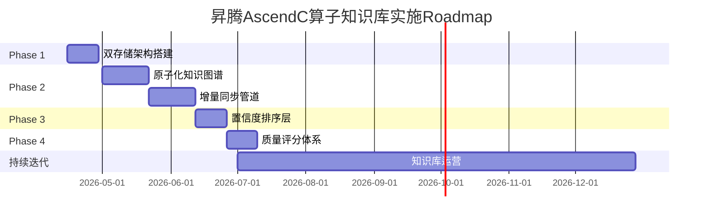
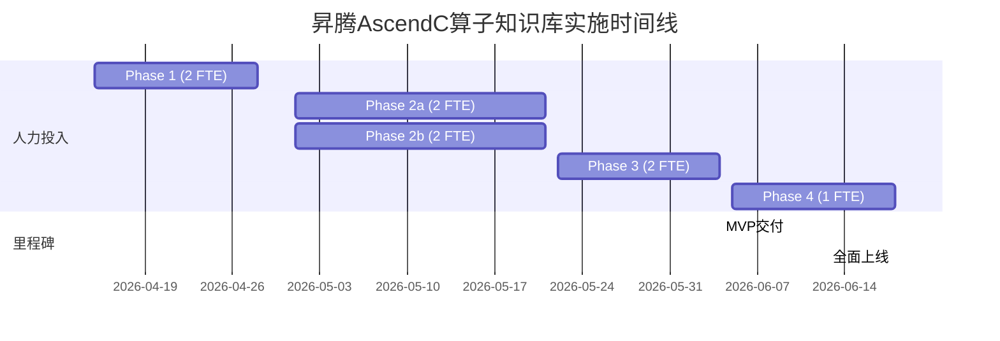

# 昇腾AscendC算子知识库 - 实施路径与Roadmap

**文档版本**: v1.0
**创建日期**: 2026-04-09
**作者**: 首席架构师
**状态**: 正式版

---

## 1. 方案依赖关系分析

### 1.1 拓扑排序

```
P1双存储架构 ──────────────────────────────┐
    │                                        │
    ▼                                        │
┌───────────────────┐                       │
│  向量库初始化      │                       │
│  KV存储初始化      │                       │
└─────────┬─────────┘                       │
          │                                 │
          ▼                                 │
P0原子化算子知识图谱 ◄────────────────────────┤
    │                                        │
    ├──────────────────────────────────────┐ │
    │                                      │ │
    ▼                                      │ │
P0增量知识同步管道 ─────────────────────────┤
    │                                      │ │
    └──────────────────────────────────────►│
                                          │ │
P0置信度感知排序层 ◄──────────────────────────┘
    │
    ▼
P1知识质量评分体系
```

### 1.2 依赖矩阵

| 方案 | 依赖方案 | 依赖类型 | 可并行度 |
|------|----------|----------|----------|
| P1 双存储架构 | 无 | - | 独立 |
| P0 原子化算子知识图谱 | P1 双存储架构 | 硬依赖 | - |
| P0 增量知识同步管道 | P1 双存储架构, P0 原子化知识图谱 | 硬依赖 | - |
| P0 置信度感知排序层 | P1 双存储架构, P0 原子化知识图谱 | 硬依赖 | - |
| P1 知识质量评分体系 | P0 置信度感知排序层 | 软依赖 | 弱依赖 |

### 1.3 实施顺序结论

**第一阶段（Phase 1）**: P1 双存储架构（可独立实施）
**第二阶段（Phase 2）**: P0 原子化算子知识图谱 + P0 增量知识同步管道（可并行）
**第三阶段（Phase 3）**: P0 置信度感知排序层
**第四阶段（Phase 4）**: P1 知识质量评分体系

---

## 2. MVP定义

### 2.1 MVP范围

**MVP核心目标**: 建立最小可用知识检索能力，支持Coding Agent查询昇腾AscendC算子相关知识

### 2.2 MVP阶段交付物

| 组件 | 交付物 | 验收标准 |
|------|--------|----------|
| 双存储架构 | 向量库 + KV存储部署完成 | 能存储/检索单条算子知识 |
| 原子化知识图谱 | 冷启动50+核心算子知识 | 包含算子名称、描述、关键上下文 |
| 增量同步管道 | Webhook接收 + 手动触发同步 | 能同步新PR的知识 |
| 置信度排序 | 基础三维度排序（权威性/时效性/准确性） | 返回结果相关性提升明显 |
| API接口 | /query 端点 | Agent能通过API获取知识 |

### 2.3 MVP支持的基本场景

```
用户查询场景:
1. "查询Add算子的向量级融合优化方法"
2. "查找MatMul算子最近3个月的优化PR"
3. "AscendC中Tilizing接口的使用示例"

Agent调用场景:
1. Code Agent在编写算子时自动检索相关优化经验
2. Code Agent在代码审查时自动关联历史修复方案
```

### 2.4 MVP验收标准

- [ ] 向量检索延迟 < 200ms（P99）
- [ ] 单次查询返回Top-5相关知识
- [ ] 冷启动知识条目 >= 50条
- [ ] API接口可用率 >= 99.9%
- [ ] 基础置信度排序生效

---

## 3. 实施阶段划分

### 3.1 阶段总览



### 3.2 Phase 1: 基础设施（14天）

**目标**: 搭建双存储架构基础

**交付物**:
1. 向量库（Milvus standalone）部署完成
2. KV存储（Redis）部署完成
3. 基础数据模型定义（Schema）
4. 存储层SDK封装

**实施细节**:

| 任务 | 工作量 | 负责人 | 备注 |
|------|--------|--------|------|
| Milvus部署 | 2人天 | - | Docker Compose部署 |
| Redis部署 | 1人天 | - | Docker Compose部署 |
| Schema设计 | 3人天 | - | 算子节点/上下文/关联关系 |
| SDK封装 | 5人天 | - | CRUD + 批量接口 |
| 本地模型embedding服务 | 3人天 | - | 避免API调用延迟 |

**技术选型决策**:
- 向量库: **Milvus** (开源、本地部署、数据可控)
- KV存储: **Redis** (高读写性能、丰富数据结构)

**复杂度**: 3人天 × 14天 ≈ 14人天

### 3.3 Phase 2a: 原子化知识图谱（21天）

**目标**: 构建核心算子知识表示

**交付物**:
1. 算子节点模型（OperatorNode）
2. 上下文关联模型（ContextLink）
3. 50+核心算子冷启动数据
4. 知识图谱查询接口

**实施细节**:

| 任务 | 工作量 | 负责人 | 备注 |
|------|--------|--------|------|
| 数据模型定义 | 3人天 | - | 核心节点+关系 |
| Embedding生成服务 | 5人天 | - | 批量处理+增量处理 |
| 知识导入Pipeline | 5人天 | - | CSV/JSON批量导入 |
| 图谱查询API | 4人天 | - | 混合检索（向量+结构） |
| 冷启动数据标注 | 4人天 | - | 50+核心算子 |

**数据模型**:

```python
# 核心数据模型
class OperatorNode:
    operator_id: str              # 唯一标识
    operator_name: str             # 算子名称
    operator_type: str              # element-wise/reduce/transform
    description: str                # 算子描述
    input_spec: List[TensorSpec]    # 输入规格
    output_spec: List[TensorSpec]   # 输出规格
    optimization_notes: List[str]  # 优化要点
    embedding_vector: List[float]   # 语义向量

class ContextLink:
    context_id: str                 # 上下文ID
    context_type: str               # problem/solution/code_change
    related_operator: str           # 关联算子
    content: str                    # 上下文内容
    source_pr: str                  # 来源PR
    source_url: str                 # 来源链接
    timestamp: datetime            # 更新时间
```

**复杂度**: 5人天 × 21天 ≈ 21人天

### 3.4 Phase 2b: 增量知识同步管道（21天，与Phase 2a并行）

**目标**: 建立准实时知识同步能力

**交付物**:
1. Webhook接收服务
2. PR语义抽取Pipeline
3. 差量同步机制
4. 同步状态监控

**实施细节**:

| 任务 | 工作量 | 负责人 | 备注 |
|------|--------|--------|------|
| Webhook服务 | 3人天 | - | GitLab/Gitea兼容 |
| PR语义抽取 | 8人天 | - | LLM API抽取 |
| 增量diff算法 | 4人天 | - | 变更检测 |
| 同步调度器 | 3人天 | - | 定时Polling兜底 |
| 监控告警 | 3人天 | - | 同步失败告警 |

**PR语义抽取Prompt策略**:

```python
# 抽取Prompt设计
EXTRACTION_PROMPT = """
从以下PR描述和代码变更中抽取算子优化知识：

PR标题: {pr_title}
PR描述: {pr_description}
代码变更: {code_diff}

请抽取:
1. 涉及的算子名称列表
2. 优化措施描述（如果适用）
3. Bug修复描述（如果适用）
4. 性能提升指标（如果有）
5. 适用场景

以JSON格式输出。
"""
```

**复杂度**: 5人天 × 21天 ≈ 21人天

### 3.5 Phase 3: 置信度感知排序层（14天）

**目标**: 实现多维排序能力

**交付物**:
1. 权威性评估模块
2. 时效性计算模块
3. 准确性评估模块
4. 综合排序服务

**实施细节**:

| 任务 | 工作量 | 负责人 | 备注 |
|------|--------|--------|------|
| 权威性评估器 | 4人天 | - | 来源权重+贡献者权重 |
| 时效性计算器 | 2人天 | - | 指数衰减模型 |
| 准确性评估器 | 4人天 | - | 纠错率统计 |
| 排序融合服务 | 4人天 | - | 多维分数融合 |

**排序公式**:

```
ConfidenceScore = w1 × AuthorityScore + w2 × RecencyScore + w3 × AccuracyScore

其中:
- AuthorityScore = SourceWeight × ContributorWeight
  - SourceWeight: 昇腾官方=1.0, 社区=0.7, 其他=0.5
  - ContributorWeight: 核心贡献者=1.0, 活跃=0.8, 新人=0.6

- RecencyScore = e^(-λ × days_since_update)
  - λ = 0.05 (可通过AB测试调优)

- AccuracyScore = 1 -纠错次数/总引用次数
```

**复杂度**: 4人天 × 14天 ≈ 14人天

### 3.6 Phase 4: 知识质量评分体系（14天）

**目标**: 建立知识质量闭环

**交付物**:
1. 引用追踪服务
2. 时效性评分服务
3. 准确性反馈接口
4. 质量可视化Dashboard

**实施细节**:

| 任务 | 工作量 | 负责人 | 备注 |
|------|--------|--------|------|
| 引用追踪 | 3人天 | - | 全链路埋点 |
| 时效性评分 | 2人天 | - | 与排序层共用 |
| 反馈收集API | 4人天 | - | Agent反馈接口 |
| Dashboard | 5人天 | - | 质量监控面板 |

**复杂度**: 4人天 × 14天 ≈ 14人天

---

## 4. 技术选型建议

### 4.1 向量库选型对比

| 维度 | Milvus | Pinecone | Qdrant |
|------|--------|----------|--------|
| 部署方式 | 本地/云 | 仅云 | 本地/云 |
| 数据可控性 | 完全可控 | 部分受限 | 完全可控 |
| 成本 | 硬件成本 | 按量付费 | 硬件成本 |
| 社区活跃度 | 高 | 高 | 中高 |
|AscendC适配 | 原生支持 | 需网络 | 原生支持 |
| 推荐结论 | **首选** | 不推荐 | 备选 |

**推荐理由**:
1. 昇腾算子知识涉及内部技术，需本地部署保证数据可控
2. Milvus社区活跃，文档完善，便于调试
3. 支持混合检索（向量+结构化过滤）

### 4.2 KV存储选型对比

| 维度 | Redis | DynamoDB | RocksDB |
|------|-------|----------|---------|
| 读写性能 | 极高 | 高 | 高 |
| 部署复杂度 | 低 | 中 | 中 |
| 成本 | 内存成本 | 按量付费 | 磁盘成本 |
| 持久化 | 支持 | 支持 | 支持 |
| 扩展性 | 集群模式 | 自动扩展 | 手动扩展 |
| 推荐结论 | **首选** | 不推荐 | 备选 |

**推荐理由**:
1. Redis与Milvus同为本地部署，网络延迟低
2. 支持丰富的数据结构（Hash/Set/Sorted Set）
3. 生态成熟，Python客户端完善

### 4.3 图数据库（暂不引入）

**决策**: 当前阶段不引入图数据库

**理由**:
1. 双存储架构已能满足核心检索需求
2. 图数据库（如Neo4j）增加运维复杂度
3. Milvus本身支持部分图关联能力

**未来扩展接口**:
```python
# 为未来图数据库预留接口
class GraphDBAdapter:
    async def query_graph(self, operator_id: str, depth: int = 2) -> Dict:
        """预留接口，未来可替换为Neo4j/JanusGraph"""
        raise NotImplementedError("图数据库扩展接口")

# 扩展点：可插拔的图数据库后端
GRAPH_DB_IMPL: GraphDBAdapter = None  # 默认为None，使用双存储模拟
```

### 4.4 PR语义抽取LLM策略

| 策略 | 优点 | 缺点 | 推荐场景 |
|------|------|------|----------|
| API调用（Claude/GPT） | 准确率高、功能强 | 成本、延迟 | Phase 2 冷启动 |
| 本地模型（Qwen/LLaMA） | 成本低、延迟可控 | 准确率略低 | 后期大规模处理 |

**推荐方案**:
- **Phase 2**: API调用（Claude 3.5 Sonnet）保证抽取质量
- **Phase 3+**: 根据成本考虑混合策略（简单PR用本地模型，复杂PR用API）

**Prompt工程要点**:
1. 使用few-shot examples提升抽取稳定性
2. 输出JSON Schema约束格式
3. 增加"不确定"时的fallback输出

---

## 5. 风险识别与缓解

### 5.1 风险矩阵

| 阶段 | 风险 | 概率 | 影响 | 风险等级 |
|------|------|------|------|----------|
| Phase 1 | 向量检索性能不达标 | 中 | 高 | **高** |
| Phase 1 | Milvus集群稳定性问题 | 低 | 高 | 中 |
| Phase 2 | PR语义抽取准确率低 | 高 | 高 | **高** |
| Phase 2 | 冷启动数据质量差 | 中 | 高 | **高** |
| Phase 3 | 排序权重调参困难 | 高 | 中 | 中 |
| Phase 4 | 评分机制被gaming | 中 | 中 | 中 |
| 全程 | 昇腾仓API访问限制 | 低 | 高 | 中 |

### 5.2 风险缓解策略

#### 风险1: PR语义抽取准确率低

**缓解措施**:
```python
# 多层兜底策略
1. LLM API抽取（准确率 ~85%）
2. 规则引擎初筛（过滤明显噪声）
3. 人工抽检机制（随机5%人工审核）
4. 低置信度标记（不确定时标记待审核）

# 渐进式优化
- 上线初期：人工审核为主
- 积累足够样本后：训练领域模型
- 远期：本地模型fine-tuned
```

#### 风险2: 冷启动数据质量差

**缓解措施**:
```python
# 数据质量保障流程
1. 自动化脚本 + 人工标注双重验证
2. 核心算子优先（Top 50算子优先处理）
3. 数据质量评分（低于阈值不导入）
4. 灰度上线（新数据先小流量测试）
```

#### 风险3: 排序权重调参困难

**缓解措施**:
```python
# AB测试框架
1. 在线实验平台（LaunchDarkly/Flagsmith）
2. 多臂老虎机算法（Thompson Sampling）
3. 渐进式权重调整（每次只改一个参数）
4. 离线评估（基于历史query重放）

# 推荐初始权重
AuthorityScore: w1 = 0.5
RecencyScore:   w2 = 0.3
AccuracyScore:   w3 = 0.2
```

#### 风险4: 评分机制被gaming

**缓解措施**:
```python
# Anti-Gaming策略
1. 引用次数平滑处理（对数衰减）
2. 异常行为检测（短时间内大量引用）
3. 权重上限（单日最大权重加成）
4. 人工抽样复核（可疑行为专项审查）
```

#### 风险5: 昇腾仓API访问限制

**缓解措施**:
```python
# 访问策略
1. Webhook为主（实时性高，API调用少）
2. 定时Polling兜底（每小时最多1次）
3. 请求间隔控制（避免触发限流）
4. 多源策略（GitLab + Gitea双源）
```

---

## 6. 总体Roadmap

### 6.1 人力估算

| 阶段 | 核心人力 | 辅助人力 | 总人天 |
|------|----------|----------|--------|
| Phase 1 | 2人 | 1人 | 14人天 |
| Phase 2a | 2人 | 1人 | 21人天 |
| Phase 2b | 2人 | 1人 | 21人天 |
| Phase 3 | 2人 | 1人 | 14人天 |
| Phase 4 | 1人 | 1人 | 14人天 |
| **合计** | - | - | **84人天** |

### 6.2 时间线



### 6.3 关键里程碑

| 里程碑 | 日期 | 验收条件 |
|--------|------|----------|
| M1: 存储基础设施就绪 | 2026-04-28 | Milvus + Redis 部署完成，能存储/检索 |
| M2: MVP可用 | 2026-06-04 | 支持Agent查询，返回排序结果 |
| M3: 全面上线 | 2026-06-18 | 增量同步正常运行，质量评分上线 |
| M4: 知识库自洽 | 2026-09-01 | 知识条目 >= 500条，月活 >= 1000次 |

---

## 7. 方案实施细节

### 7.1 P0 原子化算子知识图谱 - 实施细节

#### 7.1.1 知识表示模型

```python
# 三层结构定义
class OperatorKnowledge:
    """原子化算子知识表示"""
    # Layer 1: 核心节点
    operator: OperatorNode

    # Layer 2: 上下文关联
    contexts: List[KnowledgeContext]

    # Layer 3: 效果指标（未来扩展）
    metrics: Optional[List[PerformanceMetric]]

class OperatorNode:
    operator_id: str                    # ascendc_{算子类型}_{序号}
    operator_name: str                  # 如 "Add", "MatMul"
    operator_category: str              # element-wise | reduction | transform
    core_logic: str                      # 核心逻辑描述
    input_specs: List[TensorSpec]       # 输入规格
    output_specs: List[TensorSpec]       # 输出规格
    fusion_hints: List[str]             # 融合建议

class KnowledgeContext:
    context_id: str                      # ctx_{PR号}_{序号}
    context_type: str                   # problem | solution | code_change
    trigger_scenario: str              # 问题触发场景
    content: str                        # 上下文内容
    source: SourceInfo                   # 来源信息
    related_operators: List[str]        # 关联算子

class SourceInfo:
    source_type: str                    # pr | commit | issue | manual
    source_url: str                    # 链接
    author: str                        # 作者
    timestamp: datetime                # 更新时间
    authority_weight: float            # 权威权重 (0.0-1.0)
```

#### 7.1.2 知识获取流程

```
昇腾算子仓 Webhook触发
        │
        ▼
┌───────────────────┐
│  PR元数据获取      │
│  (标题/描述/作者)  │
└─────────┬─────────┘
          │
          ▼
┌───────────────────┐
│  LLM语义抽取       │
│  (优化措施/BUG修复)│
└─────────┬─────────┘
          │
          ▼
┌───────────────────┐
│  知识节点构建      │
│  (算子+上下文)     │
└─────────┬─────────┘
          │
          ▼
┌───────────────────┐
│  Embedding生成     │
│  (本地模型)        │
└─────────┬─────────┘
          │
          ▼
┌───────────────────┐
│  双存储写入        │
│  (向量库+KV存储)   │
└───────────────────┘
```

### 7.2 P0 置信度感知排序层 - 实施细节

#### 7.2.1 排序算法

```python
@dataclass
class ConfidenceScore:
    authority: float   # 权威性分数 [0, 1]
    recency: float     # 时效性分数 [0, 1]
    accuracy: float     # 准确性分数 [0, 1]
    final: float        # 综合分数 [0, 1]

def calculate_confidence(
    knowledge: OperatorKnowledge,
    query: str,
    user_context: UserContext
) -> ConfidenceScore:
    # 权威性计算
    authority = calculate_authority(knowledge.source)

    # 时效性计算（指数衰减）
    recency = math.exp(-0.05 * days_since(knowledge.source.timestamp))

    # 准确性计算（基于反馈）
    accuracy = calculate_accuracy(knowledge.context_id)

    # 综合分数（加权几何平均）
    weights = [0.5, 0.3, 0.2]
    final = weights[0] * authority + weights[1] * recency + weights[2] * accuracy

    return ConfidenceScore(authority, recency, accuracy, final)

def calculate_authority(source: SourceInfo) -> float:
    """权威性计算"""
    # 来源权重
    source_weights = {
        "official": 1.0,    # 昇腾官方PR
        "pr": 0.8,          # 社区PR
        "commit": 0.7,      # 直接commit
        "issue": 0.6,       # Issue反馈
        "manual": 0.5       # 手动录入
    }
    source_w = source_weights.get(source.source_type, 0.5)

    # 作者权重（可通过贡献者评级系统扩展）
    author_w = source.authority_weight

    return source_w * author_w
```

#### 7.2.2 排序服务接口

```python
class RankingService:
    async def rank_knowledge(
        self,
        query: str,
        candidates: List[OperatorKnowledge],
        user_context: UserContext,
        top_k: int = 5
    ) -> List[RankedResult]:
        """对候选知识进行置信度排序"""
        # 1. 计算每条知识的置信度分数
        scored = []
        for knowledge in candidates:
            score = calculate_confidence(knowledge, query, user_context)
            scored.append((knowledge, score))

        # 2. 按综合分数降序排列
        scored.sort(key=lambda x: x[1].final, reverse=True)

        # 3. 返回Top-K
        return [
            RankedResult(knowledge=k, score=s, rank=i+1)
            for i, (k, s) in enumerate(scored[:top_k])
        ]
```

### 7.3 P0 增量知识同步管道 - 实施细节

#### 7.3.1 Webhook事件处理

```python
class WebhookHandler:
    """Webhook事件处理器"""

    SUPPORTED_EVENTS = [
        "pull_request.merge",    # PR合并
        "push",                  # 代码推送
        "tag.create"             # 版本发布
    ]

    async def handle_event(self, event: WebhookEvent) -> SyncResult:
        if event.event_type not in self.SUPPORTED_EVENTS:
            return SyncResult(status="skipped", reason="unsupported_event")

        # 1. 解析事件
        pr_info = self.parse_pr_event(event)

        # 2. 检查是否需要同步（diff分析）
        if not self.should_sync(pr_info):
            return SyncResult(status="skipped", reason="no_relevant_change")

        # 3. 语义抽取
        extraction = await self.extract_knowledge(pr_info)

        # 4. 构建知识节点
        knowledge = self.build_knowledge_node(extraction)

        # 5. 写入存储
        await self.storage.write(knowledge)

        return SyncResult(status="success", knowledge_id=knowledge.context_id)

    async def extract_knowledge(self, pr_info: PRInfo) -> ExtractionResult:
        """LLM语义抽取"""
        prompt = EXTRACTION_PROMPT.format(
            pr_title=pr_info.title,
            pr_description=pr_info.description,
            code_diff=pr_info.diff
        )

        response = await self.llm_client.complete(prompt)

        # 解析JSON输出
        try:
            result = json.loads(response)
            return ExtractionResult(
                operators=result.get("operators", []),
                optimization=result.get("optimization"),
                bugfix=result.get("bugfix"),
                metrics=result.get("metrics"),
                confidence=result.get("confidence", 0.5)
            )
        except json.JSONDecodeError:
            # Fallback: 返回低置信度结果
            return ExtractionResult(confidence=0.1)
```

#### 7.3.2 差量同步机制

```python
class IncrementalSync:
    """增量同步机制"""

    def __init__(self, storage: KnowledgeStorage, checkpoint_store: CheckpointStore):
        self.storage = storage
        self.checkpoint = checkpoint_store

    async def sync_incremental(self, since: datetime) -> SyncReport:
        """获取增量变更"""
        # 1. 读取checkpoint
        last_sync = await self.checkpoint.get("last_sync_time", since)

        # 2. 查询昇腾仓增量变更
        changes = await self.ascend_repo.fetch_changes(
            since=last_sync,
            filter_operators=["Add", "MatMul", "Conv2d"]  # 核心算子优先
        )

        # 3. 逐条处理
        synced = []
        failed = []
        for change in changes:
            try:
                knowledge = await self.process_change(change)
                await self.storage.write(knowledge)
                synced.append(knowledge)
            except Exception as e:
                failed.append(SyncFailure(change=change, error=str(e)))

        # 4. 更新checkpoint
        await self.checkpoint.set("last_sync_time", datetime.now())

        return SyncReport(synced=len(synced), failed=len(failed), failures=failed)
```

### 7.4 P1 双存储架构 - 实施细节

#### 7.4.1 存储分工

```
┌─────────────────────────────────────────────────────────────┐
│                      双存储架构                              │
├─────────────────────────────────────────────────────────────┤
│  向量库 (Milvus)              │  KV存储 (Redis)             │
│  ─────────────────────────    │  ─────────────────────────  │
│  • 语义嵌入向量                │  • 算子原始属性              │
│  • 相似性检索                  │  • PR元数据                  │
│  • 混合过滤检索                │  • 上下文内容（长文本）        │
│                               │  • 质量评分                   │
│  ─────────────────────────    │  ─────────────────────────  │
│  Collection: operator_kb       │  Key Pattern:                │
│  - operator_id (VARCHAR)      │  • operator:{id}             │
│  - embedding (FLOAT_VECTOR)   │  • context:{id}              │
│  - metadata (JSON)            │  • quality:{id}              │
└─────────────────────────────────────────────────────────────┘
```

#### 7.4.2 Schema设计

```python
# Milvus Collection Schema
OPERATOR_KB_SCHEMA = {
    "collection_name": "operator_kb",
    "fields": [
        {"name": "operator_id", "type": "VARCHAR", "max_length": 128, "is_primary": True},
        {"name": "operator_name", "type": "VARCHAR", "max_length": 64},
        {"name": "embedding", "type": "FLOAT_VECTOR", "dim": 768},
        {"name": "context_ids", "type": "ARRAY", "element_type": "VARCHAR"},
        {"name": "category", "type": "VARCHAR", "max_length": 32},
        {"name": "updated_at", "type": "BIGINT"},  # Unix timestamp
        {"name": "quality_score", "type": "FLOAT"}
    ],
    "indexes": [
        {"field": "embedding", "index_type": "IVF_FLAT", "params": {"nlist": 1024}},
        {"field": "operator_name", "index_type": "STL_SORT"},
        {"field": "category", "index_type": "STL_SORT"}
    ]
}

# Redis Key Patterns
REDIS_KEYS = {
    "operator": "ascendc:operator:{operator_id}",           # Hash
    "context": "ascendc:context:{context_id}",               # Hash
    "quality": "ascendc:quality:{entity_id}",               # Sorted Set
    "sync_checkpoint": "ascendc:sync:checkpoint",           # String
    "引用统计": "ascendc:stats:citation:{entity_id}"        # Counter
}
```

### 7.5 P1 知识质量评分体系 - 实施细节

#### 7.5.1 三维评分模型

```python
@dataclass
class QualityScore:
    citation_score: float     # 引用频率分 [0, 10]
    recency_score: float      # 时效性分 [0, 10]
    accuracy_score: float     # 准确性分 [0, 10]
    composite: float         # 综合分 [0, 10]

class QualityScorer:
    """知识质量评分器"""

    CITATION_WEIGHT = 0.4
    RECENCY_WEIGHT = 0.3
    ACCURACY_WEIGHT = 0.3

    def calculate(self, knowledge_id: str) -> QualityScore:
        # 引用频率分（对数平滑）
        citation_count = self.get_citation_count(knowledge_id)
        citation_score = min(10, math.log1p(citation_count) * 2)

        # 时效性分（阶梯函数）
        days_since_update = self.get_days_since(knowledge_id)
        recency_score = self.calculate_recency_score(days_since_update)

        # 准确性分（纠错率）
        corrections = self.get_correction_count(knowledge_id)
        total_citations = self.get_citation_count(knowledge_id)
        accuracy_score = self.calculate_accuracy_score(corrections, total_citations)

        # 综合分
        composite = (
            self.CITATION_WEIGHT * citation_score +
            self.RECENCY_WEIGHT * recency_score +
            self.ACCURACY_WEIGHT * accuracy_score
        )

        return QualityScore(
            citation_score=citation_score,
            recency_score=recency_score,
            accuracy_score=accuracy_score,
            composite=composite
        )

    def calculate_recency_score(self, days: int) -> float:
        """时效性评分（阶梯函数）"""
        if days <= 7:
            return 10.0
        elif days <= 30:
            return 8.0
        elif days <= 90:
            return 6.0
        elif days <= 180:
            return 4.0
        elif days <= 365:
            return 2.0
        else:
            return 1.0

    def calculate_accuracy_score(self, corrections: int, total: int) -> float:
        """准确性评分"""
        if total == 0:
            return 5.0  # 默认分数
        error_rate = corrections / total
        return max(0, 10 - error_rate * 100)
```

#### 7.5.2 反馈收集接口

```python
class FeedbackAPI:
    """用户反馈接口"""

    async def report_correction(
        self,
        knowledge_id: str,
        user_id: str,
        correction_type: str,  # "wrong" | "incomplete" | "outdated"
        suggested_fix: Optional[str] = None
    ) -> bool:
        """上报纠错反馈"""

        # 1. 记录纠错
        await self.redis.zincrby(
            f"ascendc:corrections:{correction_type}",
            1,
            knowledge_id
        )

        # 2. 更新准确性分数
        await self.update_accuracy_score(knowledge_id)

        # 3. 告警（如果纠错过多）
        correction_count = await self.get_correction_count(knowledge_id)
        if correction_count > 5:
            await self.alert_high_correction(knowledge_id, correction_count)

        return True
```

---

## 8. 附录

### 8.1 术语表

| 术语 | 定义 |
|------|------|
| 原子化 | 将知识拆分为最小不可分单元 |
| 置信度 | 知识被信任程度的量化指标 |
| 差量同步 | 只同步变更部分，而非全量 |
| 冷启动 | 系统初期缺乏数据的启动阶段 |

### 8.2 参考资料

- [Milvus Documentation](https://milvus.io/docs)
- [Redis Data Types](https://redis.io/docs/data-types/)
- [Retrieval Augmented Generation Best Practices](https://docs.anthropic.com/)

---

**文档结束**

*本文档使用中文编写，采用mermaid图表格式*
